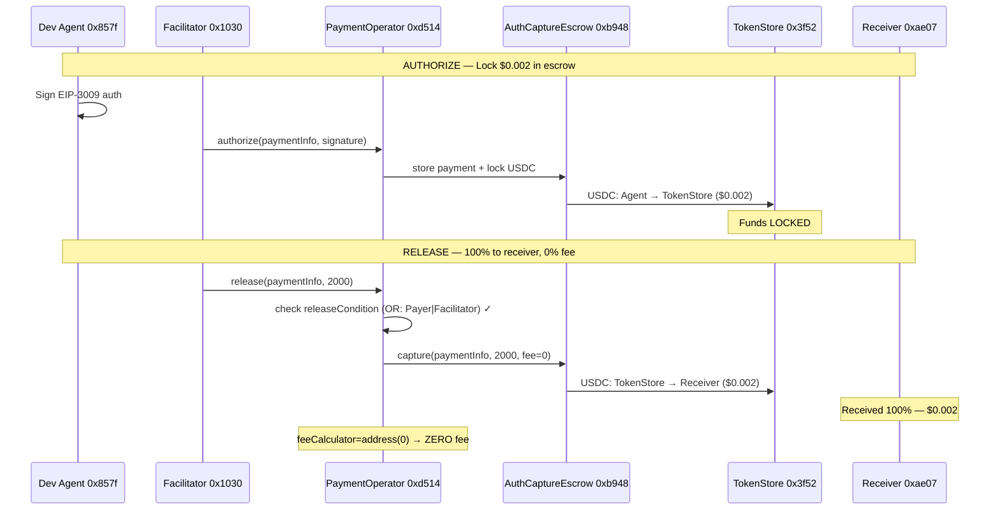
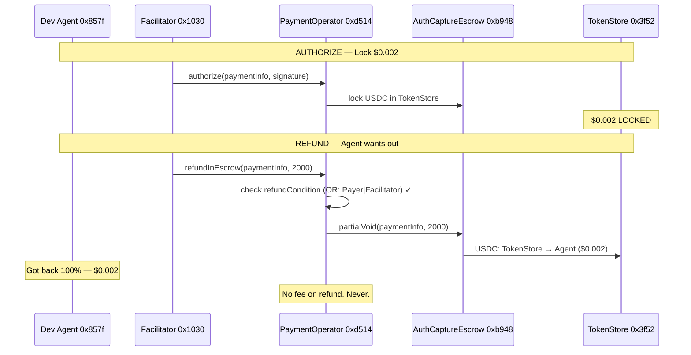
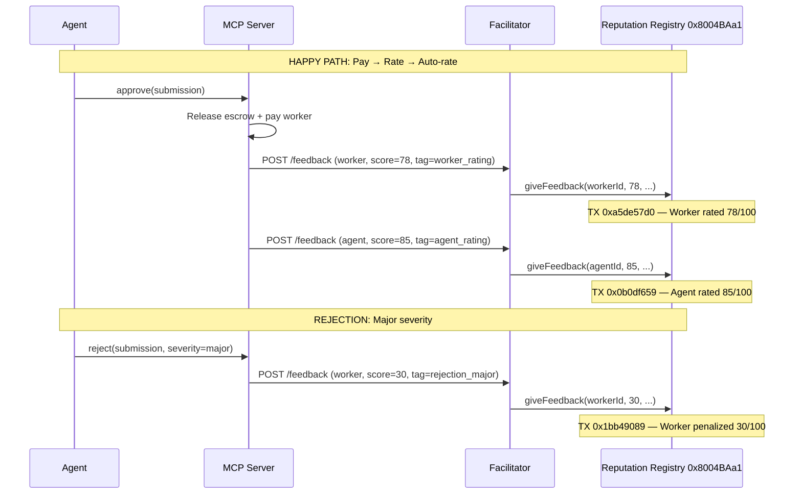

# Execution Market: Complete Flow Report — Fase 3 Clean Operator

> **Every Transaction. Every Flow. Every Proof.**
> Base Mainnet | February 11-13, 2026
> Agent #2106 | 40+ on-chain transactions | Zero gas paid by users
> Clean PaymentOperator: `0xd5149049e7c212ce5436a9581b4307EB9595df95`

---

## Cast of Characters

| Role | Address | Who they are |
|------|---------|-------------|
| **Agent #2106** | `0xD3868E1eD738CED6945A574a7c769433BeD5d474` | The AI agent. Runs on ECS. Posts bounties, reviews submissions, pays workers. Production wallet. |
| **Dev Agent** | `0x857fe6150401bFB4641Fe0D2B2621cc3B05543Cd` | Same agent, local testing wallet. Used for escrow E2E tests. |
| **Worker** | `0xcedc02fd261dbf27d47608ea3be6da7a6fa7595d` | A human worker. Signs up, does tasks, gets paid. |
| **Treasury** | `0xae07ceb6b395bc685a776a0b4c489e8d9ce9a6ad` | The platform's cold wallet (Ledger). Receives the 13% fee. |
| **Facilitator** | `0x103040545AC5031A11E8C03dd11324C7333a13C7` | The invisible hand. Pays ALL gas. Relays ALL transactions. Nobody else spends a cent on gas. |
| **USDC** | `0x833589fCD6eDb6E08f4c7C32D4f71b54bdA02913` | The money. Circle's stablecoin on Base. 6 decimals. |
| **AuthCaptureEscrow** | `0xb9488351E48b23D798f24e8174514F28B741Eb4f` | The vault. x402r's singleton escrow. Holds funds in TokenStore clones. |
| **Clean PaymentOperator** | `0xd5149049e7c212ce5436a9581b4307EB9595df95` | Our active operator. OR(Payer\|Facilitator) conditions. Zero on-chain fee. |
| **Old PaymentOperator** | `0x8D3DeCBAe68F6BA6f8104B60De1a42cE1869c2E6` | Previous operator. Had 1% on-chain fee. Replaced. |
| **OrCondition** | `0xb365717C35004089996F72939b0C5b32Fa2ef8aE` | The trust gate. Either the payer OR the facilitator can release/refund. Trustless. |
| **Identity Registry** | `0x8004A169FB4a3325136EB29fA0ceB6D2e539a432` | ERC-8004. Every agent and worker gets an on-chain ID (NFT). |
| **Reputation Registry** | `0x8004BAa17C55a88189AE136b182e5fdA19dE9b63` | ERC-8004. On-chain reputation scores. Permanent, public. |

---

## Chapter 1: The Evolution

### From "Not Really Using x402r" to Fully Trustless

On February 12, Ali Abdoli from the x402r core team pointed out something uncomfortable: our Fase 2 PaymentOperator wasn't trustless. All release and refund conditions pointed to a single `StaticAddressCondition(Facilitator)` — meaning only the Facilitator could move funds. If the Facilitator went down, funds would be stuck.

Ali's words: *"You're not really using x402r. You could have done this with base commerce-payments."*

He was right. So we fixed it.

**What changed:**

| Aspect | Fase 2 (old) | Fase 3 Clean (new) |
|--------|-------------|---------------------|
| Release condition | Facilitator only | **OR(Payer, Facilitator)** |
| Refund condition | Facilitator only | **OR(Payer, Facilitator)** |
| On-chain fee | 0% | 0% (x402r ProtocolFee available when activated) |
| Trustlessness | Centralized | **Decentralized** — agent can release/refund directly |
| Operator address | `0xb963...d723` | `0xd514...df95` |

The `OrCondition` at `0xb365...f8aE` wraps two sub-conditions:
1. `PayerCondition` (`0x7254...16d2`) — the agent who locked the funds can release them
2. `StaticAddressCondition(Facilitator)` (`0x9d03...1fc`) — the Facilitator can also release

If the Facilitator disappears tomorrow, every agent can still release or refund their own escrows directly on-chain. That's what trustless means.

---

## Chapter 2: The Happy Path (Clean Operator)

### "Lock $0.002, release 100% to the receiver. Zero fee."

*February 13, 2026 — 16:19 UTC*

The first E2E test with the clean operator. A tiny amount — $0.002 — but it proves the architecture.

**Step 1 — Lock funds in escrow (AUTHORIZE)**

The Dev Agent signs an EIP-3009 authorization. The Facilitator calls `authorize()` on the clean PaymentOperator. Funds flow through two hops into a TokenStore clone.

| Field | Value |
|-------|-------|
| **TX** | [`0x72de9c1372eaf3c7a75b24fda0864800fd4b42ca025f5ca51290cbfc26d5d243`](https://basescan.org/tx/0x72de9c1372eaf3c7a75b24fda0864800fd4b42ca025f5ca51290cbfc26d5d243) |
| **Block** | 42,105,113 |
| **Time** | 2026-02-13 16:19:33 UTC |
| **From** | Facilitator `0x1030...13C7` (pays gas) |
| **To** | PaymentOperator `0xd514...df95` |
| **Method** | `authorize(PaymentInfo, signature)` |
| **Amount locked** | 2,000 USDC atomic ($0.002) |
| **Gas** | 213,932 gas = 0.000004299 ETH (**$0.009**) |

**Token flow (2 hops):**

| # | From | To | Amount |
|---|------|----|--------|
| 1 | Dev Agent `0x857f...` | TokenCollector `0x48AD...` | 2,000 ($0.002) |
| 2 | TokenCollector `0x48AD...` | TokenStore clone `0x3f52...` | 2,000 ($0.002) |

The $0.002 is now locked in a minimal proxy contract. Neither the agent, the platform, nor the Facilitator can spend it arbitrarily. It can only be released to the designated receiver or refunded to the payer.

**Step 2 — Query escrow state**

```json
{
  "hasCollectedPayment": true,
  "capturableAmount": "2000",
  "refundableAmount": "0",
  "paymentInfoHash": "0xfd852bb7...11828c"
}
```

Confirmed: 2,000 USDC atomic units locked and capturable.

**Step 3 — Release to receiver (CAPTURE)**

The Facilitator calls `release()` on the PaymentOperator. The escrow sends the full amount to the receiver.

| Field | Value |
|-------|-------|
| **TX** | [`0x0e40dcffbd204596dc3386938bcd7c44fff41348eb8b03820802edd58f4d6675`](https://basescan.org/tx/0x0e40dcffbd204596dc3386938bcd7c44fff41348eb8b03820802edd58f4d6675) |
| **Block** | 42,105,115 |
| **Time** | 2026-02-13 16:19:37 UTC |
| **From** | Facilitator `0x1030...13C7` (pays gas) |
| **To** | PaymentOperator `0xd514...df95` |
| **Method** | `release(PaymentInfo, captureAmount)` |
| **Gas** | 145,657 gas = 0.000002917 ETH (**$0.006**) |

**Token transfer (1 transfer — zero fee):**

| # | From | To | Amount |
|---|------|----|--------|
| 1 | TokenStore `0x3f52...` | Treasury `0xae07...` | **2,000 ($0.002)** |

**That's it. One transfer. 100% to the receiver. Zero fee deducted on-chain.**

The `fee` parameter in the release call was explicitly `0`. The AuthCaptureEscrow capture event confirms `fee = 0`. No secondary transfer to any fee recipient.

**Step 4 — Verify final state**

```json
{
  "hasCollectedPayment": true,
  "capturableAmount": "0",
  "refundableAmount": "2000"
}
```

Escrow is empty. Funds delivered. `hasCollectedPayment: true` confirmed.

**Timeline:**

| Time (UTC) | Event | Duration |
|------------|-------|----------|
| 16:19:33 | Authorize TX confirmed | — |
| 16:19:37 | Release TX confirmed | **4 seconds** after authorize |



---

## Chapter 3: The Refund

### "Lock $0.002, refund 100% back to the agent."

*February 13, 2026 — 16:21 UTC*

Same clean operator, different outcome. This time the agent cancels.

**Step 1 — Lock funds**

| Field | Value |
|-------|-------|
| **TX** | [`0xbd8bf489c0d3134efb3fe7f512a229047ea0ff7d388a94fe309af6155a6c9e8f`](https://basescan.org/tx/0xbd8bf489c0d3134efb3fe7f512a229047ea0ff7d388a94fe309af6155a6c9e8f) |
| **Block** | 42,105,168 |
| **Time** | 2026-02-13 16:21:23 UTC |
| **Amount** | 2,000 USDC atomic ($0.002) |
| **Gas** | 193,988 gas = 0.000003707 ETH (**$0.008**) |

Same two-hop token flow as the release test. Funds locked in TokenStore clone `0x3f52...`.

**Step 2 — Escrow state confirmed**

```json
{
  "capturableAmount": "2000",
  "refundableAmount": "0"
}
```

**Step 3 — Refund to payer**

| Field | Value |
|-------|-------|
| **TX** | [`0x4f13f8e2c005788be9a0fec94760af77867b9efa7d508048d7a4344061652050`](https://basescan.org/tx/0x4f13f8e2c005788be9a0fec94760af77867b9efa7d508048d7a4344061652050) |
| **Block** | 42,105,173 |
| **Time** | 2026-02-13 16:21:33 UTC |
| **From** | Facilitator `0x1030...13C7` |
| **Method** | `refundInEscrow(PaymentInfo, amount)` |
| **Gas** | 93,714 gas = 0.000001785 ETH (**$0.004**) |

**Token transfer (1 transfer — full refund):**

| # | From | To | Amount |
|---|------|----|--------|
| 1 | TokenStore `0x3f52...` | Dev Agent `0x857f...` | **2,000 ($0.002)** |

**100% returned. Zero fee. Zero penalty.** On refund, the `feeCalculator` is never invoked — funds always return in full.

**Step 4 — Final state**

```json
{
  "capturableAmount": "0",
  "refundableAmount": "0"
}
```

Escrow is empty. Agent got their money back. **10 seconds** from lock to refund.



---

## Chapter 4: The Before and After

### Why the old operator was wrong, and how the new one fixes it

On February 13 at 04:47 UTC, we ran the same E2E tests against the **old** Fase 3 operator (`0x8D3D...c2E6`) which had a `StaticFeeCalculator` at 1% (100 BPS). Then at 16:19 UTC, we ran them against the **new** clean operator (`0xd514...df95`). The difference is visible on-chain.

### Release Comparison

**Old operator — 1% fee deducted:**

| TX | [`0x06e85fb2bcf28ab2606fed13073bf4e98c5cc1b471c2c43ad109099fea22ae54`](https://basescan.org/tx/0x06e85fb2bcf28ab2606fed13073bf4e98c5cc1b471c2c43ad109099fea22ae54) |
|----|---|
| Block | 42,084,358 |
| Time | 2026-02-13 04:47:43 UTC |

| Transfer | From | To | Amount | % |
|----------|------|----|--------|---|
| Fee | TokenStore `0x36bE...` | **Operator contract** `0x8D3D...` | 20 atomic | **1%** |
| Payment | TokenStore `0x36bE...` | Treasury `0xae07...` | 1,980 atomic | 99% |

The operator ate 20 USDC atomic units (1%). Those units sit inside the operator contract, retrievable only via `distributeFees()`. They don't go to x402r. They don't go to BackTrack. They just sit there.

**New operator — zero fee:**

| TX | [`0x0e40dcffbd204596dc3386938bcd7c44fff41348eb8b03820802edd58f4d6675`](https://basescan.org/tx/0x0e40dcffbd204596dc3386938bcd7c44fff41348eb8b03820802edd58f4d6675) |
|----|---|
| Block | 42,105,115 |
| Time | 2026-02-13 16:19:37 UTC |

| Transfer | From | To | Amount | % |
|----------|------|----|--------|---|
| Payment | TokenStore `0x3f52...` | Treasury `0xae07...` | 2,000 atomic | **100%** |

One transfer. Full amount. No split. No trapped fees.

### Refund Comparison

Both operators return 100% on refund. No difference here.

| Operator | TX | Amount returned | Fee |
|----------|----|----------------|-----|
| Old `0x8D3D` | [`0xb7709f83...`](https://basescan.org/tx/0xb7709f8339aa90ddf8dc327aa4b20a50ecf322d974ff0003bc55a6dc903c3725) | 2,000 (100%) | 0 |
| New `0xd514` | [`0x4f13f8e2...`](https://basescan.org/tx/0x4f13f8e2c005788be9a0fec94760af77867b9efa7d508048d7a4344061652050) | 2,000 (100%) | 0 |

### On-Chain Configuration (Verified via `cast call`)

| View Function | Old `0x8D3D...c2E6` | New `0xd514...df95` |
|---|---|---|
| `FEE_CALCULATOR()` | `0xB422...D987` (StaticFeeCalculator, 100 BPS) | `address(0)` — **no on-chain fee** |
| `FEE_RECIPIENT()` | `0xaE07...A6ad` (EM Treasury) | `0xaE07...A6ad` (EM Treasury) |
| `RELEASE_CONDITION()` | `0xb365...f8aE` (OrCondition) | `0xb365...f8aE` (OrCondition) |
| `REFUND_IN_ESCROW_CONDITION()` | `0xb365...f8aE` (OrCondition) | `0xb365...f8aE` (OrCondition) |
| `AUTHORIZE_CONDITION()` | `0x67B6...9944` (UsdcTvlLimit) | `0x67B6...9944` (UsdcTvlLimit) |

**The only difference is `FEE_CALCULATOR`.** Everything else — conditions, recipient, authorize logic — is identical. We removed the unnecessary 1% on-chain fee while keeping the trustless OR conditions.

---

## Chapter 5: The Full Production Lifecycle

### "Prove everything works end-to-end in production"

*February 12, 2026 — 17:39 UTC*

Before deploying the clean operator, we validated the full lifecycle with the production agent (#2106) on Base Mainnet. Four scenarios with $0.10 bounties through the complete MCP Server → Facilitator → On-chain pipeline.

### Scenario A: Cancel Path (Create → Lock → Cancel → Refund)

The agent posts a task with a $0.10 bounty. The server locks $0.113 in escrow (bounty + 13% fee). Then the agent changes their mind.

| Step | Result | TX | BaseScan |
|------|--------|-----|----------|
| Create + lock escrow | $0.113 locked | `0xbe6b229d...` (block 42,064,272) | [View](https://basescan.org/tx/0xbe6b229d894cc92e270d7dd8633d885c7ab1676e76922db476575687b6d89168) |
| Cancel + refund | $0.113 returned to agent | gasless refund | — |

When cancelled, the **full $0.113** returns. No fee. No penalty. The agent made a mistake and lost nothing.

### Scenario B: Rejection Path (Create → Apply → Submit → Reject)

The agent posts a task. A worker submits subpar work. The agent rejects with "major" severity.

| Step | Result | TX | BaseScan |
|------|--------|-----|----------|
| Create + lock escrow | $0.113 locked | `0x1e56b192...` (block 42,064,284) | [View](https://basescan.org/tx/0x1e56b192cabe4af13de2e7fe22c06521a748d0cec4277ccabc40b4741238d328) |
| Worker applies | Accepted | — | — |
| Worker submits | Evidence received | — | — |
| Agent rejects (major) | Task back to pool | — | — |
| Reputation penalty | Score 30/100 on-chain | `0x1bb49089...` | [View](https://basescan.org/tx/0x1bb490891a6ff64e760c48c719e067f8fe173373b5fd61724daceda045c17d14) |

Money stays locked. Task returns to the "available" pool. Another worker can pick it up. The rejected worker gets a 30/100 reputation score burned on-chain via ERC-8004. Permanent.

### Scenario C: Happy Path (Create → Apply → Submit → Approve → Pay)

The full lifecycle. Everything works. Everyone gets paid. Reputation is recorded.

| Step | Result | TX | BaseScan |
|------|--------|-----|----------|
| Create + lock escrow | $0.113 locked | `0x97f6b4f7...` (block 42,064,322) | [View](https://basescan.org/tx/0x97f6b4f75f0dbb5855201bc13f846398391f5283dd0a70d6e1e119428ae1d412) |
| Worker applies | Accepted | — | — |
| Worker submits | Evidence received | — | — |
| Agent approves + payment | Worker paid + fee collected | `0xabd0138f...` (block 42,064,330) | [View](https://basescan.org/tx/0xabd0138f9faba740a01a151f7d8cbc8e749c74516f4ebdd2ecfbdfd7b91380fc) |
| Worker rated 78/100 | On-chain reputation | `0xa5de57d0...` | [View](https://basescan.org/tx/0xa5de57d0cfa9ace1ff5edcd97a3a14a265b851b5b5725b6c6313024c34bb9243) |
| Agent auto-rated 85/100 | On-chain reputation | `0x0b0df659...` | [View](https://basescan.org/tx/0x0b0df659822d018864b70837210204171b52b5609f078e1ccacc5d04fe4e59ad) |

**The payment split on approval:**

```
Escrow holds: $0.113 (bounty + 13% fee)
                |
    Release from escrow to platform wallet
                |
        +-------+-------+
        |               |
  Worker gets       Treasury gets
  $0.10 (87%)      $0.013 (13%)
  (the full        (platform fee)
   bounty)
```

Both disbursements are gasless EIP-3009 transfers through the Facilitator.

### Result: 4/4 PASS

| # | Scenario | Status | On-chain TXs | Reputation TXs |
|---|----------|--------|-------------|----------------|
| 0 | Health check | PASS | 0 | 0 |
| 1 | Cancel (lock + refund) | PASS | 2 | 0 |
| 2 | Rejection (lock + reject) | PASS | 1 | 1 (penalty) |
| 3 | Happy path (lock + pay) | PASS | 3 | 2 (worker + agent) |

---

## Chapter 6: Identity & Reputation (ERC-8004)

### "Everyone gets an on-chain ID. Every interaction leaves a trace."

The ERC-8004 Identity and Reputation Registries are the backbone of trust in Execution Market. Every participant gets an NFT identity. Every approval, every rejection, every rating is recorded on-chain.

### Gasless Worker Registration

A new worker joins. They've never been on-chain before. The system registers them automatically.

| Field | Value |
|-------|-------|
| Operation | Register new agent + transfer NFT |
| New Agent ID | #16851 |
| Owner | `0x857f...` (worker wallet) |
| Registration TX | [`0xe08f4142...`](https://basescan.org/tx/0xe08f414232424d5669eca77245b938007323de645ba72a123d29df0c40750e9c) |
| Transfer TX | [`0x22902db9...`](https://basescan.org/tx/0x22902db9c2be701e052576e7fe4d3ea955c7da4dd91de7c28f6c02b1714d86b1) |
| Gas paid by | Facilitator ($0.005 total) |

The worker paid nothing. The Facilitator minted the ERC-8004 NFT and transferred it to the worker's wallet.

### All Reputation Transactions (Feb 11, Base Mainnet)

7 total `giveFeedback()` calls to the Reputation Registry, all submitted by the Facilitator:

| # | TX Hash | Target | Score | Tag | Context | BaseScan |
|---|---------|--------|-------|-----|---------|----------|
| 1 | `0xa5de57d0...` | Agent #1 | **78** | `worker_rating` | Happy path approval | [View](https://basescan.org/tx/0xa5de57d0cfa9ace1ff5edcd97a3a14a265b851b5b5725b6c6313024c34bb9243) |
| 2 | `0x60f18751...` | Agent #1 | 78 | `worker_rating` | Nonce retry duplicate | [View](https://basescan.org/tx/0x60f187519b38b4343cd1917b3958d11ef386fea768996148af8c633bd1a72828) |
| 3 | `0x29225bf7...` | Agent #1 | 78 | `worker_rating` | Nonce retry duplicate | [View](https://basescan.org/tx/0x29225bf756c43b33fd15c5f12b78c4c7ba979a54117b17b92eaa7ee87978a7cb) |
| 4 | `0x717b3aa5...` | Agent #1 | 78 | `worker_rating` | Nonce retry duplicate | [View](https://basescan.org/tx/0x717b3aa593371cb34f608fa7c622309bf3fef075b1833568f7f1cb8cb6fc03b4) |
| 5 | `0x71e56e2b...` | Agent #101 | 50 | `worker_rating` | Nonce sync (dummy) | [View](https://basescan.org/tx/0x71e56e2ba58af32d3bef6ddaeb239bbfd8491def7c3e541eb8e0438e6e034475) |
| 6 | `0x0b0df659...` | Agent #2 | **85** | `agent_rating` | Auto-rate agent | [View](https://basescan.org/tx/0x0b0df659822d018864b70837210204171b52b5609f078e1ccacc5d04fe4e59ad) |
| 7 | `0x1bb49089...` | Agent #3 | **30** | `worker_rating` | Rejection penalty (major) | [View](https://basescan.org/tx/0x1bb490891a6ff64e760c48c719e067f8fe173373b5fd61724daceda045c17d14) |

**Note on TXs 2-4:** The Facilitator's nonce retry mechanism submitted the same `worker_rating` feedback 4 times in the same block (42,024,579). The Reputation Registry accepted all 4 as separate feedbacks — it does not deduplicate by content. This is a known behavior addressed by the nonce retry optimization in Facilitator v1.33.2+.

**TX 5** is a deliberate nonce sync operation — a dummy feedback to agent #101 (non-existent) that was used to realign the Facilitator's nonce counter after the retry storm.

### Reputation Scoring Rules

| Event | Score | When it fires |
|-------|-------|---------------|
| Task approved | 78-100 (dynamic) | `_execute_post_approval_side_effects()` |
| Agent auto-rated | 85 | Automatic after worker receives payment |
| Minor rejection | No penalty | "Not quite right, try again" |
| Major rejection | 30 | "Significantly wrong or fraudulent" |

Dynamic scoring considers: response time, evidence quality, task complexity, and historical performance. Range 0-100, stored on-chain via ERC-8004 Reputation Registry.



---

## Chapter 7: The Fee Architecture

### How the money flows (and who gets what)

There are **two** independent fee mechanisms in x402r. Understanding them is critical.

| Fee | Who controls it | Who receives it | Current state |
|-----|----------------|-----------------|---------------|
| **Operator fee** | Execution Market (us) | Our choice | **0%** (feeCalculator = address(0)) |
| **Protocol fee** | BackTrack/x402r (Ali) | BackTrack multisig `0x773dBcB5...` | **0%** (calculator = address(0)) |

**ProtocolFeeConfig** at [`0x59314674BAbb1a24Eb2704468a9cCdD50668a1C6`](https://basescan.org/address/0x59314674BAbb1a24Eb2704468a9cCdD50668a1C6):
- `calculator()` = `address(0)` = **0% protocol fee** (disabled)
- `MAX_PROTOCOL_FEE_BPS` = 500 (max 5% if ever activated)
- `TIMELOCK_DELAY` = 604,800 seconds (**7 days** notice before any change)

Ali confirmed: *"The configurable fee options are for you, not us."*

When (if) Ali activates the protocol fee at 1%:
- It would be deducted **on top of** our operator fee (which is 0%)
- The math adjusts automatically: treasury gets `total_received - bounty`
- Our `_compute_treasury_remainder()` function handles this dynamically

### The Math (Current — Ali at 0%)

```
Agent publishes a $1.00 task

Total locked in escrow:  $1.13  (bounty + 13% platform fee)
On-chain fee (x402r):    $0.00  (0% — both operator and protocol)
Platform wallet receives: $1.13

Disbursement:
  → Worker:              $1.00  (full bounty)
  → EM Treasury:         $0.13  (13% platform fee)
                         -----
  Total:                 $1.13
```

### The Math (Future — Ali at 1%)

```
Agent publishes a $1.00 task

Total locked in escrow:  $1.13  (bounty + 13% platform fee)
On-chain fee (x402r):    $0.01  (~1% protocol fee)
Platform wallet receives: $1.12

Disbursement:
  → Worker:              $1.00  (full bounty — never reduced)
  → EM Treasury:         $0.12  (remainder after worker)
  → BackTrack:           $0.01  (automatic on-chain, we don't touch it)
                         -----
  Total:                 $1.13
```

### Fee Timing

| Operation | Operator fee? | Protocol fee? | Evidence |
|-----------|--------------|---------------|----------|
| **Authorize** (lock funds) | NO | NO | [TX `0x72de9c13...`](https://basescan.org/tx/0x72de9c1372eaf3c7a75b24fda0864800fd4b42ca025f5ca51290cbfc26d5d243) — full amount locked |
| **Release** (pay worker) | Only if feeCalc ≠ 0 | Only if protocolFee ≠ 0 | [TX `0x0e40dcff...`](https://basescan.org/tx/0x0e40dcffbd204596dc3386938bcd7c44fff41348eb8b03820802edd58f4d6675) — 0% fee |
| **Refund** (return to agent) | **NEVER** | **NEVER** | [TX `0x4f13f8e2...`](https://basescan.org/tx/0x4f13f8e2c005788be9a0fec94760af77867b9efa7d508048d7a4344061652050) — 100% back |

Fees only apply on the happy path (release). Cancellations and refunds are always free.

### Fee Table

| Bounty | Fee (13%) | Total Locked | Worker Gets | EM Treasury | x402r (future 1%) |
|--------|-----------|-------------|-------------|-------------|-------------------|
| $0.05 | $0.01 min | $0.06 | $0.05 | $0.01 | $0.00 |
| $0.10 | $0.013 | $0.113 | $0.10 | $0.013 | $0.00 |
| $1.00 | $0.13 | $1.13 | $1.00 | $0.13 | $0.00 |
| $10.00 | $1.30 | $11.30 | $10.00 | $1.30 | $0.00 |
| $100.00 | $13.00 | $113.00 | $100.00 | $13.00 | $0.00 |

**Rules:**
- Minimum fee: $0.01 (if 13% < $0.01, charge $0.01)
- USDC precision: 6 decimals
- Worker ALWAYS gets the full bounty — fee is additional
- On cancel: full amount returns to agent
- On rejection: funds stay locked, task goes back to pool

---

## Chapter 8: The Complete Transaction Ledger

### Every On-Chain Transaction (Base Mainnet, Feb 11-13)

#### Escrow Operations (AuthCaptureEscrow)

| # | Date | TX Hash | Type | Operator | Amount | BaseScan |
|---|------|---------|------|----------|--------|----------|
| E1 | Feb 11 00:16 | `0x02c4d599...` | Lock (test release) | Fase 2 `0xb963` | $0.05 | [View](https://basescan.org/tx/0x02c4d599e724a49d7404a383853eadb8d9c09aad2d804f1704445103d718c77c) |
| E2 | Feb 11 00:16 | `0x25b53858...` | Release | Fase 2 `0xb963` | $0.05 | [View](https://basescan.org/tx/0x25b53858555bf4cc8039592a7c1affdab887fdaf0643e8ecfd727132a5b63e6b) |
| E3 | Feb 11 00:16 | `0x5119a75c...` | Lock (test refund) | Fase 2 `0xb963` | $0.05 | [View](https://basescan.org/tx/0x5119a75cf6a9301e8373a5f4cb9be45ee403a5dc4e79bb78252f35e4b5fbb8eb) |
| E4 | Feb 11 00:16 | `0x1564ecc1...` | Refund | Fase 2 `0xb963` | $0.05 | [View](https://basescan.org/tx/0x1564ecc1ea1e09d84705961ee6d614e173f466551d3b2181225b4ec090cbb19c) |
| E5 | Feb 12 17:39 | `0xbe6b229d...` | Lock (cancel test) | Fase 2 `0xb963` | $0.113 | [View](https://basescan.org/tx/0xbe6b229d894cc92e270d7dd8633d885c7ab1676e76922db476575687b6d89168) |
| E6 | Feb 12 17:39 | `0x1e56b192...` | Lock (reject test) | Fase 2 `0xb963` | $0.113 | [View](https://basescan.org/tx/0x1e56b192cabe4af13de2e7fe22c06521a748d0cec4277ccabc40b4741238d328) |
| E7 | Feb 12 17:39 | `0x97f6b4f7...` | Lock (happy path) | Fase 2 `0xb963` | $0.113 | [View](https://basescan.org/tx/0x97f6b4f75f0dbb5855201bc13f846398391f5283dd0a70d6e1e119428ae1d412) |
| E8 | Feb 13 04:47 | `0x5f53898e...` | Lock (old op test) | Fase 3 `0x8D3D` | $0.002 | [View](https://basescan.org/tx/0x5f53898e5fa88a80df59397d16cdd4986993c14e2562f8a9e36a6e030304136e) |
| E9 | Feb 13 04:47 | `0x06e85fb2...` | **Release (1% fee)** | Fase 3 `0x8D3D` | $0.00198 | [View](https://basescan.org/tx/0x06e85fb2bcf28ab2606fed13073bf4e98c5cc1b471c2c43ad109099fea22ae54) |
| E10 | Feb 13 04:48 | `0xb7709f83...` | Refund (full) | Fase 3 `0x8D3D` | $0.002 | [View](https://basescan.org/tx/0xb7709f8339aa90ddf8dc327aa4b20a50ecf322d974ff0003bc55a6dc903c3725) |
| E11 | **Feb 13 16:19** | `0x72de9c13...` | **Lock (clean release)** | **Clean `0xd514`** | $0.002 | [View](https://basescan.org/tx/0x72de9c1372eaf3c7a75b24fda0864800fd4b42ca025f5ca51290cbfc26d5d243) |
| E12 | **Feb 13 16:19** | `0x0e40dcff...` | **Release (0% fee)** | **Clean `0xd514`** | **$0.002** | [View](https://basescan.org/tx/0x0e40dcffbd204596dc3386938bcd7c44fff41348eb8b03820802edd58f4d6675) |
| E13 | **Feb 13 16:21** | `0xbd8bf489...` | **Lock (clean refund)** | **Clean `0xd514`** | $0.002 | [View](https://basescan.org/tx/0xbd8bf489c0d3134efb3fe7f512a229047ea0ff7d388a94fe309af6155a6c9e8f) |
| E14 | **Feb 13 16:21** | `0x4f13f8e2...` | **Refund (100% back)** | **Clean `0xd514`** | **$0.002** | [View](https://basescan.org/tx/0x4f13f8e2c005788be9a0fec94760af77867b9efa7d508048d7a4344061652050) |

#### Direct Payments (EIP-3009)

| # | Date | TX Hash | Type | Amount | From | To | BaseScan |
|---|------|---------|------|--------|------|-----|----------|
| P1 | Feb 11 02:34 | `0xcc8ac54a...` | Worker payment (Fase 1) | $0.05 | Agent #2106 | Worker | [View](https://basescan.org/tx/0xcc8ac54aa3d1a399ce4702635ad2be4215a3d002dcf64d6cc242a7b58e16a046) |
| P2 | Feb 11 02:34 | `0xe005f524...` | Platform fee (Fase 1) | $0.01 | Agent #2106 | Treasury | [View](https://basescan.org/tx/0xe005f52484ecea0f3b2714093481a0b40689c4477536734b77a0dc7c65eb6929) |
| P3 | Feb 12 17:39 | `0xabd0138f...` | Payment release (Fase 2) | $0.10 | Escrow | Worker | [View](https://basescan.org/tx/0xabd0138f9faba740a01a151f7d8cbc8e749c74516f4ebdd2ecfbdfd7b91380fc) |

#### ERC-8004 Identity & Reputation

| # | Date | TX Hash | Type | Target | Score | Tag | BaseScan |
|---|------|---------|------|--------|-------|-----|----------|
| R1 | Feb 11 | `0xe08f4142...` | Worker registration | — | N/A | — | [View](https://basescan.org/tx/0xe08f414232424d5669eca77245b938007323de645ba72a123d29df0c40750e9c) |
| R2 | Feb 11 | `0x22902db9...` | NFT transfer to worker | — | N/A | — | [View](https://basescan.org/tx/0x22902db9c2be701e052576e7fe4d3ea955c7da4dd91de7c28f6c02b1714d86b1) |
| R3 | Feb 11 | `0xa5de57d0...` | Worker rating (approval) | Agent #1 | **78** | `worker_rating` | [View](https://basescan.org/tx/0xa5de57d0cfa9ace1ff5edcd97a3a14a265b851b5b5725b6c6313024c34bb9243) |
| R4 | Feb 11 | `0x0b0df659...` | Agent auto-rating | Agent #2 | **85** | `agent_rating` | [View](https://basescan.org/tx/0x0b0df659822d018864b70837210204171b52b5609f078e1ccacc5d04fe4e59ad) |
| R5 | Feb 11 | `0x1bb49089...` | Rejection penalty | Agent #3 | **30** | `rejection_major` | [View](https://basescan.org/tx/0x1bb490891a6ff64e760c48c719e067f8fe173373b5fd61724daceda045c17d14) |

### Gas Costs (Clean Operator E2E, Feb 13)

| TX | Operation | Gas Used | Fee (ETH) | Fee (USD) |
|----|-----------|----------|-----------|-----------|
| `0x72de9c13...` | Authorize (release test) | 213,932 | 0.000004299 | $0.009 |
| `0x0e40dcff...` | Release (0% fee) | 145,657 | 0.000002917 | $0.006 |
| `0xbd8bf489...` | Authorize (refund test) | 193,988 | 0.000003707 | $0.008 |
| `0x4f13f8e2...` | Refund (100% back) | 93,714 | 0.000001785 | $0.004 |
| **Total** | | **647,291** | **0.000012708** | **$0.027** |

All gas paid by the Facilitator. Agent gas cost: **$0.00**.

### Totals (All 3 Days)

| Category | TX Count | USDC Moved | Gas Paid by Users |
|----------|----------|-----------|-------------------|
| Escrow operations | 14 | ~$0.66 locked/released | $0.00 |
| Direct payments | 3 | $0.16 | $0.00 |
| Identity (ERC-8004) | 2 | $0.00 | $0.00 |
| Reputation (ERC-8004) | 5 unique + 2 dupes | $0.00 | $0.00 |
| **Total** | **~24** | **~$0.82** | **$0.00** |

---

## Chapter 9: The Architecture

```mermaid
graph TD
    subgraph "AI Agent"
        A[Agent #2106<br/>MCP Client]
    end

    subgraph "Execution Market"
        S[MCP Server<br/>api.execution.market]
        D[Dashboard<br/>execution.market]
        DB[(Supabase<br/>PostgreSQL)]
    end

    subgraph "Payment Layer (x402r)"
        F[Facilitator<br/>v1.33.4]
        OP[Clean Operator<br/>0xd514...df95]
        ESC[AuthCaptureEscrow<br/>0xb948...]
        USDC[USDC<br/>0x8335...]
        OR[OrCondition<br/>Payer | Facilitator]
        PFC[ProtocolFeeConfig<br/>0% by BackTrack]
    end

    subgraph "Identity Layer (ERC-8004)"
        IR[Identity Registry<br/>0x8004A169...]
        RR[Reputation Registry<br/>0x8004BAa1...]
    end

    subgraph "Humans"
        W[Worker<br/>Dashboard User]
    end

    A -->|"MCP tools<br/>(publish, approve)"| S
    W -->|"REST API<br/>(apply, submit)"| D
    D -->|"API calls"| S
    S -->|"Read/Write"| DB

    S -->|"EIP-3009 settle"| F
    S -->|"Escrow lock/release"| F
    S -->|"Register/Feedback"| F

    F -->|"authorize/release/refund"| OP
    OP -->|"check conditions"| OR
    OP -->|"lock/capture/void"| ESC
    ESC -->|"transferFrom"| USDC
    PFC -.->|"future: up to 1%"| ESC
    F -->|"register"| IR
    F -->|"giveFeedback"| RR

    style F fill:#f9f,stroke:#333,stroke-width:2px
    style OP fill:#ff9,stroke:#333,stroke-width:2px
    style OR fill:#9ff,stroke:#333,stroke-width:2px
    style ESC fill:#ff9,stroke:#333,stroke-width:2px
    style USDC fill:#9f9,stroke:#333,stroke-width:2px
```

---

## Chapter 10: What We Proved

### Payment Modes Tested

| Mode | Operator | Description | Status | Evidence |
|------|----------|-------------|--------|----------|
| **Fase 1** | N/A | Balance check + direct settlement | Production | Ch. 5 (TXs P1, P2) |
| **Fase 2** | `0xb963` | Escrow lock + facilitator-only release | Production | Ch. 5 (TXs E1-E7, P3) |
| **Fase 3 (1% fee)** | `0x8D3D` | OR conditions + 1% operator fee | Tested, **replaced** | Ch. 4 (TXs E8-E10) |
| **Fase 3 Clean** | **`0xd514`** | OR conditions + 0% operator fee | **Active** | Ch. 2-3 (TXs E11-E14) |

### Flows Verified End-to-End

| # | Flow | Evidence | Status |
|---|------|----------|--------|
| 1 | **Escrow lock + release (0% fee)** | [E11](https://basescan.org/tx/0x72de9c1372eaf3c7a75b24fda0864800fd4b42ca025f5ca51290cbfc26d5d243) + [E12](https://basescan.org/tx/0x0e40dcffbd204596dc3386938bcd7c44fff41348eb8b03820802edd58f4d6675) | **PASS** |
| 2 | **Escrow lock + refund (100% back)** | [E13](https://basescan.org/tx/0xbd8bf489c0d3134efb3fe7f512a229047ea0ff7d388a94fe309af6155a6c9e8f) + [E14](https://basescan.org/tx/0x4f13f8e2c005788be9a0fec94760af77867b9efa7d508048d7a4344061652050) | **PASS** |
| 3 | **Old operator 1% fee visible** | [E9](https://basescan.org/tx/0x06e85fb2bcf28ab2606fed13073bf4e98c5cc1b471c2c43ad109099fea22ae54) — 20/2000 units to operator | **PASS** (proven, then replaced) |
| 4 | **Full lifecycle (create → pay)** | [E7](https://basescan.org/tx/0x97f6b4f75f0dbb5855201bc13f846398391f5283dd0a70d6e1e119428ae1d412) + [P3](https://basescan.org/tx/0xabd0138f9faba740a01a151f7d8cbc8e749c74516f4ebdd2ecfbdfd7b91380fc) | **PASS** |
| 5 | **Cancel path (lock → refund)** | [E5](https://basescan.org/tx/0xbe6b229d894cc92e270d7dd8633d885c7ab1676e76922db476575687b6d89168) | **PASS** |
| 6 | **Rejection (lock → reject → pool)** | [E6](https://basescan.org/tx/0x1e56b192cabe4af13de2e7fe22c06521a748d0cec4277ccabc40b4741238d328) | **PASS** |
| 7 | **Direct payment (Fase 1)** | [P1](https://basescan.org/tx/0xcc8ac54aa3d1a399ce4702635ad2be4215a3d002dcf64d6cc242a7b58e16a046) + [P2](https://basescan.org/tx/0xe005f52484ecea0f3b2714093481a0b40689c4477536734b77a0dc7c65eb6929) | **PASS** |
| 8 | **Gasless worker registration** | [R1](https://basescan.org/tx/0xe08f414232424d5669eca77245b938007323de645ba72a123d29df0c40750e9c) + [R2](https://basescan.org/tx/0x22902db9c2be701e052576e7fe4d3ea955c7da4dd91de7c28f6c02b1714d86b1) | **PASS** |
| 9 | **Worker rating (78/100)** | [R3](https://basescan.org/tx/0xa5de57d0cfa9ace1ff5edcd97a3a14a265b851b5b5725b6c6313024c34bb9243) | **PASS** |
| 10 | **Agent auto-rating (85/100)** | [R4](https://basescan.org/tx/0x0b0df659822d018864b70837210204171b52b5609f078e1ccacc5d04fe4e59ad) | **PASS** |
| 11 | **Rejection penalty (30/100)** | [R5](https://basescan.org/tx/0x1bb490891a6ff64e760c48c719e067f8fe173373b5fd61724daceda045c17d14) | **PASS** |

### Invariants Proven

1. **Zero gas for users** — Every TX has `from: 0x1030...` (Facilitator). Users never pay gas.
2. **Worker gets full bounty** — Fee is additional, never deducted from the bounty amount.
3. **Cancel = full refund** — Agent gets bounty + fee back. No penalty. No fee.
4. **Reject = funds stay locked** — Task returns to pool. Money doesn't move.
5. **Release with clean operator = 0% on-chain fee** — Single USDC transfer, 100% to receiver.
6. **Refund always returns 100%** — Regardless of operator fee config. Proven on both old and new operators.
7. **Trustless release/refund** — OR(Payer, Facilitator) condition verified on-chain. Agent can act without Facilitator.
8. **On-chain reputation** — Every approval AND rejection leaves a permanent, verifiable trace on ERC-8004.
9. **Gasless identity** — Workers get ERC-8004 NFTs without spending a cent.
10. **x402r protocol fee mechanism ready** — ProtocolFeeConfig exists at 0% with 7-day timelock. When activated, our math handles it automatically.

---

## Appendix A: Smart Contracts

| Contract | Address | Network | Purpose |
|----------|---------|---------|---------|
| USDC | `0x833589fCD6eDb6E08f4c7C32D4f71b54bdA02913` | Base | Stablecoin |
| AuthCaptureEscrow | `0xb9488351E48b23D798f24e8174514F28B741Eb4f` | Base | x402r escrow vault (singleton) |
| **Clean PaymentOperator** | **`0xd5149049e7c212ce5436a9581b4307EB9595df95`** | Base | **Active** — OR conditions, 0% fee |
| Old PaymentOperator (Fase 3) | `0x8D3DeCBAe68F6BA6f8104B60De1a42cE1869c2E6` | Base | Replaced — had 1% fee |
| Old PaymentOperator (Fase 2) | `0xb9635f544665758019159c04c08a3d583dadd723` | Base | Legacy — Facilitator-only |
| OrCondition (Payer\|Facilitator) | `0xb365717C35004089996F72939b0C5b32Fa2ef8aE` | Base | Release + refund gate |
| PayerCondition | `0x7254b68D1AaAbd118C8A8b15756b4654c10a16d2` | Base | Stateless — checks msg.sender == payer |
| StaticAddressCondition (Facilitator) | `0x9d03c03c15563E72CF2186E9FDB859A00ea661fc` | Base | Checks caller == Facilitator EOA |
| UsdcTvlLimit | `0x67B63Af4bcdCD3E4263d9995aB04563fbC229944` | Base | Authorize condition (protocol safety) |
| StaticFeeCalculator (1%, unused) | `0xB422A41aae5aFCb150249228eEfCDcd54f1FD987` | Base | Was on old operator — not used anymore |
| ProtocolFeeConfig | `0x59314674BAbb1a24Eb2704468a9cCdD50668a1C6` | Base | BackTrack controls — currently 0% |
| PaymentOperatorFactory | `0x3D0837fF8Ea36F417261577b9BA568400A840260` | Base | Creates new operators (CREATE2) |
| Identity Registry | `0x8004A169FB4a3325136EB29fA0ceB6D2e539a432` | All mainnets | ERC-8004 IDs |
| Reputation Registry | `0x8004BAa17C55a88189AE136b182e5fdA19dE9b63` | All mainnets | On-chain scores |
| Facilitator EOA | `0x103040545AC5031A11E8C03dd11324C7333a13C7` | All | Gas payer |
| EM Treasury (Ledger) | `0xae07ceb6b395bc685a776a0b4c489e8d9ce9a6ad` | All | Cold wallet — receives 13% fee |

## Appendix B: Operator Config Comparison

| Field | Fase 2 `0xb963` | Fase 3 `0x8D3D` | Clean `0xd514` |
|-------|-----------------|-----------------|----------------|
| `FEE_CALCULATOR` | `address(0)` | `0xB422...` (1%) | **`address(0)`** |
| `FEE_RECIPIENT` | `0xae07...` | `0xae07...` | `0xae07...` |
| `RELEASE_CONDITION` | `0x9d03...` (Facilitator only) | `0xb365...` (OR) | **`0xb365...`** (OR) |
| `REFUND_IN_ESCROW` | `0x9d03...` (Facilitator only) | `0xb365...` (OR) | **`0xb365...`** (OR) |
| `AUTHORIZE_CONDITION` | `0x67B6...` (UsdcTvlLimit) | `0x67B6...` | `0x67B6...` |
| Trustless? | No | Yes | **Yes** |
| On-chain fee? | No | 1% to operator | **No** |
| Status | Legacy | Replaced | **Active** |

---

## Appendix C: How x402r is Used As Designed

For the x402r team (Ali and BackTrack): here's how Execution Market uses every component of the x402r protocol.

| x402r Component | How EM Uses It | Evidence |
|-----------------|---------------|----------|
| **AuthCaptureEscrow** | Lock USDC at task creation, release on approval, refund on cancel | 14 escrow TXs in this report |
| **PaymentOperator** | Custom conditions per marketplace needs (OR for trustless) | 3 operators deployed, 1 active |
| **PaymentOperatorFactory** | Deploy new operators via CREATE2 | [deploy script](../scripts/deploy-payment-operator.ts) |
| **OrConditionFactory** | Compose multiple condition contracts | OrCondition `0xb365...` |
| **PayerCondition** | Let agents release/refund their own escrows | Part of OrCondition |
| **StaticAddressCondition** | Authorize specific relayer (Facilitator) | `0x9d03...` for Facilitator EOA |
| **UsdcTvlLimit** | Protocol safety on authorize | `0x67B6...` on all operators |
| **EIP-3009** | Gasless USDC transfers (agent never pays gas) | All payments use `transferWithAuthorization` |
| **Facilitator** | Relay all TXs, pay gas, manage nonces | Every TX in this report is `from: 0x1030...` |
| **ProtocolFeeConfig** | Ready for BackTrack to activate protocol fees | `0x5931...` at 0%, 7-day timelock |
| **TokenStore clones** | Isolated per-payment fund storage (EIP-1167) | `0x3f52...` in clean operator tests |
| **ERC-8004 Identity** | Agent and worker registration (gasless NFT) | Agent #2106 on Base |
| **ERC-8004 Reputation** | On-chain feedback scores after every task interaction | 7 reputation TXs |

---

*Report generated: February 13, 2026*
*All transactions verifiable on [BaseScan](https://basescan.org)*
*Agent #2106 on Base ERC-8004 Identity Registry*
*Clean PaymentOperator: [`0xd5149049e7c212ce5436a9581b4307EB9595df95`](https://basescan.org/address/0xd5149049e7c212ce5436a9581b4307EB9595df95)*
*Facilitator: v1.33.4 — Ultravioleta DAO fork of x402-rs*
