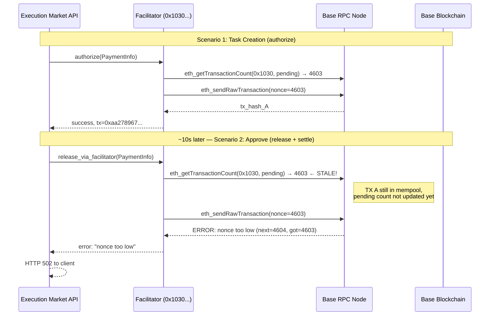

# Facilitator Bug Report: Nonce Desync Under Sequential Escrow Calls

> **Reporter**: Execution Market (Agent #2106 on Base ERC-8004)
> **Date**: 2026-02-12
> **Severity**: Medium (intermittent, causes 502/504 on burst traffic)
> **Facilitator URL**: `https://facilitator.ultravioletadao.xyz`
> **Network**: Base Mainnet (chain 8453)
> **Affected operations**: `authorize`, `release_via_facilitator`, `settle`

---

## Executive Summary

During E2E testing of Execution Market's full task lifecycle against our production API (`https://api.execution.market`), we consistently observe **intermittent nonce desync errors** when the Facilitator processes multiple escrow operations in rapid succession (< 10 seconds apart). The errors manifest as:

1. **"nonce too low"** errors from the Facilitator's transaction submission
2. **HTTP 502 Bad Gateway** when the ALB times out waiting for Facilitator response
3. **HTTP 504 Gateway Timeout** when the Facilitator takes > 60s to respond

Each individual operation works correctly in isolation. The bug only manifests when 2+ Facilitator calls happen within ~10 seconds of each other.

---

## Environment

| Component | Value |
|-----------|-------|
| **Our server** | ECS Fargate on `api.execution.market` (FastAPI + uvicorn) |
| **Payment mode** | `fase2` (on-chain escrow via x402r SDK) |
| **SDK** | `uvd-x402-sdk` (AdvancedEscrowClient) |
| **Facilitator** | `https://facilitator.ultravioletadao.xyz` |
| **Escrow contract** | AuthCaptureEscrow on Base |
| **PaymentOperator** | `0xb9635f544665758019159c04c08a3d583dadd723` |
| **Agent wallet (payer)** | `0xD3868E1eD738CED6945A574a7c769433BeD5d474` |
| **Facilitator EOA** | `0x103040545AC5031A11E8C03dd11324C7333a13C7` |
| **Token** | USDC (`0x833589fCD6eDb6E08f4c7C32D4f71b54bdA02913`) |
| **ALB idle timeout** | 60 seconds (AWS default) |

---

## Reproduction Steps

### What we're doing

We run 4 E2E scenarios sequentially with **10-second pauses** between them:

```
Scenario 1 (happy_path):     POST /tasks  →  [Facilitator: authorize]
                              POST /approve →  [Facilitator: release + 2× settle]
        --- 10s pause ---
Scenario 2 (cancel_path):    POST /tasks  →  [Facilitator: authorize]
                              POST /cancel →  [auth expiry, no facilitator call]
        --- 10s pause ---
Scenario 3 (rejection_path): POST /tasks  →  [Facilitator: authorize]
                              POST /reject →  [no payment, DB update only]
```

### Expected behavior

All 4 scenarios complete successfully every time. Each Facilitator call should return a valid TX hash.

### Actual behavior

When run in sequence, **1-2 out of 4 scenarios randomly fail** with nonce-related errors:

| Run | Scenario 1 (happy) | Scenario 2 (cancel) | Scenario 3 (reject) | Failure type |
|-----|----|----|----|----|
| Post-deploy #1 | PASS (authorize + release + 2× settle) | FAIL | PASS | 504 on authorize |
| Post-deploy #2 | FAIL (authorize OK, release → 502) | PASS | PASS | 502 on release/settle |
| Isolated cancel | PASS | - | - | Works alone |
| Isolated happy | PASS | - | - | Works alone |

**Key observation**: Every scenario works when run **in isolation** with >60s gap from any prior Facilitator call.

---

## Exact Error Messages Observed

### Error 1: "nonce too low"

This error comes from the Facilitator's RPC submission. The Facilitator signs and submits a TX with nonce N, but the RPC node has already seen nonce N from a prior TX that the Facilitator's local state hasn't caught up to yet.

```
nonce too low: next nonce 4604, tx nonce 4603
```

Observed during:
- `authorize` calls when a prior `settle` TX was still propagating
- `settle` calls when a prior `authorize` TX was still propagating

### Error 2: HTTP 502 Bad Gateway

The ALB receives an invalid/empty response from our ECS container because the underlying Facilitator call failed or timed out. Our server has a 30s timeout for Facilitator HTTP calls, but the ALB has a 60s idle timeout for the full request.

```json
{
  "_http_status": 502,
  "approve_data": {}
}
```

### Error 3: HTTP 504 Gateway Timeout

The full request chain (client → ALB → ECS → Facilitator) exceeds 60s.

```
Task creation failed: HTTP 504 -
```

---

## Facilitator API Calls We Make

### 1. `authorize` (task creation — locks funds in escrow)

Our code path:
```python
# payment_dispatcher.py, line 644
auth_result = await asyncio.to_thread(client.authorize, pi)
```

The SDK's `AdvancedEscrowClient.authorize(pi)` calls the Facilitator to:
1. Submit an `authorize()` TX to the AuthCaptureEscrow contract
2. The Facilitator signs this TX with its own EOA (`0x1030...`)
3. Gas is paid by the Facilitator (gasless for us)

**PaymentInfo structure** sent to Facilitator:
```python
PaymentInfo(
    operator="0xb9635f544665758019159c04c08a3d583dadd723",  # Our PaymentOperator
    receiver="0xD386...",  # Platform wallet
    token="0x8335...",     # USDC on Base
    max_amount=54000,      # $0.054 (bounty + 8% fee) in atomic units
    pre_approval_expiry=...,
    authorization_expiry=...,
    refund_expiry=...,
    min_fee_bps=0,
    max_fee_bps=800,       # 8%
    fee_receiver="0x0000000000000000000000000000000000000000",
    salt="0x...",          # Random per call
    chain_id=8453,
)
```

### 2. `release_via_facilitator` (task approval — releases escrowed funds)

Our code path:
```python
# payment_dispatcher.py, line 1100
release_result = await asyncio.to_thread(client.release_via_facilitator, pi)
```

Facilitator submits a `release()` TX to AuthCaptureEscrow. Requires the same `PaymentInfo` used in `authorize`.

### 3. `settle` (disbursement — EIP-3009 transfer)

Our code path:
```python
# sdk_client.py, line 925
resp = httpx.post(
    f"{self.facilitator_url}/settle",
    json=settle_request,
    timeout=30.0,
)
```

This is a standard x402 settlement call. We sign an EIP-3009 `transferWithAuthorization` off-chain, and the Facilitator submits it on-chain (gasless).

**Settle request structure:**
```json
{
  "x402Version": 1,
  "paymentPayload": {
    "signature": "0x...",
    "payload": {
      "from": "0xD386...",
      "to": "0x<worker_or_treasury>",
      "value": "50000",
      "validAfter": "0",
      "validBefore": "1739451600",
      "nonce": "0x<random_32_bytes>"
    }
  },
  "paymentRequirements": {
    "scheme": "exact",
    "network": "base",
    "maxAmountRequired": "50000",
    "resource": "https://api.execution.market/api/v1/tasks",
    "payTo": "0x<recipient>",
    "maxTimeoutSeconds": 300,
    "asset": "0x833589fCD6eDb6E08f4c7C32D4f71b54bdA02913"
  }
}
```

**Note**: Our EIP-3009 nonces are random (`secrets.token_hex(32)`) — they don't conflict. The nonce issue is with the **Facilitator's own EOA nonce** for submitting TXs to the RPC.

---

## Typical Approval Flow (3 sequential Facilitator calls)

When a task is approved, our server makes **3 Facilitator calls in series**:

```
Time 0s:   release_via_facilitator(pi)    → Facilitator TX (nonce N)
Time ~5s:  POST /settle (worker payment)  → Facilitator TX (nonce N+1)
Time ~10s: POST /settle (platform fee)    → Facilitator TX (nonce N+2)
```

If nonce N hasn't been mined/confirmed by the time nonce N+1 is submitted, the Facilitator may:
- Submit N+1 with the **same nonce as N** (if it tracks pending nonces locally and misses N)
- Submit N+1 with **N's nonce** because N hasn't been reflected in `eth_getTransactionCount(pending)` yet

---

## On-Chain Evidence

All TXs below are on **Base Mainnet**. Verify on BaseScan.

### Successful TXs (no nonce issues — ran with sufficient gaps)

| TX Hash | Operation | Amount | Status |
|---------|-----------|--------|--------|
| [`0xc6dc894bc9e9ecf4e54652c7258427350e38efb761aaae23d65247f8bcf34a67`](https://basescan.org/tx/0xc6dc894bc9e9ecf4e54652c7258427350e38efb761aaae23d65247f8bcf34a67) | Escrow authorize (happy path) | $0.054 | Success |
| [`0xff36a09a8ef3a7142ed75dbb22910d84f5168ec6ad21c614b56f02fa3c8419da`](https://basescan.org/tx/0xff36a09a8ef3a7142ed75dbb22910d84f5168ec6ad21c614b56f02fa3c8419da) | Payment release (happy path) | $0.05 → worker | Success |
| [`0x09581052311fc06b3980786d6f2b9725df689ea40343adfbc2549a93cc769d76`](https://basescan.org/tx/0x09581052311fc06b3980786d6f2b9725df689ea40343adfbc2549a93cc769d76) | Escrow authorize (cancel test) | $0.054 | Success |
| [`0x7b6ae910ec838ab3f0a0f12de5ef61a0ba3f9da895f44a29de171dafd7d69653`](https://basescan.org/tx/0x7b6ae910ec838ab3f0a0f12de5ef61a0ba3f9da895f44a29de171dafd7d69653) | Escrow authorize (rejection test) | $0.054 | Success |
| [`0xaa27896770a901e90c77351137d52ceb0e0601c15d6d61c77f8cceff1560fc2e`](https://basescan.org/tx/0xaa27896770a901e90c77351137d52ceb0e0601c15d6d61c77f8cceff1560fc2e) | Escrow authorize (happy, run 2) | $0.054 | Success |
| [`0xe9d4dbe77008242f4c3a32840e9a6db4ff7ed991d18db955dbd6d240a35e4c56`](https://basescan.org/tx/0xe9d4dbe77008242f4c3a32840e9a6db4ff7ed991d18db955dbd6d240a35e4c56) | Escrow authorize (reject, run 2) | $0.054 | Success |

### Failed calls (no TX produced — nonce error before submission)

| Timestamp (UTC) | Operation | Error | Context |
|-----------------|-----------|-------|---------|
| 2026-02-12 ~13:07:45 | `approve` (release + settle) | HTTP 502 | Ran ~12s after prior `authorize` |
| 2026-02-12 ~13:08:40 | `authorize` (task creation) | HTTP 504 | Ran ~10s after prior `settle` |
| Earlier runs | `settle` | "nonce too low: next nonce 4604, tx nonce 4603" | < 10s after prior `settle` |
| Earlier runs | `settle` | "nonce too low: next nonce 4587, tx nonce 4586" | Rapid sequential calls |

---

## Root Cause Hypothesis

The Facilitator EOA (`0x103040545AC5031A11E8C03dd11324C7333a13C7`) uses a **single nonce sequence** for all on-chain transactions. When multiple clients (or the same client rapidly) request transactions, the Facilitator's nonce tracking falls behind:

```
                          Facilitator Internal State
                          ─────────────────────────
Request A arrives    →    nonce = 4603, submit TX with nonce 4603
Request B arrives    →    nonce = 4603 (still!), submit TX with nonce 4603  ← CONFLICT
TX A confirms        →    on-chain nonce now 4604
TX B rejected        →    "nonce too low: next nonce 4604, tx nonce 4603"
```

### Why this happens

1. **No nonce reservation**: The Facilitator likely reads `eth_getTransactionCount(address, "pending")` before each TX, but "pending" state on Base RPC nodes can lag by 1-2 seconds behind actual mempool state
2. **No local nonce queue**: If 2 requests arrive within the same RPC polling interval, both get the same nonce
3. **No retry with nonce bump**: When "nonce too low" occurs, the Facilitator doesn't auto-retry with nonce+1
4. **Single-threaded nonce lock?**: Possibly no mutex/lock protecting the nonce counter across concurrent requests

---

## Suggested Fix (from our side, as consumers)

We've already implemented:
- **10-second pauses** between scenarios to allow nonce propagation
- **120-second client timeout** (though ALB limits to 60s)
- **Non-blocking fee collection**: Worker payment succeeds even if fee TX fails

### What we think could help on the Facilitator side

1. **Local nonce counter with mutex**: Instead of reading nonce from RPC each time, maintain an in-memory counter protected by a lock. Increment atomically per TX submission.

2. **Optimistic nonce management**: Track pending TXs locally. When submitting TX N+1, don't wait for TX N to be mined — use `nonce = last_submitted + 1` instead of `eth_getTransactionCount`.

3. **Retry with nonce bump**: On "nonce too low" error, automatically retry with `failed_nonce + 1` (up to 3 retries).

4. **Per-payer nonce queuing**: If multiple payers/operators are submitting through the same Facilitator, ensure nonce tracking is per-account (it may already be, but worth checking).

5. **TX receipt polling before returning**: Instead of returning as soon as the TX is submitted, optionally wait for 1 confirmation before returning the TX hash. This ensures the next caller gets an accurate nonce from `eth_getTransactionCount`.

---

## Sequence Diagram



---

## Impact on Execution Market

- **Production**: Low impact currently — real tasks are created hours apart, not seconds
- **E2E testing**: High impact — automated test suites run scenarios in rapid succession
- **Future scaling**: As volume increases, concurrent task creation/approval will hit this more frequently
- **Agent SDK users**: External AI agents using our MCP tools may batch-create tasks

---

## Reproduction Script

Our full E2E test script is at `scripts/e2e_mcp_api.py`. To reproduce the nonce issue:

```bash
# Run all 4 scenarios in sequence (10s pauses between them)
python scripts/e2e_mcp_api.py

# To see the issue more consistently, reduce pauses:
# Edit the script to remove `await asyncio.sleep(10)` lines
# Then run — failures should be frequent
```

Or hit the Facilitator directly with 3 rapid calls:

```python
import httpx, time

FACILITATOR = "https://facilitator.ultravioletadao.xyz"

# Call 1: authorize
resp1 = httpx.post(f"{FACILITATOR}/settle", json={...}, timeout=30)
print(f"Call 1: {resp1.status_code}")  # Usually OK

# No pause — immediate second call
resp2 = httpx.post(f"{FACILITATOR}/settle", json={...}, timeout=30)
print(f"Call 2: {resp2.status_code}")  # Likely "nonce too low"

# No pause — immediate third call
resp3 = httpx.post(f"{FACILITATOR}/settle", json={...}, timeout=30)
print(f"Call 3: {resp3.status_code}")  # Likely "nonce too low"
```

---

## Contact

- **Project**: Execution Market (`https://execution.market`)
- **Agent ID**: 2106 (Base ERC-8004)
- **GitHub**: [@ultravioletadao](https://github.com/ultravioletadao)
- **Developer**: 0xultravioleta (`0xultravioleta@gmail.com`)
