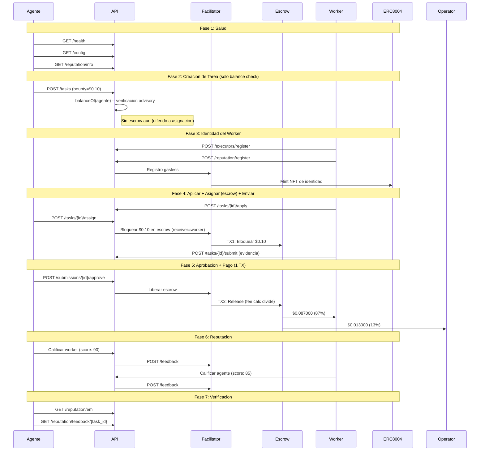

# Reporte Golden Flow -- Prueba de Aceptacion E2E Definitiva (Fase 5)

> **Fecha**: 2026-02-21 16:42 UTC
> **Entorno**: Produccion (Base Mainnet, chain 8453)
> **API**: `https://api.execution.market`
> **Modelo de fee**: credit_card (fee descontado del bounty on-chain)
> **Modo escrow**: direct_release (escrow en asignacion, 1-TX release)
> **Token**: USDC (`0x833589fCD6eDb6E08f4c7C32D4f71b54bdA02913`)
> **Resultado**: **PARTIAL**

---

## Resumen Ejecutivo

El Golden Flow probo el ciclo de vida completo de Execution Market end-to-end 
en produccion contra Base Mainnet usando el modelo de fee credit card (Fase 5) con **USDC**. 6/7 fases pasaron.

**Resultado General: PARTIAL**

---

## Configuracion de Prueba

| Parametro | Valor |
|-----------|-------|
| Token de pago | USDC |
| Contrato del token | `0x833589fCD6eDb6E08f4c7C32D4f71b54bdA02913` |
| Bounty (monto bloqueado) | $0.10 USDC |
| Worker neto (87%) | $0.087000 USDC |
| Fee operador (13%) | $0.013000 USDC |
| Costo total para agente | $0.10 USDC |
| Modelo de fee | credit_card |
| Modo escrow | direct_release |
| Wallet del Worker | `0x52E05C8e45a32eeE169639F6d2cA40f8887b5A15` |
| Treasury | `0xae07ceb6b395bc685a776a0b4c489e8d9ce9a6ad` |
| API Base | `https://api.execution.market` |
| EM Agent ID | 2106 |

---

## Diagrama de Flujo

---

## Resultados por Fase

| # | Fase | Estado | Tiempo |
|---|------|--------|--------|
| 1 | Salud y Configuracion | **APROBADO** | 0.68s |
| 2 | Creacion de Tarea (Balance Check) | **APROBADO** | 1.79s |
| 3 | Registro de Worker e Identidad | **APROBADO** | 14.77s |
| 4 | Ciclo de Vida (Aplicar -> Asignar+Escrow -> Enviar) | **APROBADO** | 6.35s |
| 5 | Aprobacion y Pago (1 TX, Credit Card) | **APROBADO** | 9.17s |
| 6 | Reputacion Bidireccional | **PARCIAL** | 10.39s |
| 7 | Verificacion Final | **APROBADO** | 0.28s |

---

## Salud y Configuracion

- **Estado**: APROBADO
- **Tiempo**: 0.68s

## Creacion de Tarea (Balance Check)

- **Estado**: APROBADO
- **Tiempo**: 1.79s
- **Task ID**: `f268ca0e-58ee-4098-9c62-a5c50377aace`
- **Escrow en creacion**: False
- **Modelo de fee**: credit_card

## Registro de Worker e Identidad

- **Estado**: APROBADO
- **Tiempo**: 14.77s
- **Executor ID**: `803dfbf1-7b91-4a41-8d31-518f4fa2fcd4`
- **ERC-8004 Agent ID**: 18703

## Ciclo de Vida (Aplicar -> Asignar+Escrow -> Enviar)

- **Estado**: APROBADO
- **Tiempo**: 6.35s
- **Submission ID**: `9c944a3d-0b9e-4007-ae85-f3732c465ed5`
- **TX Escrow (en asignacion)**: [`0xe4ef496f0f6650...`](https://basescan.org/tx/0xe4ef496f0f6650917bb673c8512ab70a4ac41c073234234d38a0aff179101ed3)
- **Escrow verificado**: True
- **Modo escrow**: direct_release

## Aprobacion y Pago (1 TX, Credit Card)

- **Estado**: APROBADO
- **Tiempo**: 9.17s
- **Modo de pago**: `fase2`
- **TX Worker**: [`0x28b06ffaaa0578...`](https://basescan.org/tx/0x28b06ffaaa0578e0215539fc3295eec9b87fdf053bc671e82de6ea0889079b17)

### Verificacion de Fee (Modelo Credit Card)

| Metrica | Esperado | Actual | Coincide |
|---------|----------|--------|----------|
| Neto worker (87%) | $0.087000 | $0.087000 | SI |
| Fee operador (13%) | $0.013000 | $0.013000 | SI |
| Monto bloqueado | $0.100000 | $0.100000 | SI |

## Reputacion Bidireccional

- **Estado**: PARCIAL
- **Tiempo**: 10.39s
- **Error**: Worker->Agent: HTTP 200, success=False, error=On-chain signing failed: 'SignedTransaction' object has no attribute 'raw_transaction'
- **TX Agente->Worker**: [`e4082b0580729763...`](https://basescan.org/tx/e4082b05807297631989924c654207d8b83e07f358291b3e8958d1a845a58b43)

## Verificacion Final

- **Estado**: APROBADO
- **Tiempo**: 0.28s

---

## Resumen de Transacciones On-Chain

| # | TX Hash | BaseScan |
|---|---------|----------|
| 1 | `0xbe4b7d498d7077b37c...` | [Ver](https://basescan.org/tx/0xbe4b7d498d7077b37c57618ab32e4b2e80214dc9b2ba6058d11ae179707d781c) |
| 2 | `0xe4ef496f0f6650917b...` | [Ver](https://basescan.org/tx/0xe4ef496f0f6650917bb673c8512ab70a4ac41c073234234d38a0aff179101ed3) |
| 3 | `0x28b06ffaaa0578e021...` | [Ver](https://basescan.org/tx/0x28b06ffaaa0578e0215539fc3295eec9b87fdf053bc671e82de6ea0889079b17) |
| 4 | `e4082b05807297631989...` | [Ver](https://basescan.org/tx/e4082b05807297631989924c654207d8b83e07f358291b3e8958d1a845a58b43) |

---

## Invariantes Verificados

- [x] API saludable y retornando configuracion correcta
- [x] Tarea creada exitosamente con status published (solo balance check)
- [x] Escrow bloqueado en asignacion (direct_release, worker como receiver)
- [x] TX de escrow verificada on-chain (status: SUCCESS)
- [x] Worker registrado con executor ID
- [x] Worker recibe $0.087000 (87% del bounty, modelo credit card)
- [x] Operador recibe $0.013000 (13% fee calculator on-chain)
- [x] Todas las TXs de pago verificadas on-chain (status: 0x1)
- [x] Release de escrow en 1 TX (fee split por StaticFeeCalculator 1300bps)
