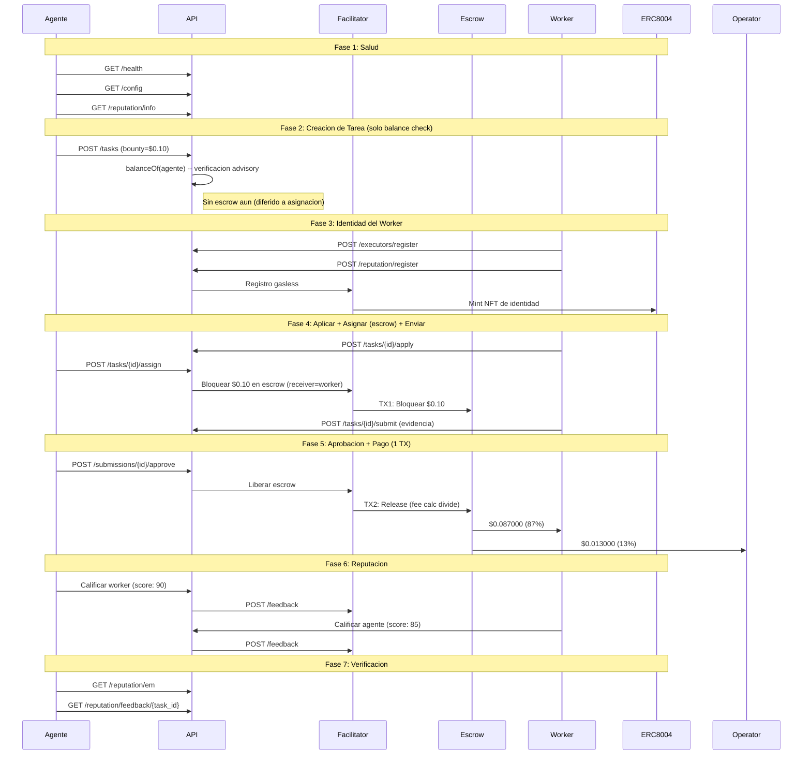

# Reporte Golden Flow -- Prueba de Aceptacion E2E Definitiva (Fase 5)

> **Fecha**: 2026-02-22 02:08 UTC
> **Entorno**: Produccion (Base Mainnet, chain 8453)
> **API**: `https://api.execution.market`
> **Modelo de fee**: credit_card (fee descontado del bounty on-chain)
> **Modo escrow**: direct_release (escrow en asignacion, 1-TX release)
> **Token**: EURC (`0x60a3E35Cc302bFA44Cb288Bc5a4F316Fdb1adb42`)
> **Resultado**: **PARTIAL**

---

## Resumen Ejecutivo

El Golden Flow probo el ciclo de vida completo de Execution Market end-to-end 
en produccion contra Base Mainnet usando el modelo de fee credit card (Fase 5) con **EURC**. 6/7 fases pasaron.

**Resultado General: PARTIAL**

---

## Configuracion de Prueba

| Parametro | Valor |
|-----------|-------|
| Token de pago | EURC |
| Contrato del token | `0x60a3E35Cc302bFA44Cb288Bc5a4F316Fdb1adb42` |
| Bounty (monto bloqueado) | $0.10 EURC |
| Worker neto (87%) | $0.087000 EURC |
| Fee operador (13%) | $0.013000 EURC |
| Costo total para agente | $0.10 EURC |
| Modelo de fee | credit_card |
| Modo escrow | direct_release |
| Wallet del Worker | `0x52E05C8e45a32eeE169639F6d2cA40f8887b5A15` |
| Treasury | `0xae07ceb6b395bc685a776a0b4c489e8d9ce9a6ad` |
| API Base | `https://api.execution.market` |
| EM Agent ID | 2106 |

---

## Diagrama de Flujo

---

## Resultados por Fase

| # | Fase | Estado | Tiempo |
|---|------|--------|--------|
| 1 | Salud y Configuracion | **APROBADO** | 1.04s |
| 2 | Creacion de Tarea (Balance Check) | **APROBADO** | 1.73s |
| 3 | Registro de Worker e Identidad | **APROBADO** | 14.55s |
| 4 | Ciclo de Vida (Aplicar -> Asignar+Escrow -> Enviar) | **APROBADO** | 6.56s |
| 5 | Aprobacion y Pago (1 TX, Credit Card) | **APROBADO** | 34.99s |
| 6 | Reputacion Bidireccional | **PARCIAL** | 2.39s |
| 7 | Verificacion Final | **APROBADO** | 0.26s |

---

## Salud y Configuracion

- **Estado**: APROBADO
- **Tiempo**: 1.04s

## Creacion de Tarea (Balance Check)

- **Estado**: APROBADO
- **Tiempo**: 1.73s
- **Task ID**: `82f73432-d49b-46f6-9366-aa4c1021f11e`
- **Escrow en creacion**: False
- **Modelo de fee**: credit_card

## Registro de Worker e Identidad

- **Estado**: APROBADO
- **Tiempo**: 14.55s
- **Executor ID**: `803dfbf1-7b91-4a41-8d31-518f4fa2fcd4`
- **ERC-8004 Agent ID**: 18773

## Ciclo de Vida (Aplicar -> Asignar+Escrow -> Enviar)

- **Estado**: APROBADO
- **Tiempo**: 6.56s
- **Submission ID**: `37dc2267-3d7d-4af8-ac3d-db38ea6e573c`
- **TX Escrow (en asignacion)**: [`0xb539db8e953026...`](https://basescan.org/tx/0xb539db8e953026589a91c24423dc932160c72f37063be61d93cb1be617c3dc2e)
- **Escrow verificado**: True
- **Modo escrow**: direct_release

## Aprobacion y Pago (1 TX, Credit Card)

- **Estado**: APROBADO
- **Tiempo**: 34.99s
- **Modo de pago**: `fase2`
- **TX Worker**: [`0xc4cfe70190194f...`](https://basescan.org/tx/0xc4cfe70190194f62bf0fbd190f39cac607082218b0b17d6ec2b54752b2c66f7c)

### Verificacion de Fee (Modelo Credit Card)

| Metrica | Esperado | Actual | Coincide |
|---------|----------|--------|----------|
| Neto worker (87%) | $0.087000 | $0.087000 | SI |
| Fee operador (13%) | $0.013000 | $0.013000 | SI |
| Monto bloqueado | $0.100000 | $0.100000 | SI |

## Reputacion Bidireccional

- **Estado**: PARCIAL
- **Tiempo**: 2.39s
- **Error**: Worker->Agent: HTTP 200, success=False, error=On-chain signing failed: 'SignedTransaction' object has no attribute 'raw_transaction'
- **TX Agente->Worker**: [`0b9284ac6baefe0f...`](https://basescan.org/tx/0b9284ac6baefe0f08163643022201ad690d39b914d0b054b7272a909664bf23)

## Verificacion Final

- **Estado**: APROBADO
- **Tiempo**: 0.26s

---

## Resumen de Transacciones On-Chain

| # | TX Hash | BaseScan |
|---|---------|----------|
| 1 | `0x459afafcb963ae0fdc...` | [Ver](https://basescan.org/tx/0x459afafcb963ae0fdcb795fc6737a00da8b58c9246544a85f1c3707a792d44cc) |
| 2 | `0xb539db8e953026589a...` | [Ver](https://basescan.org/tx/0xb539db8e953026589a91c24423dc932160c72f37063be61d93cb1be617c3dc2e) |
| 3 | `0xc4cfe70190194f62bf...` | [Ver](https://basescan.org/tx/0xc4cfe70190194f62bf0fbd190f39cac607082218b0b17d6ec2b54752b2c66f7c) |
| 4 | `0b9284ac6baefe0f0816...` | [Ver](https://basescan.org/tx/0b9284ac6baefe0f08163643022201ad690d39b914d0b054b7272a909664bf23) |

---

## Invariantes Verificados

- [x] API saludable y retornando configuracion correcta
- [x] Tarea creada exitosamente con status published (solo balance check)
- [x] Escrow bloqueado en asignacion (direct_release, worker como receiver)
- [x] TX de escrow verificada on-chain (status: SUCCESS)
- [x] Worker registrado con executor ID
- [x] Worker recibe $0.087000 (87% del bounty, modelo credit card)
- [x] Operador recibe $0.013000 (13% fee calculator on-chain)
- [x] Todas las TXs de pago verificadas on-chain (status: 0x1)
- [x] Release de escrow en 1 TX (fee split por StaticFeeCalculator 1300bps)
