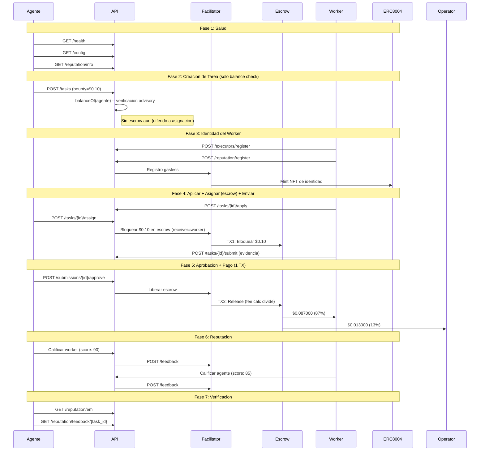

# Reporte Golden Flow -- Prueba de Aceptacion E2E Definitiva (Fase 5)

> **Fecha**: 2026-02-14 17:55 UTC
> **Entorno**: Produccion (Base Mainnet, chain 8453)
> **API**: `https://api.execution.market`
> **Modelo de fee**: credit_card (fee descontado del bounty on-chain)
> **Modo escrow**: direct_release (escrow en asignacion, 1-TX release)
> **Resultado**: **PASS**

---

## Resumen Ejecutivo

El Golden Flow probo el ciclo de vida completo de Execution Market end-to-end 
en produccion contra Base Mainnet usando el modelo de fee credit card (Fase 5). 7/7 fases pasaron.

**Resultado General: PASS**

---

## Configuracion de Prueba

| Parametro | Valor |
|-----------|-------|
| Bounty (monto bloqueado) | $0.10 USDC |
| Worker neto (87%) | $0.087000 USDC |
| Fee operador (13%) | $0.013000 USDC |
| Costo total para agente | $0.10 USDC |
| Modelo de fee | credit_card |
| Modo escrow | direct_release |
| Wallet del Worker | `0x52E05C8e45a32eeE169639F6d2cA40f8887b5A15` |
| Treasury | `0xae07ceb6b395bc685a776a0b4c489e8d9ce9a6ad` |
| API Base | `https://api.execution.market` |
| EM Agent ID | 2106 |

---

## Diagrama de Flujo

---

## Resultados por Fase

| # | Fase | Estado | Tiempo |
|---|------|--------|--------|
| 1 | Salud y Configuracion | **APROBADO** | 0.93s |
| 2 | Creacion de Tarea (Balance Check) | **APROBADO** | 91.33s |
| 3 | Registro de Worker e Identidad | **APROBADO** | 7.14s |
| 4 | Ciclo de Vida (Aplicar -> Asignar+Escrow -> Enviar) | **APROBADO** | 6.26s |
| 5 | Aprobacion y Pago (1 TX, Credit Card) | **APROBADO** | 27.59s |
| 6 | Reputacion Bidireccional | **APROBADO** | 8.3s |
| 7 | Verificacion Final | **APROBADO** | 0.28s |

---

## Salud y Configuracion

- **Estado**: APROBADO
- **Tiempo**: 0.93s

## Creacion de Tarea (Balance Check)

- **Estado**: APROBADO
- **Tiempo**: 91.33s
- **Task ID**: `7b4c0175-9ba6-4c93-84e9-36bebe0ec25a`
- **Escrow en creacion**: False
- **Modelo de fee**: credit_card

## Registro de Worker e Identidad

- **Estado**: APROBADO
- **Tiempo**: 7.14s
- **Executor ID**: `803dfbf1-7b91-4a41-8d31-518f4fa2fcd4`

## Ciclo de Vida (Aplicar -> Asignar+Escrow -> Enviar)

- **Estado**: APROBADO
- **Tiempo**: 6.26s
- **Submission ID**: `2a68a56e-e5e7-4412-ba9f-7882afec8d90`
- **TX Escrow (en asignacion)**: [`0xba6f704383a176...`](https://basescan.org/tx/0xba6f704383a176fcb2c2d7e52755c41bdaec1cf626564288637e87875051078a)
- **Escrow verificado**: True
- **Modo escrow**: direct_release

## Aprobacion y Pago (1 TX, Credit Card)

- **Estado**: APROBADO
- **Tiempo**: 27.59s
- **Modo de pago**: `fase2`
- **TX Worker**: [`0xa86bdcf8b05a6e...`](https://basescan.org/tx/0xa86bdcf8b05a6ebcbf1d2f6b9cfe0777ad66f908f92610bb57099e42ad37f5e6)

### Verificacion de Fee (Modelo Credit Card)

| Metrica | Esperado | Actual | Coincide |
|---------|----------|--------|----------|
| Neto worker (87%) | $0.087000 | $0.087000 | SI |
| Fee operador (13%) | $0.013000 | $0.013000 | SI |
| Monto bloqueado | $0.100000 | $0.100000 | SI |

## Reputacion Bidireccional

- **Estado**: APROBADO
- **Tiempo**: 8.3s
- **TX Agente->Worker**: [`fe74cf95c5d7817a...`](https://basescan.org/tx/fe74cf95c5d7817a1e677b96a2eb384366df6026717f705348051905729ef12b)
- **TX Worker->Agente**: [`18468ee223fa6bc5...`](https://basescan.org/tx/18468ee223fa6bc5db24e72a3626228358875ee6d94fd04e33e3cd763c537887)

## Verificacion Final

- **Estado**: APROBADO
- **Tiempo**: 0.28s

---

## Resumen de Transacciones On-Chain

| # | TX Hash | BaseScan |
|---|---------|----------|
| 1 | `0xba6f704383a176fcb2...` | [Ver](https://basescan.org/tx/0xba6f704383a176fcb2c2d7e52755c41bdaec1cf626564288637e87875051078a) |
| 2 | `0xa86bdcf8b05a6ebcbf...` | [Ver](https://basescan.org/tx/0xa86bdcf8b05a6ebcbf1d2f6b9cfe0777ad66f908f92610bb57099e42ad37f5e6) |
| 3 | `fe74cf95c5d7817a1e67...` | [Ver](https://basescan.org/tx/fe74cf95c5d7817a1e677b96a2eb384366df6026717f705348051905729ef12b) |
| 4 | `18468ee223fa6bc5db24...` | [Ver](https://basescan.org/tx/18468ee223fa6bc5db24e72a3626228358875ee6d94fd04e33e3cd763c537887) |

---

## Invariantes Verificados

- [x] API saludable y retornando configuracion correcta
- [x] Tarea creada exitosamente con status published (solo balance check)
- [x] Escrow bloqueado en asignacion (direct_release, worker como receiver)
- [x] TX de escrow verificada on-chain (status: SUCCESS)
- [x] Worker registrado con executor ID
- [x] Worker recibe $0.087000 (87% del bounty, modelo credit card)
- [x] Operador recibe $0.013000 (13% fee calculator on-chain)
- [x] Todas las TXs de pago verificadas on-chain (status: 0x1)
- [x] Release de escrow en 1 TX (fee split por StaticFeeCalculator 1300bps)
- [x] Reputacion bidireccional: agente califico worker Y worker califico agente
