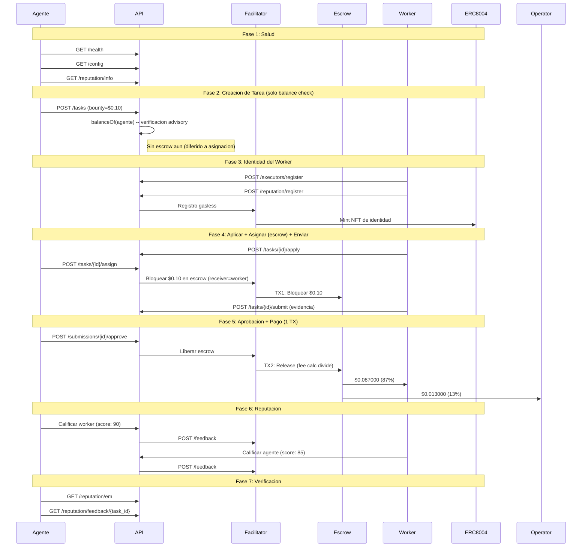

# Reporte Golden Flow -- Prueba de Aceptacion E2E Definitiva (Fase 5)

> **Fecha**: 2026-02-21 03:51 UTC
> **Entorno**: Produccion (Base Mainnet, chain 8453)
> **API**: `https://api.execution.market`
> **Modelo de fee**: credit_card (fee descontado del bounty on-chain)
> **Modo escrow**: direct_release (escrow en asignacion, 1-TX release)
> **Token**: USDC (`0x833589fCD6eDb6E08f4c7C32D4f71b54bdA02913`)
> **Resultado**: **FAIL**

---

## Resumen Ejecutivo

El Golden Flow probo el ciclo de vida completo de Execution Market end-to-end 
en produccion contra Base Mainnet usando el modelo de fee credit card (Fase 5) con **USDC**. 6/7 fases pasaron.

**Resultado General: FAIL**

---

## Configuracion de Prueba

| Parametro | Valor |
|-----------|-------|
| Token de pago | USDC |
| Contrato del token | `0x833589fCD6eDb6E08f4c7C32D4f71b54bdA02913` |
| Bounty (monto bloqueado) | $0.10 USDC |
| Worker neto (87%) | $0.087000 USDC |
| Fee operador (13%) | $0.013000 USDC |
| Costo total para agente | $0.10 USDC |
| Modelo de fee | credit_card |
| Modo escrow | direct_release |
| Wallet del Worker | `0x52E05C8e45a32eeE169639F6d2cA40f8887b5A15` |
| Treasury | `0xae07ceb6b395bc685a776a0b4c489e8d9ce9a6ad` |
| API Base | `https://api.execution.market` |
| EM Agent ID | 2106 |

---

## Diagrama de Flujo

---

## Resultados por Fase

| # | Fase | Estado | Tiempo |
|---|------|--------|--------|
| 1 | Salud y Configuracion | **APROBADO** | 0.69s |
| 2 | Creacion de Tarea (Balance Check) | **APROBADO** | 1.34s |
| 3 | Registro de Worker e Identidad | **APROBADO** | 14.78s |
| 4 | Ciclo de Vida (Aplicar -> Asignar+Escrow -> Enviar) | **APROBADO** | 3.37s |
| 5 | Aprobacion y Pago (1 TX, Credit Card) | **APROBADO** | 21.82s |
| 6 | Reputacion Bidireccional | **FALLIDO** | 1.56s |
| 7 | Verificacion Final | **APROBADO** | 0.25s |

---

## Salud y Configuracion

- **Estado**: APROBADO
- **Tiempo**: 0.69s

## Creacion de Tarea (Balance Check)

- **Estado**: APROBADO
- **Tiempo**: 1.34s
- **Task ID**: `bb163aa1-ced1-453b-a776-92dc08798a64`
- **Escrow en creacion**: False
- **Modelo de fee**: credit_card

## Registro de Worker e Identidad

- **Estado**: APROBADO
- **Tiempo**: 14.78s
- **Executor ID**: `803dfbf1-7b91-4a41-8d31-518f4fa2fcd4`
- **ERC-8004 Agent ID**: 18613

## Ciclo de Vida (Aplicar -> Asignar+Escrow -> Enviar)

- **Estado**: APROBADO
- **Tiempo**: 3.37s
- **Submission ID**: `746e2d05-821d-4293-b795-6b95e3433840`
- **TX Escrow (en asignacion)**: [`0xe1b35ff5308811...`](https://basescan.org/tx/0xe1b35ff5308811201323e7e5cc12fe25d2e812a7cd196564a62c86f7f8540665)
- **Escrow verificado**: True
- **Modo escrow**: direct_release

## Aprobacion y Pago (1 TX, Credit Card)

- **Estado**: APROBADO
- **Tiempo**: 21.82s
- **Modo de pago**: `unknown`
- **TX Worker**: [`0x4e65280ba444f5...`](https://basescan.org/tx/0x4e65280ba444f55e1d5971ad2e54026cb4003ee33296f99f7bb6aa58973b0499)

## Reputacion Bidireccional

- **Estado**: FALLIDO
- **Tiempo**: 1.56s
- **Error**: Unexpected error: 'charmap' codec can't encode characters in position 9-10: character maps to <undefined>

## Verificacion Final

- **Estado**: APROBADO
- **Tiempo**: 0.25s

---

## Resumen de Transacciones On-Chain

| # | TX Hash | BaseScan |
|---|---------|----------|
| 1 | `0x3a6920303c335fd6d9...` | [Ver](https://basescan.org/tx/0x3a6920303c335fd6d9fa3e47a4b21aa282e04b1d7522eb042efa215968c4c923) |
| 2 | `0xe1b35ff53088112013...` | [Ver](https://basescan.org/tx/0xe1b35ff5308811201323e7e5cc12fe25d2e812a7cd196564a62c86f7f8540665) |
| 3 | `0x4e65280ba444f55e1d...` | [Ver](https://basescan.org/tx/0x4e65280ba444f55e1d5971ad2e54026cb4003ee33296f99f7bb6aa58973b0499) |
| 4 | `db0d363f119ebd91ef69...` | [Ver](https://basescan.org/tx/db0d363f119ebd91ef696c7eef1fc5b67db9e4e7fc42a69f6c1d467db7e8aca2) |

---

## Invariantes Verificados

- [x] API saludable y retornando configuracion correcta
- [x] Tarea creada exitosamente con status published (solo balance check)
- [x] Escrow bloqueado en asignacion (direct_release, worker como receiver)
- [x] TX de escrow verificada on-chain (status: SUCCESS)
- [x] Worker registrado con executor ID
- [x] Operador recibe $0.013000 (13% fee calculator on-chain)
- [x] Todas las TXs de pago verificadas on-chain (status: 0x1)
- [x] Release de escrow en 1 TX (fee split por StaticFeeCalculator 1300bps)
