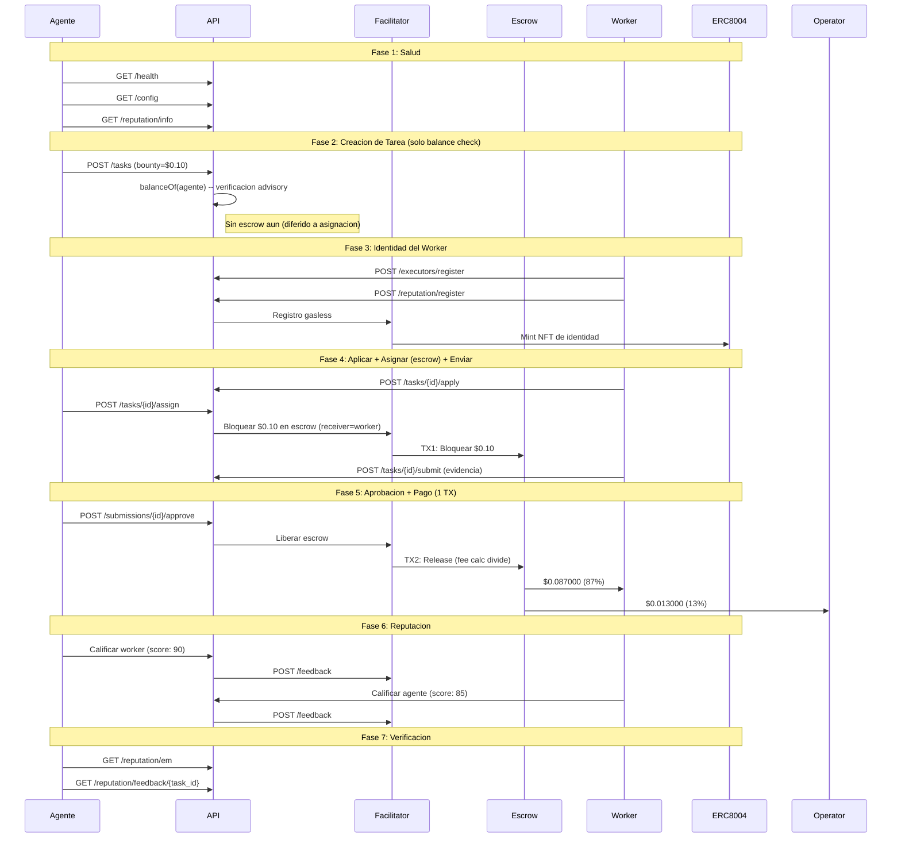

# Reporte Golden Flow -- Prueba de Aceptacion E2E Definitiva (Fase 5)

> **Fecha**: 2026-02-14 04:05 UTC
> **Entorno**: Produccion (Base Mainnet, chain 8453)
> **API**: `https://api.execution.market`
> **Modelo de fee**: credit_card (fee descontado del bounty on-chain)
> **Modo escrow**: direct_release (escrow en asignacion, 1-TX release)
> **Resultado**: **PARTIAL**

---

## Resumen Ejecutivo

El Golden Flow probo el ciclo de vida completo de Execution Market end-to-end 
en produccion contra Base Mainnet usando el modelo de fee credit card (Fase 5). 6/7 fases pasaron.

**Resultado General: PARTIAL**

---

## Configuracion de Prueba

| Parametro | Valor |
|-----------|-------|
| Bounty (monto bloqueado) | $0.10 USDC |
| Worker neto (87%) | $0.087000 USDC |
| Fee operador (13%) | $0.013000 USDC |
| Costo total para agente | $0.10 USDC |
| Modelo de fee | credit_card |
| Modo escrow | direct_release |
| Wallet del Worker | `0x52E05C8e45a32eeE169639F6d2cA40f8887b5A15` |
| Treasury | `0xae07ceb6b395bc685a776a0b4c489e8d9ce9a6ad` |
| API Base | `https://api.execution.market` |
| EM Agent ID | 2106 |

---

## Diagrama de Flujo

---

## Resultados por Fase

| # | Fase | Estado | Tiempo |
|---|------|--------|--------|
| 1 | Salud y Configuracion | **APROBADO** | 11.94s |
| 2 | Creacion de Tarea (Balance Check) | **APROBADO** | 91.85s |
| 3 | Registro de Worker e Identidad | **APROBADO** | 7.5s |
| 4 | Ciclo de Vida (Aplicar -> Asignar+Escrow -> Enviar) | **APROBADO** | 8.02s |
| 5 | Aprobacion y Pago (1 TX, Credit Card) | **APROBADO** | 42.94s |
| 6 | Reputacion Bidireccional | **PARCIAL** | 66.31s |
| 7 | Verificacion Final | **APROBADO** | 0.27s |

---

## Salud y Configuracion

- **Estado**: APROBADO
- **Tiempo**: 11.94s

## Creacion de Tarea (Balance Check)

- **Estado**: APROBADO
- **Tiempo**: 91.85s
- **Task ID**: `e2215052-7436-48d7-bfe4-16447c2b6b03`
- **Escrow en creacion**: False
- **Modelo de fee**: credit_card

## Registro de Worker e Identidad

- **Estado**: APROBADO
- **Tiempo**: 7.5s
- **Executor ID**: `803dfbf1-7b91-4a41-8d31-518f4fa2fcd4`

## Ciclo de Vida (Aplicar -> Asignar+Escrow -> Enviar)

- **Estado**: APROBADO
- **Tiempo**: 8.02s
- **Submission ID**: `88329014-1d0b-4553-b018-ff31306f9ea7`
- **TX Escrow (en asignacion)**: [`0x0e8a29356f9dcc...`](https://basescan.org/tx/0x0e8a29356f9dcc8f3bd52378ae4dad210344935edb48f859d1fb1b7dd3915530)
- **Escrow verificado**: True
- **Modo escrow**: direct_release

## Aprobacion y Pago (1 TX, Credit Card)

- **Estado**: APROBADO
- **Tiempo**: 42.94s
- **Modo de pago**: `fase2`
- **TX Worker**: [`0x48110f7a38936e...`](https://basescan.org/tx/0x48110f7a38936ee6816dbf7ce5ba827f0b1c48d6e1f5ba2fe01fe3eda1ffaa6c)

## Reputacion Bidireccional

- **Estado**: PARCIAL
- **Tiempo**: 66.31s
- **Error**: Agent->Worker: HTTP 200, success=False, error=; Worker->Agent: HTTP 200, success=False, error=

## Verificacion Final

- **Estado**: APROBADO
- **Tiempo**: 0.27s

---

## Resumen de Transacciones On-Chain

| # | TX Hash | BaseScan |
|---|---------|----------|
| 1 | `0x0e8a29356f9dcc8f3b...` | [Ver](https://basescan.org/tx/0x0e8a29356f9dcc8f3bd52378ae4dad210344935edb48f859d1fb1b7dd3915530) |
| 2 | `0x48110f7a38936ee681...` | [Ver](https://basescan.org/tx/0x48110f7a38936ee6816dbf7ce5ba827f0b1c48d6e1f5ba2fe01fe3eda1ffaa6c) |

---

## Invariantes Verificados

- [x] API saludable y retornando configuracion correcta
- [x] Tarea creada exitosamente con status published (solo balance check)
- [x] Escrow bloqueado en asignacion (direct_release, worker como receiver)
- [x] TX de escrow verificada on-chain (status: SUCCESS)
- [x] Worker registrado con executor ID
- [x] Todas las TXs de pago verificadas on-chain (status: 0x1)
- [x] Release de escrow en 1 TX (fee split por StaticFeeCalculator 1300bps)
