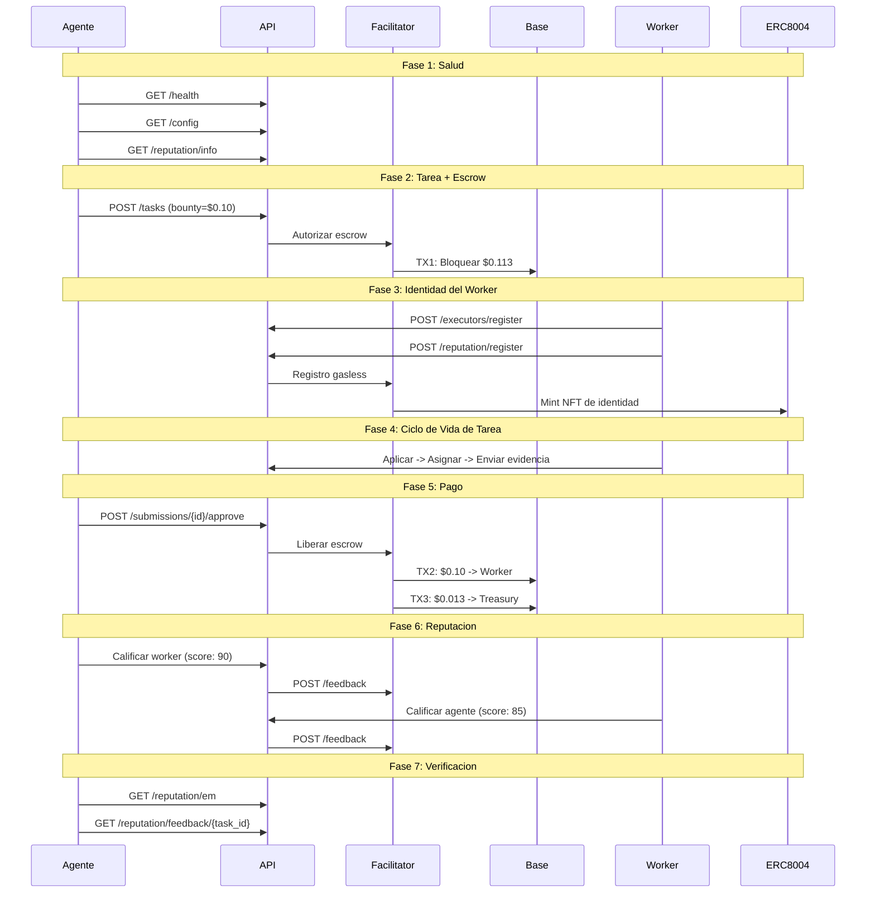

# Reporte Golden Flow -- Prueba de Aceptacion E2E Definitiva

> **Fecha**: 2026-02-13 23:43 UTC
> **Entorno**: Produccion (Base Mainnet, chain 8453)
> **API**: `https://api.execution.market`
> **Resultado**: **PASS**

---

## Resumen Ejecutivo

El Golden Flow probo el ciclo de vida completo de Execution Market end-to-end 
en produccion contra Base Mainnet. 7/7 fases pasaron.

**Resultado General: PASS**

---

## Configuracion de Prueba

| Parametro | Valor |
|-----------|-------|
| Bounty | $0.10 USDC |
| Fee de plataforma | 13% ($0.013000) |
| Costo total | $0.113000 USDC |
| Wallet del Worker | `0x52E05C8e45a32eeE169639F6d2cA40f8887b5A15` |
| Treasury | `0xae07ceb6b395bc685a776a0b4c489e8d9ce9a6ad` |
| API Base | `https://api.execution.market` |
| EM Agent ID | 2106 |

---

## Diagrama de Flujo

---

## Resultados por Fase

| # | Fase | Estado | Tiempo |
|---|------|--------|--------|
| 1 | Salud y Configuracion | **APROBADO** | 0.47s |
| 2 | Creacion de Tarea con Escrow | **APROBADO** | 20.46s |
| 3 | Registro de Worker e Identidad | **APROBADO** | 0.38s |
| 4 | Ciclo de Vida (Aplicar -> Asignar -> Enviar) | **APROBADO** | 2.28s |
| 5 | Aprobacion y Pago | **APROBADO** | 26.16s |
| 6 | Reputacion Bidireccional | **APROBADO** | 10.31s |
| 7 | Verificacion Final | **APROBADO** | 0.27s |

---

## Salud y Configuracion

- **Estado**: APROBADO
- **Tiempo**: 0.47s

## Creacion de Tarea con Escrow

- **Estado**: APROBADO
- **Tiempo**: 20.46s
- **Task ID**: `ad4d4406-bd43-4734-ac57-5a21732aa1bb`
- **TX Escrow**: [`0xf94925d273f5a0...`](https://basescan.org/tx/0xf94925d273f5a0b1abf83b983becba8f43db9508a982245f57ef7952797c93d6)

## Registro de Worker e Identidad

- **Estado**: APROBADO
- **Tiempo**: 0.38s
- **Executor ID**: `803dfbf1-7b91-4a41-8d31-518f4fa2fcd4`

## Ciclo de Vida (Aplicar -> Asignar -> Enviar)

- **Estado**: APROBADO
- **Tiempo**: 2.28s

## Aprobacion y Pago

- **Estado**: APROBADO
- **Tiempo**: 26.16s
- **Modo de pago**: `facilitator`
- **TX Worker**: [`0x750f3843a8fb6e...`](https://basescan.org/tx/0x750f3843a8fb6e94135257c39ee500a914ef745f2d977e73090b818a4d360578)

## Reputacion Bidireccional

- **Estado**: APROBADO
- **Tiempo**: 10.31s
- **TX Agente->Worker**: [`0x417e03cb8125f3...`](https://basescan.org/tx/0x417e03cb8125f3c579a90d66eebfe00d5185a199b1b39f0e5641e8df30426113)
- **TX Worker->Agente**: [`0x17cf9ed176fc18...`](https://basescan.org/tx/0x17cf9ed176fc18ffede104f6b9ac6a48c1b8d060c3fb4da765f7e73fdbf1beb2)

## Verificacion Final

- **Estado**: APROBADO
- **Tiempo**: 0.27s

---

## Resumen de Transacciones On-Chain

| # | TX Hash | BaseScan |
|---|---------|----------|
| 1 | `0xf94925d273f5a0b1ab...` | [Ver](https://basescan.org/tx/0xf94925d273f5a0b1abf83b983becba8f43db9508a982245f57ef7952797c93d6) |
| 2 | `0x750f3843a8fb6e9413...` | [Ver](https://basescan.org/tx/0x750f3843a8fb6e94135257c39ee500a914ef745f2d977e73090b818a4d360578) |
| 3 | `0x417e03cb8125f3c579...` | [Ver](https://basescan.org/tx/0x417e03cb8125f3c579a90d66eebfe00d5185a199b1b39f0e5641e8df30426113) |
| 4 | `0x17cf9ed176fc18ffed...` | [Ver](https://basescan.org/tx/0x17cf9ed176fc18ffede104f6b9ac6a48c1b8d060c3fb4da765f7e73fdbf1beb2) |

---

## Invariantes Verificados

- [x] API saludable y retornando configuracion correcta
- [x] Tarea creada exitosamente con status published
- [x] TX de escrow verificada on-chain (status: SUCCESS)
- [x] Worker registrado con executor ID
- [x] Treasury recibe $0.013000 (13% fee de plataforma)
- [x] Todas las TXs de pago verificadas on-chain (status: 0x1)
- [x] Reputacion bidireccional: agente califico worker Y worker califico agente
