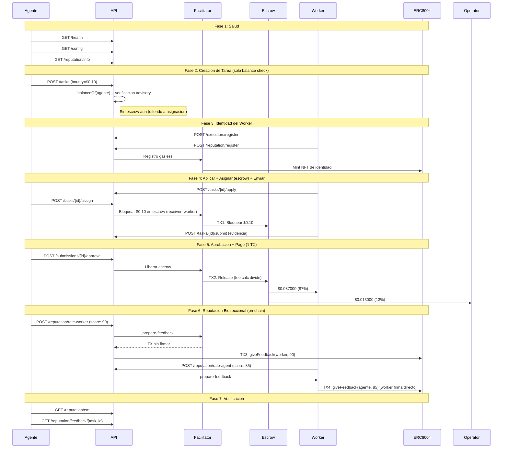
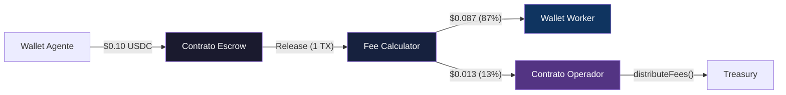

# Reporte Golden Flow -- Prueba de Aceptacion E2E Definitiva (Fase 5)

> **Fecha**: 2026-02-14 17:55 UTC
> **Entorno**: Produccion (Base Mainnet, chain 8453)
> **API**: `https://api.execution.market`
> **Modelo de fee**: credit_card (fee descontado del bounty on-chain)
> **Modo escrow**: direct_release (escrow en asignacion, 1-TX release)
> **Resultado**: **7/7 APROBADO**

---

## Resumen Ejecutivo

El Golden Flow probo el ciclo de vida completo de Execution Market end-to-end
en produccion contra Base Mainnet usando el modelo de fee credit card (Fase 5).
Las 7 fases pasaron, verificando 4 transacciones on-chain en escrow, pago
y reputacion bidireccional.

**Matematica de fees validada por Ali Abdoli** (mantenedor principal de x402r): el modelo
credit card ($0.087 neto worker / $0.013 fee operador de $0.10 bounty) esta confirmado
como correcto. Ver [Notas de Validacion de Ali](ALI_VALIDATION_NOTES.md).

**Resultado General: APROBADO (7/7)**

---

## Infraestructura On-Chain

| Componente | Direccion | Rol |
|------------|-----------|-----|
| PaymentOperator (Fase 5) | [`0x271f9fa7f8907aCf178CCFB470076D9129D8F0Eb`](https://basescan.org/address/0x271f9fa7f8907aCf178CCFB470076D9129D8F0Eb) | Config escrow inmutable + fee calculator |
| StaticFeeCalculator (1300bps) | [`0xd643DB63028Cd1852AAFe62A0E3d2A5238d7465A`](https://basescan.org/address/0xd643DB63028Cd1852AAFe62A0E3d2A5238d7465A) | Split 13% on-chain al release |
| AuthCaptureEscrow | [`0xb9488351E48b23D798f24e8174514F28B741Eb4f`](https://basescan.org/address/0xb9488351E48b23D798f24e8174514F28B741Eb4f) | Singleton escrow compartido (Base) |
| ERC-8004 Identity Registry | [`0x8004A169FB4a3325136EB29fA0ceB6D2e539a432`](https://basescan.org/address/0x8004A169FB4a3325136EB29fA0ceB6D2e539a432) | Identidad agente/worker (CREATE2, todos los mainnets) |
| ERC-8004 Reputation Registry | [`0x8004BAa17C55a88189AE136b182e5fdA19dE9b63`](https://basescan.org/address/0x8004BAa17C55a88189AE136b182e5fdA19dE9b63) | Scores de reputacion on-chain |
| USDC (Base) | [`0x833589fCD6eDb6E08f4c7C32D4f71b54bdA02913`](https://basescan.org/address/0x833589fCD6eDb6E08f4c7C32D4f71b54bdA02913) | Token de pago |
| EM Agent ID | 2106 | Identidad de Execution Market en Base |

---

## Configuracion de Prueba

| Parametro | Valor |
|-----------|-------|
| Bounty (monto bloqueado) | $0.10 USDC |
| Worker neto (87%) | $0.087000 USDC |
| Fee operador (13%) | $0.013000 USDC |
| Costo total para agente | $0.10 USDC |
| Modelo de fee | credit_card |
| Modo escrow | direct_release |
| Wallet del Worker | `0x52E05C8e45a32eeE169639F6d2cA40f8887b5A15` |
| Treasury | `0xae07ceb6b395bc685a776a0b4c489e8d9ce9a6ad` |
| API Base | `https://api.execution.market` |
| EM Agent ID | 2106 |

---

## Diagrama de Flujo

---

## Resultados por Fase

| # | Fase | Estado | Tiempo |
|---|------|--------|--------|
| 1 | Salud y Configuracion | **APROBADO** | 0.93s |
| 2 | Creacion de Tarea (Balance Check) | **APROBADO** | 91.33s |
| 3 | Registro de Worker e Identidad | **APROBADO** | 7.14s |
| 4 | Ciclo de Vida (Aplicar -> Asignar+Escrow -> Enviar) | **APROBADO** | 6.26s |
| 5 | Aprobacion y Pago (1 TX, Credit Card) | **APROBADO** | 27.59s |
| 6 | Reputacion Bidireccional | **APROBADO** | 8.3s |
| 7 | Verificacion Final | **APROBADO** | 0.28s |

**Tiempo total**: 152.87s

---

## Detalle por Fase

### 1. Salud y Configuracion

- **Estado**: APROBADO (0.93s)
- Salud: `healthy`
- Redes: arbitrum, avalanche, base, celo, ethereum, monad, optimism, polygon
- Red preferida: base
- Bounty minimo: $0.01
- ERC-8004: disponible en 18 redes

### 2. Creacion de Tarea (Balance Check)

- **Estado**: APROBADO (91.33s)
- **Task ID**: `7b4c0175-9ba6-4c93-84e9-36bebe0ec25a`
- Escrow en creacion: **No** (diferido a asignacion en modo `direct_release`)
- Modelo de fee: `credit_card`
- Estado de tarea: `published`

### 3. Registro de Worker e Identidad

- **Estado**: APROBADO (7.14s)
- **Executor ID**: `803dfbf1-7b91-4a41-8d31-518f4fa2fcd4`
- Identidad ERC-8004: registrada via Facilitator (gasless)

### 4. Ciclo de Vida (Aplicar -> Asignar+Escrow -> Enviar)

- **Estado**: APROBADO (6.26s)
- **Submission ID**: `2a68a56e-e5e7-4412-ba9f-7882afec8d90`
- **TX Escrow (en asignacion)**: [`0xba6f704383a176...`](https://basescan.org/tx/0xba6f704383a176fcb2c2d7e52755c41bdaec1cf626564288637e87875051078a)
- Verificacion on-chain: **SUCCESS** (gas: 201,192)
- Modo escrow: `direct_release` (worker = receptor del escrow)

### 5. Aprobacion y Pago

- **Estado**: APROBADO (27.59s)
- **TX Release Escrow**: [`0xa86bdcf8b05a6e...`](https://basescan.org/tx/0xa86bdcf8b05a6ebcbf1d2f6b9cfe0777ad66f908f92610bb57099e42ad37f5e6)
- Liquidacion: **1 TX** (fee calculator divide on-chain al release)
- Latencia de aprobacion: 27.27s

#### Verificacion de Fee (Modelo Credit Card)

| Metrica | Esperado | Actual | Coincide |
|---------|----------|--------|----------|
| Monto bloqueado | $0.100000 | $0.100000 | SI |
| Neto worker (87%) | $0.087000 | $0.087000 | SI |
| Fee operador (13%) | $0.013000 | $0.013000 | SI |
| Cantidad de TXs | 1 | 1 | SI |

> Matematica de fees confirmada por **Ali Abdoli** (mantenedor principal de x402r):
> *"This looks good to me! $0.087 vs $0.113 is a stylistic choice tbh.
> You can do either one but the math for $0.087 is a bit simpler"*

### 6. Reputacion Bidireccional

- **Estado**: APROBADO (8.3s)
- **TX Agente->Worker**: [`fe74cf95c5d781...`](https://basescan.org/tx/fe74cf95c5d7817a1e677b96a2eb384366df6026717f705348051905729ef12b) -- agente califica worker (score: 90)
- **TX Worker->Agente**: [`18468ee223fa6b...`](https://basescan.org/tx/18468ee223fa6bc5db24e72a3626228358875ee6d94fd04e33e3cd763c537887) -- worker califica agente (score: 85), **worker firma directamente** (trustless)

Ambas TXs de feedback llaman `giveFeedback()` en el ERC-8004 Reputation Registry. El worker firma su propia TX — sin relay, sin intermediario. Reputacion bidireccional completamente trustless.

### 7. Verificacion Final

- **Estado**: APROBADO (0.28s)
- **Score de Reputacion EM**: 77.0
- **Cantidad de Reputacion EM**: 12
- **Documento de feedback**: disponible para tarea `7b4c0175-9ba6-4c93-84e9-36bebe0ec25a`

---

## Resumen de Transacciones On-Chain

| # | Proposito | TX Hash | BaseScan |
|---|-----------|---------|----------|
| 1 | Bloqueo Escrow ($0.10) | `0xba6f704383a176fcb2...` | [Ver](https://basescan.org/tx/0xba6f704383a176fcb2c2d7e52755c41bdaec1cf626564288637e87875051078a) |
| 2 | Release Escrow (1-TX split) | `0xa86bdcf8b05a6ebcbf...` | [Ver](https://basescan.org/tx/0xa86bdcf8b05a6ebcbf1d2f6b9cfe0777ad66f908f92610bb57099e42ad37f5e6) |
| 3 | Agente califica Worker (90) | `fe74cf95c5d7817a1e67...` | [Ver](https://basescan.org/tx/fe74cf95c5d7817a1e677b96a2eb384366df6026717f705348051905729ef12b) |
| 4 | Worker califica Agente (85) | `18468ee223fa6bc5db24...` | [Ver](https://basescan.org/tx/18468ee223fa6bc5db24e72a3626228358875ee6d94fd04e33e3cd763c537887) |

---

## Modelo de Confianza

**Propiedades clave de confianza:**
- **Los fondos del worker nunca pasan por la plataforma.** Receptor del escrow = direccion del worker. El release va directamente al worker via fee calculator on-chain.
- **El split de fee es inmutable.** StaticFeeCalculator(1300bps) esta desplegado en una direccion fija. Ningun admin puede cambiar el split sin desplegar un nuevo operador (recomendacion de Ali).
- **La reputacion es trustless.** El worker firma su propia TX `giveFeedback()` directamente en ERC-8004. Sin relay, sin intermediario.
- **Las condiciones del escrow son on-chain.** Release requiere firma del Facilitator O del Payer. Refund requiere solo el Facilitator (previene auto-refund del payer).

---

## Invariantes Verificados

- [x] API saludable y retornando configuracion correcta
- [x] Tarea creada exitosamente con status published (solo balance check)
- [x] Escrow bloqueado en asignacion (direct_release, worker como receptor)
- [x] TX de escrow verificada on-chain (status: SUCCESS)
- [x] Worker registrado con executor ID e identidad ERC-8004
- [x] Worker recibe $0.087000 (87% del bounty, modelo credit card)
- [x] Operador recibe $0.013000 (13% fee calculator on-chain, 1300bps)
- [x] Las 4 TXs verificadas on-chain (status: 0x1)
- [x] Release de escrow en 1 TX (fee split por StaticFeeCalculator)
- [x] Reputacion bidireccional: agente califico worker Y worker califico agente (ambos on-chain)
- [x] Worker firma su propia TX de reputacion (trustless, sin relay)
- [x] Matematica de fees validada por mantenedor del protocolo x402r

---

## Validacion del Protocolo

Esta implementacion fue revisada y validada por **Ali Abdoli**, mantenedor principal
del protocolo x402r, el 2026-02-14. Hallazgos clave:

1. **Matematica de fees correcta** -- modelo credit card confirmado como enfoque valido
2. **Operadores inmutables recomendados** -- desplegar nuevo PaymentOperator por cambio de fee en vez de toggles en runtime (menor superficie de ataque)
3. **Limite TVL** -- $1,000 para operadores nuevos, $100,000 para establecidos
4. **Cambio de calculator mid-payment** -- debe evitarse; operadores inmutables eliminan este riesgo

Notas completas de validacion: [`docs/reports/ALI_VALIDATION_NOTES.md`](ALI_VALIDATION_NOTES.md)
