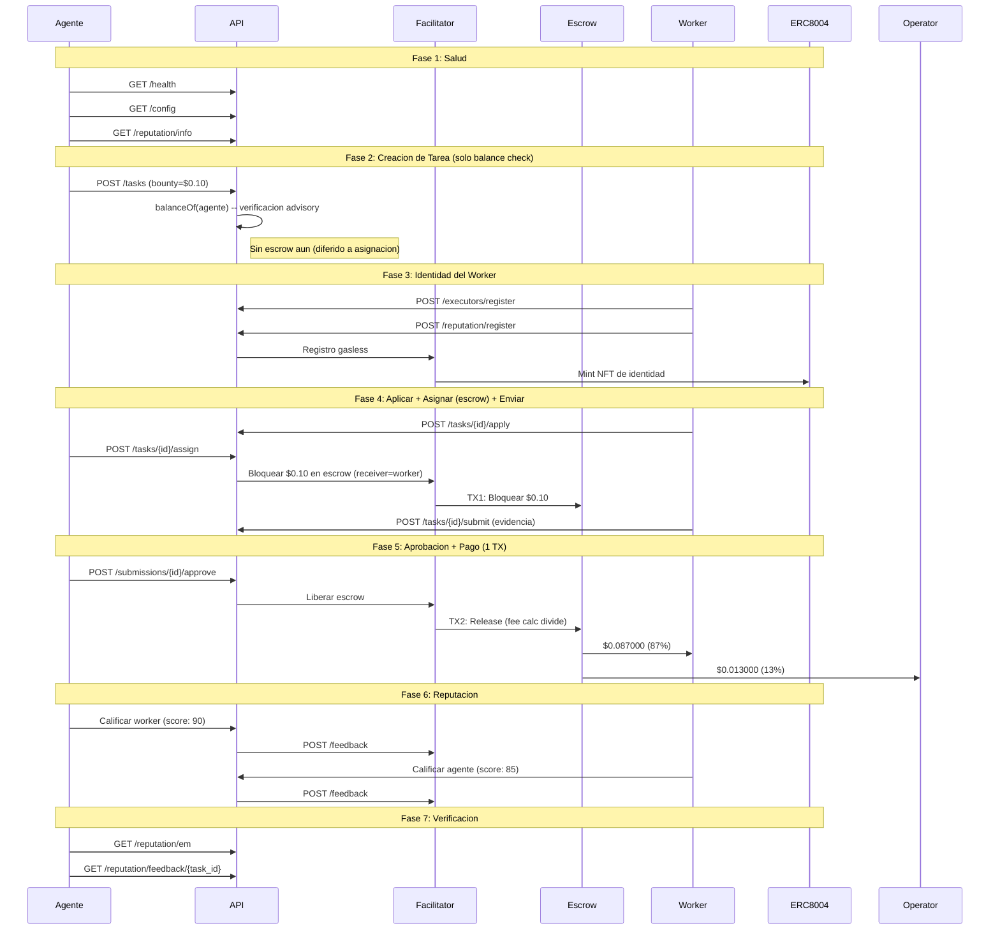

# Reporte Golden Flow -- Prueba de Aceptacion E2E Definitiva (Fase 5)

> **Fecha**: 2026-02-21 04:10 UTC
> **Entorno**: Produccion (Base Mainnet, chain 8453)
> **API**: `https://api.execution.market`
> **Modelo de fee**: credit_card (fee descontado del bounty on-chain)
> **Modo escrow**: direct_release (escrow en asignacion, 1-TX release)
> **Token**: USDC (`0x833589fCD6eDb6E08f4c7C32D4f71b54bdA02913`)
> **Resultado**: **PARTIAL**

---

## Resumen Ejecutivo

El Golden Flow probo el ciclo de vida completo de Execution Market end-to-end 
en produccion contra Base Mainnet usando el modelo de fee credit card (Fase 5) con **USDC**. 6/7 fases pasaron.

**Resultado General: PARTIAL**

---

## Configuracion de Prueba

| Parametro | Valor |
|-----------|-------|
| Token de pago | USDC |
| Contrato del token | `0x833589fCD6eDb6E08f4c7C32D4f71b54bdA02913` |
| Bounty (monto bloqueado) | $0.10 USDC |
| Worker neto (87%) | $0.087000 USDC |
| Fee operador (13%) | $0.013000 USDC |
| Costo total para agente | $0.10 USDC |
| Modelo de fee | credit_card |
| Modo escrow | direct_release |
| Wallet del Worker | `0x52E05C8e45a32eeE169639F6d2cA40f8887b5A15` |
| Treasury | `0xae07ceb6b395bc685a776a0b4c489e8d9ce9a6ad` |
| API Base | `https://api.execution.market` |
| EM Agent ID | 2106 |

---

## Diagrama de Flujo

---

## Resultados por Fase

| # | Fase | Estado | Tiempo |
|---|------|--------|--------|
| 1 | Salud y Configuracion | **APROBADO** | 0.83s |
| 2 | Creacion de Tarea (Balance Check) | **APROBADO** | 1.28s |
| 3 | Registro de Worker e Identidad | **APROBADO** | 13.51s |
| 4 | Ciclo de Vida (Aplicar -> Asignar+Escrow -> Enviar) | **APROBADO** | 10.34s |
| 5 | Aprobacion y Pago (1 TX, Credit Card) | **APROBADO** | 26.02s |
| 6 | Reputacion Bidireccional | **PARCIAL** | 1.76s |
| 7 | Verificacion Final | **APROBADO** | 0.29s |

---

## Salud y Configuracion

- **Estado**: APROBADO
- **Tiempo**: 0.83s

## Creacion de Tarea (Balance Check)

- **Estado**: APROBADO
- **Tiempo**: 1.28s
- **Task ID**: `15b43386-6221-4e0d-84e3-dd3866648f84`
- **Escrow en creacion**: False
- **Modelo de fee**: credit_card

## Registro de Worker e Identidad

- **Estado**: APROBADO
- **Tiempo**: 13.51s
- **Executor ID**: `803dfbf1-7b91-4a41-8d31-518f4fa2fcd4`
- **ERC-8004 Agent ID**: 18616

## Ciclo de Vida (Aplicar -> Asignar+Escrow -> Enviar)

- **Estado**: APROBADO
- **Tiempo**: 10.34s
- **Submission ID**: `7852a41d-dbbe-4eb4-87de-5f5e1cf6eb5f`
- **TX Escrow (en asignacion)**: [`0x43e5d75cc11d43...`](https://basescan.org/tx/0x43e5d75cc11d43d468a468d9279da52947726069b28dece9de106c5ad097075c)
- **Escrow verificado**: True
- **Modo escrow**: direct_release

## Aprobacion y Pago (1 TX, Credit Card)

- **Estado**: APROBADO
- **Tiempo**: 26.02s
- **Modo de pago**: `unknown`
- **TX Worker**: [`0xb6229e82316a5c...`](https://basescan.org/tx/0xb6229e82316a5c56285845b16f0fa0979780c370f28f8be3549839d49d8108e2)
- **TX Fee**: [`0xc4c7b9ba3a990d...`](https://basescan.org/tx/0xc4c7b9ba3a990d8ffb1edfde869a5f17cba4503d93aaeb9d0f6797ca22c48f17)

## Reputacion Bidireccional

- **Estado**: PARCIAL
- **Tiempo**: 1.76s
- **Error**: Worker->Agent: HTTP 200, success=False, error=EM_WORKER_PRIVATE_KEY not set — worker cannot sign on-chain TX
- **TX Agente->Worker**: [`51cd777c225d6155...`](https://basescan.org/tx/51cd777c225d6155458d5e271aa28ba7cdcc7311e35916faa4a39b0d89f450c8)

## Verificacion Final

- **Estado**: APROBADO
- **Tiempo**: 0.29s

---

## Resumen de Transacciones On-Chain

| # | TX Hash | BaseScan |
|---|---------|----------|
| 1 | `0xdb6cea7b1d34ab3f87...` | [Ver](https://basescan.org/tx/0xdb6cea7b1d34ab3f875253fc94e7af997f5a4c79c39c36d4544542baa161b960) |
| 2 | `0x43e5d75cc11d43d468...` | [Ver](https://basescan.org/tx/0x43e5d75cc11d43d468a468d9279da52947726069b28dece9de106c5ad097075c) |
| 3 | `0xb6229e82316a5c5628...` | [Ver](https://basescan.org/tx/0xb6229e82316a5c56285845b16f0fa0979780c370f28f8be3549839d49d8108e2) |
| 4 | `0xc4c7b9ba3a990d8ffb...` | [Ver](https://basescan.org/tx/0xc4c7b9ba3a990d8ffb1edfde869a5f17cba4503d93aaeb9d0f6797ca22c48f17) |
| 5 | `51cd777c225d6155458d...` | [Ver](https://basescan.org/tx/51cd777c225d6155458d5e271aa28ba7cdcc7311e35916faa4a39b0d89f450c8) |

---

## Invariantes Verificados

- [x] API saludable y retornando configuracion correcta
- [x] Tarea creada exitosamente con status published (solo balance check)
- [x] Escrow bloqueado en asignacion (direct_release, worker como receiver)
- [x] TX de escrow verificada on-chain (status: SUCCESS)
- [x] Worker registrado con executor ID
- [x] Operador recibe $0.013000 (13% fee calculator on-chain)
- [x] Todas las TXs de pago verificadas on-chain (status: 0x1)
- [x] Release de escrow en 1 TX (fee split por StaticFeeCalculator 1300bps)
