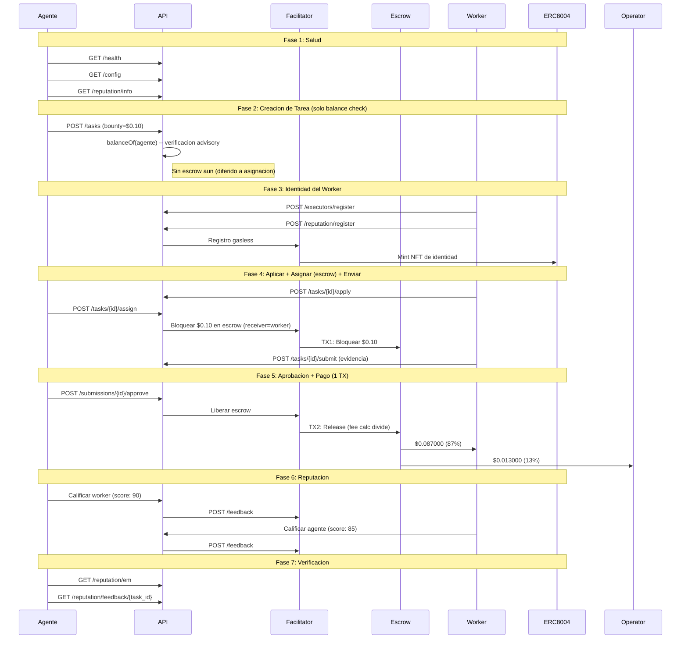

# Reporte Golden Flow -- Prueba de Aceptacion E2E Definitiva (Fase 5)

> **Fecha**: 2026-02-16 10:04 UTC
> **Entorno**: Produccion (Base Mainnet, chain 8453)
> **API**: `https://api.execution.market`
> **Modelo de fee**: credit_card (fee descontado del bounty on-chain)
> **Modo escrow**: direct_release (escrow en asignacion, 1-TX release)
> **Resultado**: **PARTIAL**

---

## Resumen Ejecutivo

El Golden Flow probo el ciclo de vida completo de Execution Market end-to-end 
en produccion contra Base Mainnet usando el modelo de fee credit card (Fase 5). 6/7 fases pasaron.

**Resultado General: PARTIAL**

---

## Configuracion de Prueba

| Parametro | Valor |
|-----------|-------|
| Bounty (monto bloqueado) | $0.10 USDC |
| Worker neto (87%) | $0.087000 USDC |
| Fee operador (13%) | $0.013000 USDC |
| Costo total para agente | $0.10 USDC |
| Modelo de fee | credit_card |
| Modo escrow | direct_release |
| Wallet del Worker | `0x52E05C8e45a32eeE169639F6d2cA40f8887b5A15` |
| Treasury | `0xae07ceb6b395bc685a776a0b4c489e8d9ce9a6ad` |
| API Base | `https://api.execution.market` |
| EM Agent ID | 2106 |

---

## Diagrama de Flujo

---

## Resultados por Fase

| # | Fase | Estado | Tiempo |
|---|------|--------|--------|
| 1 | Salud y Configuracion | **APROBADO** | 0.52s |
| 2 | Creacion de Tarea (Balance Check) | **APROBADO** | 6.59s |
| 3 | Registro de Worker e Identidad | **APROBADO** | 11.47s |
| 4 | Ciclo de Vida (Aplicar -> Asignar+Escrow -> Enviar) | **APROBADO** | 26.97s |
| 5 | Aprobacion y Pago (1 TX, Credit Card) | **APROBADO** | 19.49s |
| 6 | Reputacion Bidireccional | **PARCIAL** | 2.82s |
| 7 | Verificacion Final | **APROBADO** | 0.27s |

---

## Salud y Configuracion

- **Estado**: APROBADO
- **Tiempo**: 0.52s

## Creacion de Tarea (Balance Check)

- **Estado**: APROBADO
- **Tiempo**: 6.59s
- **Task ID**: `4eabee24-3780-4d1b-bbc6-e3a165cd931c`
- **Escrow en creacion**: False
- **Modelo de fee**: credit_card

## Registro de Worker e Identidad

- **Estado**: APROBADO
- **Tiempo**: 11.47s
- **Executor ID**: `803dfbf1-7b91-4a41-8d31-518f4fa2fcd4`
- **ERC-8004 Agent ID**: 17841

## Ciclo de Vida (Aplicar -> Asignar+Escrow -> Enviar)

- **Estado**: APROBADO
- **Tiempo**: 26.97s
- **Submission ID**: `d6275a6d-c4b4-49d6-bfd5-5c7c639dbcc9`
- **TX Escrow (en asignacion)**: [`0x88837b64962aba...`](https://basescan.org/tx/0x88837b64962abaaf3ca2f0d1049bbfcc840ea0badd091497c67d008e172bf54a)
- **Escrow verificado**: True
- **Modo escrow**: direct_release

## Aprobacion y Pago (1 TX, Credit Card)

- **Estado**: APROBADO
- **Tiempo**: 19.49s
- **Modo de pago**: `fase2`
- **TX Worker**: [`0x5838585d434f35...`](https://basescan.org/tx/0x5838585d434f35cda943b8e17d4fcce905c83fcfc1ded3ca7bca6702425419dd)

### Verificacion de Fee (Modelo Credit Card)

| Metrica | Esperado | Actual | Coincide |
|---------|----------|--------|----------|
| Neto worker (87%) | $0.087000 | $0.087000 | SI |
| Fee operador (13%) | $0.013000 | $0.013000 | SI |
| Monto bloqueado | $0.100000 | $0.100000 | SI |

## Reputacion Bidireccional

- **Estado**: PARCIAL
- **Tiempo**: 2.82s
- **Error**: Worker->Agent: HTTP 200, success=False, error=On-chain signing failed: {'code': -32000, 'message': 'nonce too low: next nonce 47, tx nonce 46'}
- **TX Agente->Worker**: [`ebcfccb6294cfeab...`](https://basescan.org/tx/ebcfccb6294cfeab3ad8d17af95ff529ce810c6c1ddd4998adc27ef55d15a57d)

## Verificacion Final

- **Estado**: APROBADO
- **Tiempo**: 0.27s

---

## Resumen de Transacciones On-Chain

| # | TX Hash | BaseScan |
|---|---------|----------|
| 1 | `0xc77e3209dcba705d8b...` | [Ver](https://basescan.org/tx/0xc77e3209dcba705d8bffebc1c2ed9d099d65433361ca0702dbe5bc2711fed4dc) |
| 2 | `0x88837b64962abaaf3c...` | [Ver](https://basescan.org/tx/0x88837b64962abaaf3ca2f0d1049bbfcc840ea0badd091497c67d008e172bf54a) |
| 3 | `0x5838585d434f35cda9...` | [Ver](https://basescan.org/tx/0x5838585d434f35cda943b8e17d4fcce905c83fcfc1ded3ca7bca6702425419dd) |
| 4 | `ebcfccb6294cfeab3ad8...` | [Ver](https://basescan.org/tx/ebcfccb6294cfeab3ad8d17af95ff529ce810c6c1ddd4998adc27ef55d15a57d) |

---

## Invariantes Verificados

- [x] API saludable y retornando configuracion correcta
- [x] Tarea creada exitosamente con status published (solo balance check)
- [x] Escrow bloqueado en asignacion (direct_release, worker como receiver)
- [x] TX de escrow verificada on-chain (status: SUCCESS)
- [x] Worker registrado con executor ID
- [x] Worker recibe $0.087000 (87% del bounty, modelo credit card)
- [x] Operador recibe $0.013000 (13% fee calculator on-chain)
- [x] Todas las TXs de pago verificadas on-chain (status: 0x1)
- [x] Release de escrow en 1 TX (fee split por StaticFeeCalculator 1300bps)
