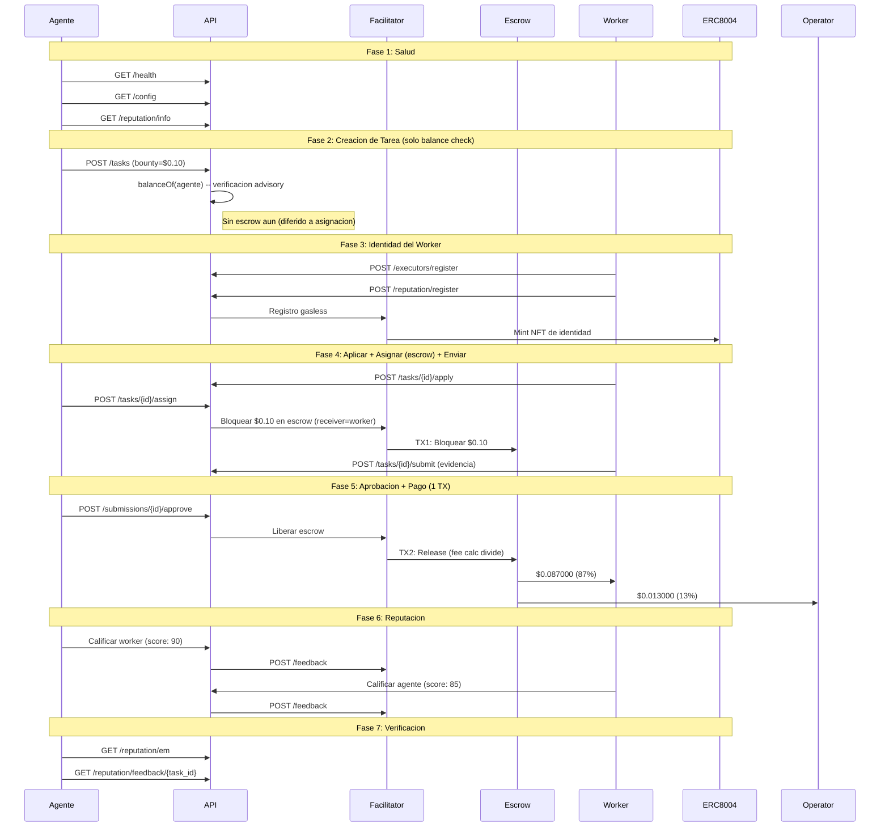

# Reporte Golden Flow -- Prueba de Aceptacion E2E Definitiva (Fase 5)

> **Fecha**: 2026-02-16 15:21 UTC
> **Entorno**: Produccion (Base Mainnet, chain 8453)
> **API**: `https://api.execution.market`
> **Modelo de fee**: credit_card (fee descontado del bounty on-chain)
> **Modo escrow**: direct_release (escrow en asignacion, 1-TX release)
> **Resultado**: **PASS**

---

## Resumen Ejecutivo

El Golden Flow probo el ciclo de vida completo de Execution Market end-to-end 
en produccion contra Base Mainnet usando el modelo de fee credit card (Fase 5). 7/7 fases pasaron.

**Resultado General: PASS**

---

## Configuracion de Prueba

| Parametro | Valor |
|-----------|-------|
| Bounty (monto bloqueado) | $0.10 USDC |
| Worker neto (87%) | $0.087000 USDC |
| Fee operador (13%) | $0.013000 USDC |
| Costo total para agente | $0.10 USDC |
| Modelo de fee | credit_card |
| Modo escrow | direct_release |
| Wallet del Worker | `0x52E05C8e45a32eeE169639F6d2cA40f8887b5A15` |
| Treasury | `0xae07ceb6b395bc685a776a0b4c489e8d9ce9a6ad` |
| API Base | `https://api.execution.market` |
| EM Agent ID | 2106 |

---

## Diagrama de Flujo

---

## Resultados por Fase

| # | Fase | Estado | Tiempo |
|---|------|--------|--------|
| 1 | Salud y Configuracion | **APROBADO** | 0.69s |
| 2 | Creacion de Tarea (Balance Check) | **APROBADO** | 91.98s |
| 3 | Registro de Worker e Identidad | **APROBADO** | 1.97s |
| 4 | Ciclo de Vida (Aplicar -> Asignar+Escrow -> Enviar) | **APROBADO** | 6.27s |
| 5 | Aprobacion y Pago (1 TX, Credit Card) | **APROBADO** | 18.9s |
| 6 | Reputacion Bidireccional | **APROBADO** | 2.43s |
| 7 | Verificacion Final | **APROBADO** | 0.36s |

---

## Salud y Configuracion

- **Estado**: APROBADO
- **Tiempo**: 0.69s

## Creacion de Tarea (Balance Check)

- **Estado**: APROBADO
- **Tiempo**: 91.98s
- **Task ID**: `812d1d27-358b-4fd7-afbc-36d8e1cc58ca`
- **Escrow en creacion**: False
- **Modelo de fee**: credit_card

## Registro de Worker e Identidad

- **Estado**: APROBADO
- **Tiempo**: 1.97s
- **Executor ID**: `803dfbf1-7b91-4a41-8d31-518f4fa2fcd4`

## Ciclo de Vida (Aplicar -> Asignar+Escrow -> Enviar)

- **Estado**: APROBADO
- **Tiempo**: 6.27s
- **Submission ID**: `2b518c1d-4750-41be-b514-e6e13860165e`
- **TX Escrow (en asignacion)**: [`0xc8c1caf4c765fc...`](https://basescan.org/tx/0xc8c1caf4c765fc9678c864a30383aa890c4da90ce849acf4707a521277b92c59)
- **Escrow verificado**: True
- **Modo escrow**: direct_release

## Aprobacion y Pago (1 TX, Credit Card)

- **Estado**: APROBADO
- **Tiempo**: 18.9s
- **Modo de pago**: `fase2`
- **TX Worker**: [`0x197c81878b9d54...`](https://basescan.org/tx/0x197c81878b9d548c70c292ecf1d3a8be29ebdf024d4a6850e2fd8763647fa227)

### Verificacion de Fee (Modelo Credit Card)

| Metrica | Esperado | Actual | Coincide |
|---------|----------|--------|----------|
| Neto worker (87%) | $0.087000 | $0.087000 | SI |
| Fee operador (13%) | $0.013000 | $0.013000 | SI |
| Monto bloqueado | $0.100000 | $0.100000 | SI |

## Reputacion Bidireccional

- **Estado**: APROBADO
- **Tiempo**: 2.43s
- **TX Agente->Worker**: [`37d88e3ab72ec14d...`](https://basescan.org/tx/37d88e3ab72ec14da50c37db9e136f947e1d49b62f4f337d760fd15c970ee3f0)
- **TX Worker->Agente**: [`555502e31583865a...`](https://basescan.org/tx/555502e31583865ac0d672fa351ddf8348359db0f432e2035af1483cb7378d91)

## Verificacion Final

- **Estado**: APROBADO
- **Tiempo**: 0.36s

---

## Resumen de Transacciones On-Chain

| # | TX Hash | BaseScan |
|---|---------|----------|
| 1 | `0xc8c1caf4c765fc9678...` | [Ver](https://basescan.org/tx/0xc8c1caf4c765fc9678c864a30383aa890c4da90ce849acf4707a521277b92c59) |
| 2 | `0x197c81878b9d548c70...` | [Ver](https://basescan.org/tx/0x197c81878b9d548c70c292ecf1d3a8be29ebdf024d4a6850e2fd8763647fa227) |
| 3 | `37d88e3ab72ec14da50c...` | [Ver](https://basescan.org/tx/37d88e3ab72ec14da50c37db9e136f947e1d49b62f4f337d760fd15c970ee3f0) |
| 4 | `555502e31583865ac0d6...` | [Ver](https://basescan.org/tx/555502e31583865ac0d672fa351ddf8348359db0f432e2035af1483cb7378d91) |

---

## Invariantes Verificados

- [x] API saludable y retornando configuracion correcta
- [x] Tarea creada exitosamente con status published (solo balance check)
- [x] Escrow bloqueado en asignacion (direct_release, worker como receiver)
- [x] TX de escrow verificada on-chain (status: SUCCESS)
- [x] Worker registrado con executor ID
- [x] Worker recibe $0.087000 (87% del bounty, modelo credit card)
- [x] Operador recibe $0.013000 (13% fee calculator on-chain)
- [x] Todas las TXs de pago verificadas on-chain (status: 0x1)
- [x] Release de escrow en 1 TX (fee split por StaticFeeCalculator 1300bps)
- [x] Reputacion bidireccional: agente califico worker Y worker califico agente
