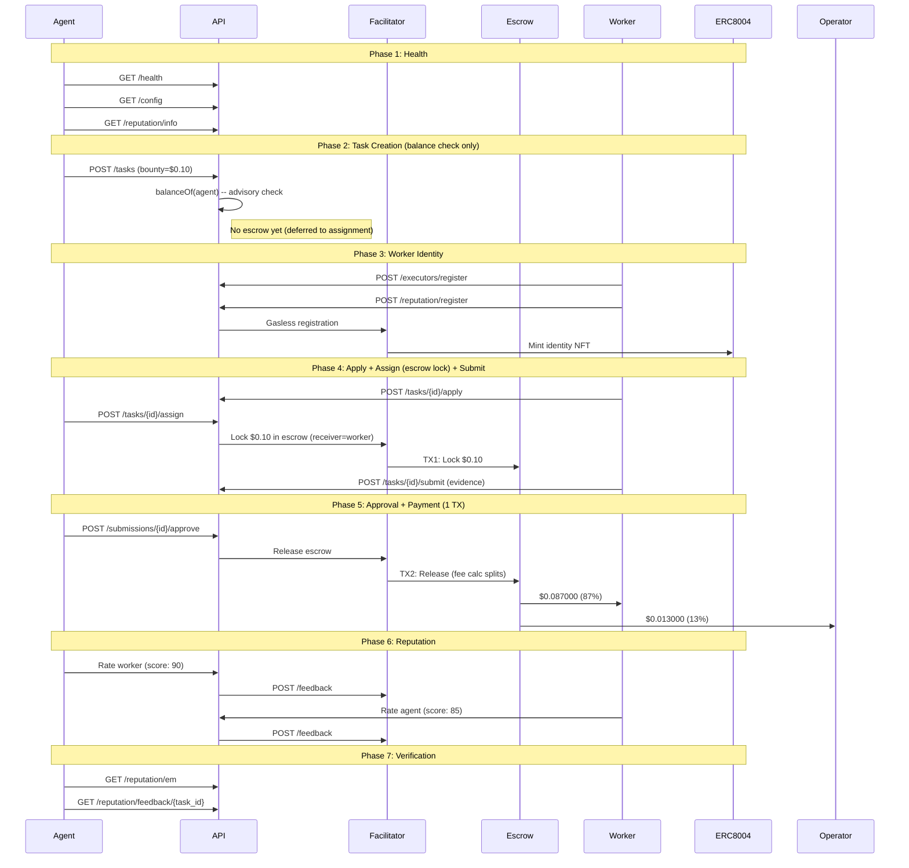

# Golden Flow Report -- Definitive E2E Acceptance Test (Fase 5)

> **Date**: 2026-02-14 04:30 UTC
> **Environment**: Production (Base Mainnet, chain 8453)
> **API**: `https://api.execution.market`
> **Fee Model**: credit_card (fee deducted from bounty on-chain)
> **Escrow Mode**: direct_release (escrow at assignment, 1-TX release)
> **Result**: **PARTIAL**

---

## Executive Summary

The Golden Flow tested the complete Execution Market lifecycle end-to-end 
on production against Base Mainnet using the Fase 5 credit card fee model. 6/7 phases passed.

**Overall Result: PARTIAL**

---

## Test Configuration

| Parameter | Value |
|-----------|-------|
| Bounty (lock amount) | $0.10 USDC |
| Worker Net (87%) | $0.087000 USDC |
| Operator Fee (13%) | $0.013000 USDC |
| Total Cost to Agent | $0.10 USDC |
| Fee Model | credit_card |
| Escrow Mode | direct_release |
| Worker Wallet | `0x52E05C8e45a32eeE169639F6d2cA40f8887b5A15` |
| Treasury | `0xae07ceb6b395bc685a776a0b4c489e8d9ce9a6ad` |
| API Base | `https://api.execution.market` |
| EM Agent ID | 2106 |

---

## Flow Diagram

---

## Phase Results

| # | Phase | Status | Time |
|---|-------|--------|------|
| 1 | Health & Config Verification | **PASS** | 0.53s |
| 2 | Task Creation (Balance Check) | **PASS** | 91.84s |
| 3 | Worker Registration & Identity | **PASS** | 5.41s |
| 4 | Task Lifecycle (Apply -> Assign+Escrow -> Submit) | **PASS** | 6.27s |
| 5 | Approval & Payment Settlement | **PASS** | 57.08s |
| 6 | Bidirectional Reputation | **PARTIAL** | 63.61s |
| 7 | Final Verification | **PASS** | 0.39s |

---

## Health & Config Verification

- **Status**: PASS
- **Time**: 0.53s

## Task Creation (Balance Check)

- **Status**: PASS
- **Time**: 91.84s

- **Task ID**: `1d9fc238-0eb1-4d46-a8b3-e210aa1dcd5f`
- **Escrow at creation**: False
- **Fee model**: credit_card

## Worker Registration & Identity

- **Status**: PASS
- **Time**: 5.41s

- **Executor ID**: `803dfbf1-7b91-4a41-8d31-518f4fa2fcd4`

## Task Lifecycle (Apply -> Assign+Escrow -> Submit)

- **Status**: PASS
- **Time**: 6.27s

- **Submission ID**: `fe98ce0d-7824-406b-8c22-9a03bd42fdcc`
- **Escrow TX (at assignment)**: [`0x2fe52a0fade20e...`](https://basescan.org/tx/0x2fe52a0fade20e100e1d54dfaa71ee4f5a2315f28fce481a8836741758ae22f8)
- **Escrow Verified**: True
- **Escrow mode**: direct_release

## Approval & Payment Settlement

- **Status**: PASS
- **Time**: 57.08s

- **Payment Mode**: `fase2`
- **Worker TX**: [`0x92b2687ef1d03f...`](https://basescan.org/tx/0x92b2687ef1d03fda370aea6b3491694c6a71e0584dc6b49267813ffa4736dbf3)
- **Escrow Release**: [`0x92b2687ef1d03f...`](https://basescan.org/tx/0x92b2687ef1d03fda370aea6b3491694c6a71e0584dc6b49267813ffa4736dbf3)

### Fee Math Verification (Credit Card Model)

| Metric | Expected | Actual | Match |
|--------|----------|--------|-------|
| Worker net (87%) | $0.087000 | $0.087000 | YES |
| Operator fee (13%) | $0.013000 | $0.013000 | YES |
| Lock amount | $0.100000 | $0.100000 | YES |

## Bidirectional Reputation

- **Status**: PARTIAL
- **Time**: 63.61s
- **Error**: Agent->Worker: HTTP 200, success=False, error=; Worker->Agent: HTTP 200, success=False, error=

## Final Verification

- **Status**: PASS
- **Time**: 0.39s

- **EM Reputation Score**: 76.0
- **EM Reputation Count**: 9
- **Feedback Available**: True

---

## On-Chain Transaction Summary

| # | TX Hash | BaseScan |
|---|---------|----------|
| 1 | `0x2fe52a0fade20e100e...` | [View](https://basescan.org/tx/0x2fe52a0fade20e100e1d54dfaa71ee4f5a2315f28fce481a8836741758ae22f8) |
| 2 | `0x92b2687ef1d03fda37...` | [View](https://basescan.org/tx/0x92b2687ef1d03fda370aea6b3491694c6a71e0584dc6b49267813ffa4736dbf3) |

---

## Invariants Verified

- [x] API is healthy and returning correct configuration
- [x] Task created successfully with published status (balance check only)
- [x] Escrow locked at assignment (direct_release, worker as receiver)
- [x] Escrow lock TX verified on-chain (status: SUCCESS)
- [x] Worker registered with executor ID
- [x] Worker receives $0.087000 (87% of bounty, credit card model)
- [x] Operator receives $0.013000 (13% on-chain fee calculator)
- [x] All payment TXs verified on-chain (status: 0x1)
- [x] Single-TX escrow release (fee split by StaticFeeCalculator 1300bps)
