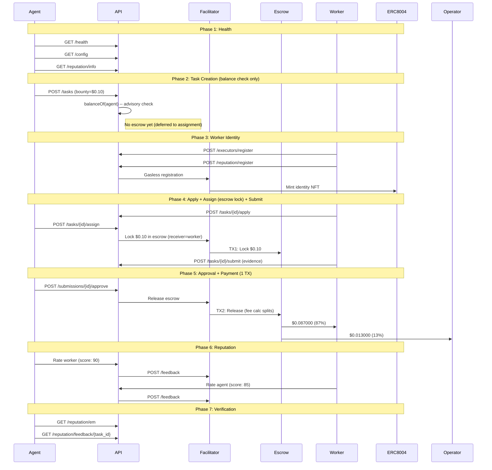

# Golden Flow Report -- Definitive E2E Acceptance Test (Fase 5)

> **Date**: 2026-02-21 16:42 UTC
> **Environment**: Production (Base Mainnet, chain 8453)
> **API**: `https://api.execution.market`
> **Fee Model**: credit_card (fee deducted from bounty on-chain)
> **Escrow Mode**: direct_release (escrow at assignment, 1-TX release)
> **Token**: USDC (`0x833589fCD6eDb6E08f4c7C32D4f71b54bdA02913`)
> **Result**: **PARTIAL**

---

## Executive Summary

The Golden Flow tested the complete Execution Market lifecycle end-to-end 
on production against Base Mainnet using the Fase 5 credit card fee model with **USDC**. 6/7 phases passed.

**Overall Result: PARTIAL**

---

## Test Configuration

| Parameter | Value |
|-----------|-------|
| Payment Token | USDC |
| Token Contract | `0x833589fCD6eDb6E08f4c7C32D4f71b54bdA02913` |
| Bounty (lock amount) | $0.10 USDC |
| Worker Net (87%) | $0.087000 USDC |
| Operator Fee (13%) | $0.013000 USDC |
| Total Cost to Agent | $0.10 USDC |
| Fee Model | credit_card |
| Escrow Mode | direct_release |
| Worker Wallet | `0x52E05C8e45a32eeE169639F6d2cA40f8887b5A15` |
| Treasury | `0xae07ceb6b395bc685a776a0b4c489e8d9ce9a6ad` |
| API Base | `https://api.execution.market` |
| EM Agent ID | 2106 |

---

## Flow Diagram

---

## Phase Results

| # | Phase | Status | Time |
|---|-------|--------|------|
| 1 | Health & Config Verification | **PASS** | 0.68s |
| 2 | Task Creation (Balance Check) | **PASS** | 1.79s |
| 3 | Worker Registration & Identity | **PASS** | 14.77s |
| 4 | Task Lifecycle (Apply -> Assign+Escrow -> Submit) | **PASS** | 6.35s |
| 5 | Approval & Payment Settlement | **PASS** | 9.17s |
| 6 | Bidirectional Reputation | **PARTIAL** | 10.39s |
| 7 | Final Verification | **PASS** | 0.28s |

---

## Health & Config Verification

- **Status**: PASS
- **Time**: 0.68s

## Task Creation (Balance Check)

- **Status**: PASS
- **Time**: 1.79s

- **Task ID**: `f268ca0e-58ee-4098-9c62-a5c50377aace`
- **Escrow at creation**: False
- **Fee model**: credit_card

## Worker Registration & Identity

- **Status**: PASS
- **Time**: 14.77s

- **Executor ID**: `803dfbf1-7b91-4a41-8d31-518f4fa2fcd4`
- **ERC-8004 Agent ID**: 18703
- **ERC-8004 TX**: [`0xbe4b7d498d7077...`](https://basescan.org/tx/0xbe4b7d498d7077b37c57618ab32e4b2e80214dc9b2ba6058d11ae179707d781c)

## Task Lifecycle (Apply -> Assign+Escrow -> Submit)

- **Status**: PASS
- **Time**: 6.35s

- **Submission ID**: `9c944a3d-0b9e-4007-ae85-f3732c465ed5`
- **Escrow TX (at assignment)**: [`0xe4ef496f0f6650...`](https://basescan.org/tx/0xe4ef496f0f6650917bb673c8512ab70a4ac41c073234234d38a0aff179101ed3)
- **Escrow Verified**: True
- **Escrow mode**: direct_release

## Approval & Payment Settlement

- **Status**: PASS
- **Time**: 9.17s

- **Payment Mode**: `fase2`
- **Worker TX**: [`0x28b06ffaaa0578...`](https://basescan.org/tx/0x28b06ffaaa0578e0215539fc3295eec9b87fdf053bc671e82de6ea0889079b17)
- **Escrow Release**: [`0x28b06ffaaa0578...`](https://basescan.org/tx/0x28b06ffaaa0578e0215539fc3295eec9b87fdf053bc671e82de6ea0889079b17)

### Fee Math Verification (Credit Card Model)

| Metric | Expected | Actual | Match |
|--------|----------|--------|-------|
| Worker net (87%) | $0.087000 | $0.087000 | YES |
| Operator fee (13%) | $0.013000 | $0.013000 | YES |
| Lock amount | $0.100000 | $0.100000 | YES |

## Bidirectional Reputation

- **Status**: PARTIAL
- **Time**: 10.39s
- **Error**: Worker->Agent: HTTP 200, success=False, error=On-chain signing failed: 'SignedTransaction' object has no attribute 'raw_transaction'

- **Agent->Worker TX**: [`e4082b0580729763...`](https://basescan.org/tx/e4082b05807297631989924c654207d8b83e07f358291b3e8958d1a845a58b43)

## Final Verification

- **Status**: PASS
- **Time**: 0.28s

- **EM Reputation Score**: 80.0
- **EM Reputation Count**: 16
- **Feedback Available**: True

---

## ERC-8004 Identity Verification

| Field | Value |
|-------|-------|
| Worker Wallet | `0x52E05C8e45a32eeE169639F6d2cA40f8887b5A15` |
| ERC-8004 Agent ID | 18703 |
| Network | base |
| Identity Registry | `0x8004A169FB4a3325136EB29fA0ceB6D2e539a432` |
| Registration TX | `0xbe4b7d498d7077b37c57618ab32e4b2e80214dc9b2ba6058d11ae179707d781c` |

---

## On-Chain Transaction Summary

| # | TX Hash | BaseScan |
|---|---------|----------|
| 1 | `0xbe4b7d498d7077b37c...` | [View](https://basescan.org/tx/0xbe4b7d498d7077b37c57618ab32e4b2e80214dc9b2ba6058d11ae179707d781c) |
| 2 | `0xe4ef496f0f6650917b...` | [View](https://basescan.org/tx/0xe4ef496f0f6650917bb673c8512ab70a4ac41c073234234d38a0aff179101ed3) |
| 3 | `0x28b06ffaaa0578e021...` | [View](https://basescan.org/tx/0x28b06ffaaa0578e0215539fc3295eec9b87fdf053bc671e82de6ea0889079b17) |
| 4 | `e4082b05807297631989...` | [View](https://basescan.org/tx/e4082b05807297631989924c654207d8b83e07f358291b3e8958d1a845a58b43) |

---

## Invariants Verified

- [x] API is healthy and returning correct configuration
- [x] Task created successfully with published status (balance check only)
- [x] Escrow locked at assignment (direct_release, worker as receiver)
- [x] Escrow lock TX verified on-chain (status: SUCCESS)
- [x] Worker registered with executor ID
- [x] Worker receives $0.087000 (87% of bounty, credit card model)
- [x] Operator receives $0.013000 (13% on-chain fee calculator)
- [x] All payment TXs verified on-chain (status: 0x1)
- [x] Single-TX escrow release (fee split by StaticFeeCalculator 1300bps)
