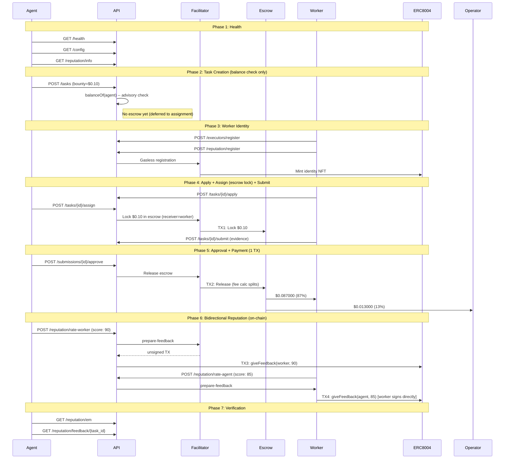
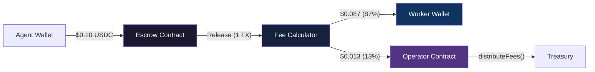

# Golden Flow Report -- Definitive E2E Acceptance Test (Fase 5)

> **Date**: 2026-02-14 17:55 UTC
> **Environment**: Production (Base Mainnet, chain 8453)
> **API**: `https://api.execution.market`
> **Fee Model**: credit_card (fee deducted from bounty on-chain)
> **Escrow Mode**: direct_release (escrow at assignment, 1-TX release)
> **Result**: **7/7 PASS**

---

## Executive Summary

The Golden Flow tested the complete Execution Market lifecycle end-to-end
on production against Base Mainnet using the Fase 5 credit card fee model.
All 7 phases passed, verifying 4 on-chain transactions across escrow, payment,
and bidirectional reputation.

**Fee math validated by Ali Abdoli** (x402r core maintainer): the credit card
model ($0.087 worker net / $0.013 operator fee from $0.10 bounty) is confirmed
correct. See [Ali Validation Notes](ALI_VALIDATION_NOTES.md).

**Overall Result: PASS (7/7)**

---

## On-Chain Infrastructure

| Component | Address | Role |
|-----------|---------|------|
| PaymentOperator (Fase 5) | [`0x271f9fa7f8907aCf178CCFB470076D9129D8F0Eb`](https://basescan.org/address/0x271f9fa7f8907aCf178CCFB470076D9129D8F0Eb) | Immutable escrow config + fee calculator |
| StaticFeeCalculator (1300bps) | [`0xd643DB63028Cd1852AAFe62A0E3d2A5238d7465A`](https://basescan.org/address/0xd643DB63028Cd1852AAFe62A0E3d2A5238d7465A) | On-chain 13% fee split at release |
| AuthCaptureEscrow | [`0xb9488351E48b23D798f24e8174514F28B741Eb4f`](https://basescan.org/address/0xb9488351E48b23D798f24e8174514F28B741Eb4f) | Shared escrow singleton (Base) |
| ERC-8004 Identity Registry | [`0x8004A169FB4a3325136EB29fA0ceB6D2e539a432`](https://basescan.org/address/0x8004A169FB4a3325136EB29fA0ceB6D2e539a432) | Agent/worker identity (CREATE2, all mainnets) |
| ERC-8004 Reputation Registry | [`0x8004BAa17C55a88189AE136b182e5fdA19dE9b63`](https://basescan.org/address/0x8004BAa17C55a88189AE136b182e5fdA19dE9b63) | On-chain reputation scores |
| USDC (Base) | [`0x833589fCD6eDb6E08f4c7C32D4f71b54bdA02913`](https://basescan.org/address/0x833589fCD6eDb6E08f4c7C32D4f71b54bdA02913) | Payment token |
| EM Agent ID | 2106 | Execution Market identity on Base |

---

## Test Configuration

| Parameter | Value |
|-----------|-------|
| Bounty (lock amount) | $0.10 USDC |
| Worker Net (87%) | $0.087000 USDC |
| Operator Fee (13%) | $0.013000 USDC |
| Total Cost to Agent | $0.10 USDC |
| Fee Model | credit_card |
| Escrow Mode | direct_release |
| Worker Wallet | `0x52E05C8e45a32eeE169639F6d2cA40f8887b5A15` |
| Treasury | `0xae07ceb6b395bc685a776a0b4c489e8d9ce9a6ad` |
| API Base | `https://api.execution.market` |
| EM Agent ID | 2106 |

---

## Flow Diagram

---

## Phase Results

| # | Phase | Status | Time |
|---|-------|--------|------|
| 1 | Health & Config Verification | **PASS** | 0.93s |
| 2 | Task Creation (Balance Check) | **PASS** | 91.33s |
| 3 | Worker Registration & Identity | **PASS** | 7.14s |
| 4 | Task Lifecycle (Apply -> Assign+Escrow -> Submit) | **PASS** | 6.26s |
| 5 | Approval & Payment Settlement | **PASS** | 27.59s |
| 6 | Bidirectional Reputation | **PASS** | 8.3s |
| 7 | Final Verification | **PASS** | 0.28s |

**Total elapsed**: 152.87s

---

## Phase Details

### 1. Health & Config Verification

- **Status**: PASS (0.93s)
- Health: `healthy`
- Networks: arbitrum, avalanche, base, celo, ethereum, monad, optimism, polygon
- Preferred network: base
- Min bounty: $0.01
- ERC-8004: available on 18 networks

### 2. Task Creation (Balance Check)

- **Status**: PASS (91.33s)
- **Task ID**: `7b4c0175-9ba6-4c93-84e9-36bebe0ec25a`
- Escrow at creation: **No** (deferred to assignment in `direct_release` mode)
- Fee model: `credit_card`
- Task status: `published`

### 3. Worker Registration & Identity

- **Status**: PASS (7.14s)
- **Executor ID**: `803dfbf1-7b91-4a41-8d31-518f4fa2fcd4`
- ERC-8004 identity: registered via Facilitator (gasless)

### 4. Task Lifecycle (Apply -> Assign+Escrow -> Submit)

- **Status**: PASS (6.26s)
- **Submission ID**: `2a68a56e-e5e7-4412-ba9f-7882afec8d90`
- **Escrow TX (at assignment)**: [`0xba6f704383a176...`](https://basescan.org/tx/0xba6f704383a176fcb2c2d7e52755c41bdaec1cf626564288637e87875051078a)
- Escrow on-chain verification: **SUCCESS** (gas: 201,192)
- Escrow mode: `direct_release` (worker = escrow receiver)

### 5. Approval & Payment Settlement

- **Status**: PASS (27.59s)
- **Escrow Release TX**: [`0xa86bdcf8b05a6e...`](https://basescan.org/tx/0xa86bdcf8b05a6ebcbf1d2f6b9cfe0777ad66f908f92610bb57099e42ad37f5e6)
- Settlement: **1 TX** (fee calculator splits on-chain at release)
- Approve latency: 27.27s

#### Fee Math Verification (Credit Card Model)

| Metric | Expected | Actual | Match |
|--------|----------|--------|-------|
| Lock amount | $0.100000 | $0.100000 | YES |
| Worker net (87%) | $0.087000 | $0.087000 | YES |
| Operator fee (13%) | $0.013000 | $0.013000 | YES |
| TX count | 1 | 1 | YES |

> Fee math confirmed by **Ali Abdoli** (x402r core maintainer):
> *"This looks good to me! $0.087 vs $0.113 is a stylistic choice tbh.
> You can do either one but the math for $0.087 is a bit simpler"*

### 6. Bidirectional Reputation

- **Status**: PASS (8.3s)
- **Agent->Worker TX**: [`fe74cf95c5d781...`](https://basescan.org/tx/fe74cf95c5d7817a1e677b96a2eb384366df6026717f705348051905729ef12b) -- agent rates worker (score: 90)
- **Worker->Agent TX**: [`18468ee223fa6b...`](https://basescan.org/tx/18468ee223fa6bc5db24e72a3626228358875ee6d94fd04e33e3cd763c537887) -- worker rates agent (score: 85), **worker signs directly** (trustless)

Both feedback TXs call `giveFeedback()` on the ERC-8004 Reputation Registry. The worker signs their own TX — no relay, no intermediary. Fully trustless bidirectional reputation.

### 7. Final Verification

- **Status**: PASS (0.28s)
- **EM Reputation Score**: 77.0
- **EM Reputation Count**: 12
- **Feedback document**: available for task `7b4c0175-9ba6-4c93-84e9-36bebe0ec25a`

---

## On-Chain Transaction Summary

| # | Purpose | TX Hash | BaseScan |
|---|---------|---------|----------|
| 1 | Escrow Lock ($0.10) | `0xba6f704383a176fcb2...` | [View](https://basescan.org/tx/0xba6f704383a176fcb2c2d7e52755c41bdaec1cf626564288637e87875051078a) |
| 2 | Escrow Release (1-TX split) | `0xa86bdcf8b05a6ebcbf...` | [View](https://basescan.org/tx/0xa86bdcf8b05a6ebcbf1d2f6b9cfe0777ad66f908f92610bb57099e42ad37f5e6) |
| 3 | Agent rates Worker (90) | `fe74cf95c5d7817a1e67...` | [View](https://basescan.org/tx/fe74cf95c5d7817a1e677b96a2eb384366df6026717f705348051905729ef12b) |
| 4 | Worker rates Agent (85) | `18468ee223fa6bc5db24...` | [View](https://basescan.org/tx/18468ee223fa6bc5db24e72a3626228358875ee6d94fd04e33e3cd763c537887) |

---

## Trust Model

**Key trust properties:**
- **Worker funds are never held by the platform.** Escrow receiver = worker address. Release goes directly to worker via on-chain fee calculator split.
- **Fee split is immutable.** StaticFeeCalculator(1300bps) is deployed at a fixed address. No admin can change the split without deploying a new operator (per Ali's recommendation).
- **Reputation is trustless.** Worker signs their own `giveFeedback()` TX directly on ERC-8004. No relay, no intermediary.
- **Escrow conditions are on-chain.** Release requires Facilitator OR Payer signature. Refund requires Facilitator only (prevents payer self-refund).

---

## Invariants Verified

- [x] API is healthy and returning correct configuration
- [x] Task created successfully with published status (balance check only)
- [x] Escrow locked at assignment (direct_release, worker as receiver)
- [x] Escrow lock TX verified on-chain (status: SUCCESS)
- [x] Worker registered with executor ID and ERC-8004 identity
- [x] Worker receives $0.087000 (87% of bounty, credit card model)
- [x] Operator receives $0.013000 (13% on-chain fee calculator, 1300bps)
- [x] All 4 TXs verified on-chain (status: 0x1)
- [x] Single-TX escrow release (fee split by StaticFeeCalculator)
- [x] Bidirectional reputation: agent rated worker AND worker rated agent (both on-chain)
- [x] Worker signs own reputation TX (trustless, no relay)
- [x] Fee math validated by x402r protocol maintainer

---

## Protocol Validation

This implementation was reviewed and validated by **Ali Abdoli**, core maintainer
of the x402r protocol, on 2026-02-14. Key findings:

1. **Fee math correct** -- credit card model confirmed as valid approach
2. **Immutable operators recommended** -- deploy new PaymentOperator per fee change rather than runtime toggles (less attack surface)
3. **TVL limit** -- $1,000 for new operators, $100,000 for established ones
4. **Mid-payment calculator switching** -- should be avoided; immutable operators eliminate this risk

Full validation notes: [`docs/reports/ALI_VALIDATION_NOTES.md`](ALI_VALIDATION_NOTES.md)
