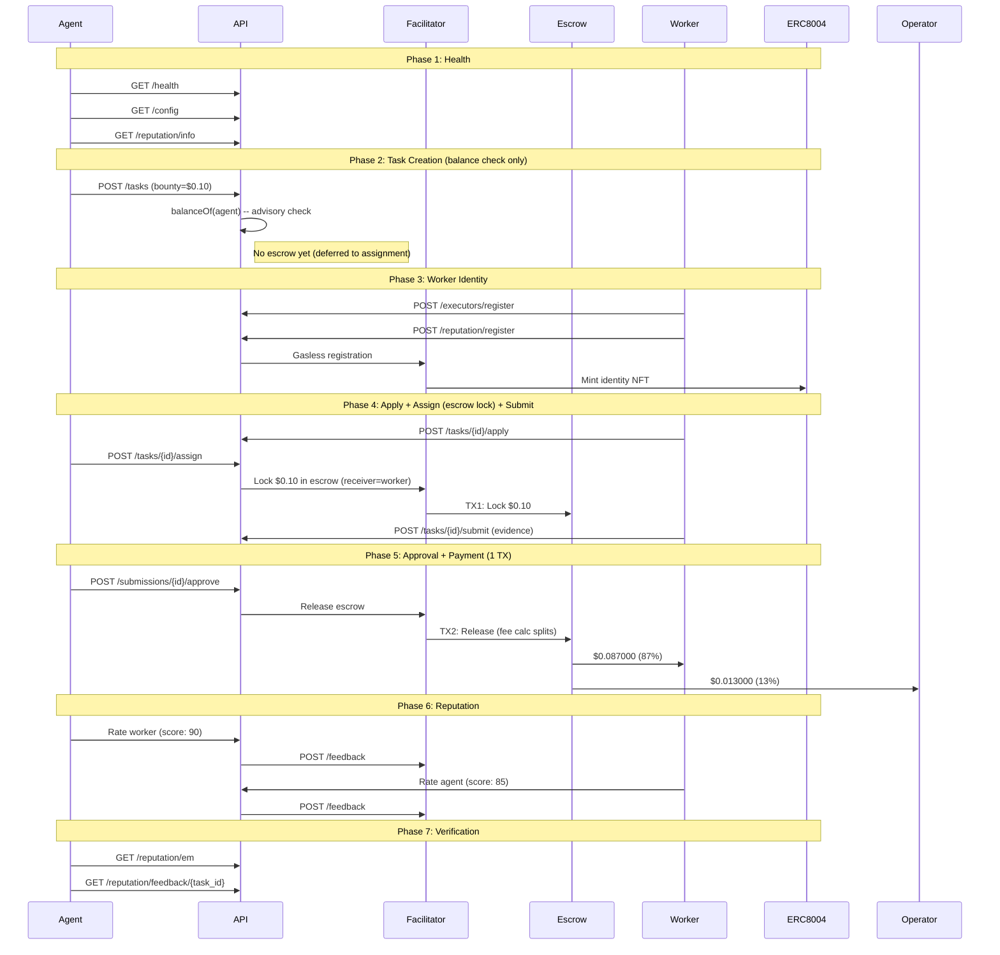

# Golden Flow Report -- Definitive E2E Acceptance Test (Fase 5)

> **Date**: 2026-02-16 15:21 UTC
> **Environment**: Production (Base Mainnet, chain 8453)
> **API**: `https://api.execution.market`
> **Fee Model**: credit_card (fee deducted from bounty on-chain)
> **Escrow Mode**: direct_release (escrow at assignment, 1-TX release)
> **Result**: **PASS**

---

## Executive Summary

The Golden Flow tested the complete Execution Market lifecycle end-to-end 
on production against Base Mainnet using the Fase 5 credit card fee model. 7/7 phases passed.

**Overall Result: PASS**

---

## Test Configuration

| Parameter | Value |
|-----------|-------|
| Bounty (lock amount) | $0.10 USDC |
| Worker Net (87%) | $0.087000 USDC |
| Operator Fee (13%) | $0.013000 USDC |
| Total Cost to Agent | $0.10 USDC |
| Fee Model | credit_card |
| Escrow Mode | direct_release |
| Worker Wallet | `0x52E05C8e45a32eeE169639F6d2cA40f8887b5A15` |
| Treasury | `0xae07ceb6b395bc685a776a0b4c489e8d9ce9a6ad` |
| API Base | `https://api.execution.market` |
| EM Agent ID | 2106 |

---

## Flow Diagram

---

## Phase Results

| # | Phase | Status | Time |
|---|-------|--------|------|
| 1 | Health & Config Verification | **PASS** | 0.69s |
| 2 | Task Creation (Balance Check) | **PASS** | 91.98s |
| 3 | Worker Registration & Identity | **PASS** | 1.97s |
| 4 | Task Lifecycle (Apply -> Assign+Escrow -> Submit) | **PASS** | 6.27s |
| 5 | Approval & Payment Settlement | **PASS** | 18.9s |
| 6 | Bidirectional Reputation | **PASS** | 2.43s |
| 7 | Final Verification | **PASS** | 0.36s |

---

## Health & Config Verification

- **Status**: PASS
- **Time**: 0.69s

## Task Creation (Balance Check)

- **Status**: PASS
- **Time**: 91.98s

- **Task ID**: `812d1d27-358b-4fd7-afbc-36d8e1cc58ca`
- **Escrow at creation**: False
- **Fee model**: credit_card

## Worker Registration & Identity

- **Status**: PASS
- **Time**: 1.97s

- **Executor ID**: `803dfbf1-7b91-4a41-8d31-518f4fa2fcd4`

## Task Lifecycle (Apply -> Assign+Escrow -> Submit)

- **Status**: PASS
- **Time**: 6.27s

- **Submission ID**: `2b518c1d-4750-41be-b514-e6e13860165e`
- **Escrow TX (at assignment)**: [`0xc8c1caf4c765fc...`](https://basescan.org/tx/0xc8c1caf4c765fc9678c864a30383aa890c4da90ce849acf4707a521277b92c59)
- **Escrow Verified**: True
- **Escrow mode**: direct_release

## Approval & Payment Settlement

- **Status**: PASS
- **Time**: 18.9s

- **Payment Mode**: `fase2`
- **Worker TX**: [`0x197c81878b9d54...`](https://basescan.org/tx/0x197c81878b9d548c70c292ecf1d3a8be29ebdf024d4a6850e2fd8763647fa227)
- **Escrow Release**: [`0x197c81878b9d54...`](https://basescan.org/tx/0x197c81878b9d548c70c292ecf1d3a8be29ebdf024d4a6850e2fd8763647fa227)

### Fee Math Verification (Credit Card Model)

| Metric | Expected | Actual | Match |
|--------|----------|--------|-------|
| Worker net (87%) | $0.087000 | $0.087000 | YES |
| Operator fee (13%) | $0.013000 | $0.013000 | YES |
| Lock amount | $0.100000 | $0.100000 | YES |

## Bidirectional Reputation

- **Status**: PASS
- **Time**: 2.43s

- **Agent->Worker TX**: [`37d88e3ab72ec14d...`](https://basescan.org/tx/37d88e3ab72ec14da50c37db9e136f947e1d49b62f4f337d760fd15c970ee3f0)
- **Worker->Agent TX**: [`555502e31583865a...`](https://basescan.org/tx/555502e31583865ac0d672fa351ddf8348359db0f432e2035af1483cb7378d91)

## Final Verification

- **Status**: PASS
- **Time**: 0.36s

- **EM Reputation Score**: 79.0
- **EM Reputation Count**: 14
- **Feedback Available**: True

---

## On-Chain Transaction Summary

| # | TX Hash | BaseScan |
|---|---------|----------|
| 1 | `0xc8c1caf4c765fc9678...` | [View](https://basescan.org/tx/0xc8c1caf4c765fc9678c864a30383aa890c4da90ce849acf4707a521277b92c59) |
| 2 | `0x197c81878b9d548c70...` | [View](https://basescan.org/tx/0x197c81878b9d548c70c292ecf1d3a8be29ebdf024d4a6850e2fd8763647fa227) |
| 3 | `37d88e3ab72ec14da50c...` | [View](https://basescan.org/tx/37d88e3ab72ec14da50c37db9e136f947e1d49b62f4f337d760fd15c970ee3f0) |
| 4 | `555502e31583865ac0d6...` | [View](https://basescan.org/tx/555502e31583865ac0d672fa351ddf8348359db0f432e2035af1483cb7378d91) |

---

## Invariants Verified

- [x] API is healthy and returning correct configuration
- [x] Task created successfully with published status (balance check only)
- [x] Escrow locked at assignment (direct_release, worker as receiver)
- [x] Escrow lock TX verified on-chain (status: SUCCESS)
- [x] Worker registered with executor ID
- [x] Worker receives $0.087000 (87% of bounty, credit card model)
- [x] Operator receives $0.013000 (13% on-chain fee calculator)
- [x] All payment TXs verified on-chain (status: 0x1)
- [x] Single-TX escrow release (fee split by StaticFeeCalculator 1300bps)
- [x] Bidirectional reputation: agent rated worker AND worker rated agent
