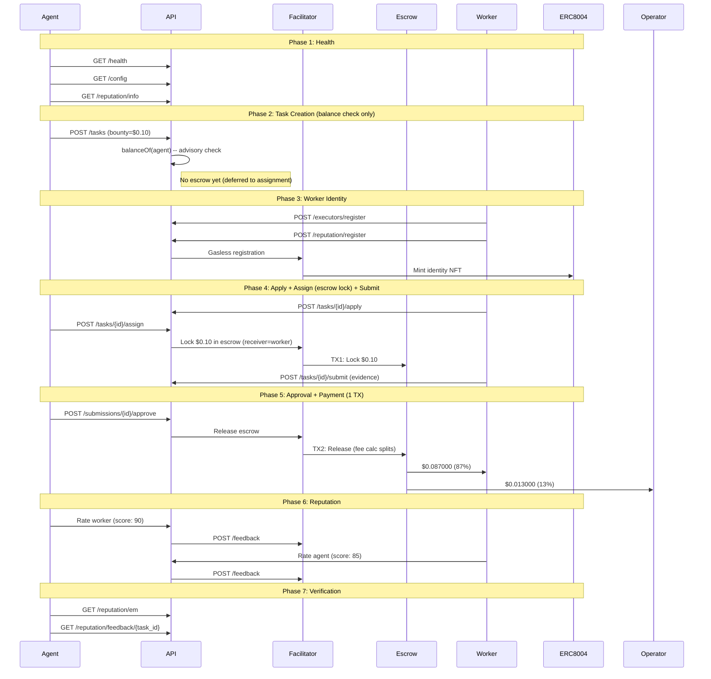

# Golden Flow Report -- Definitive E2E Acceptance Test (Fase 5)

> **Date**: 2026-02-21 03:51 UTC
> **Environment**: Production (Base Mainnet, chain 8453)
> **API**: `https://api.execution.market`
> **Fee Model**: credit_card (fee deducted from bounty on-chain)
> **Escrow Mode**: direct_release (escrow at assignment, 1-TX release)
> **Token**: USDC (`0x833589fCD6eDb6E08f4c7C32D4f71b54bdA02913`)
> **Result**: **FAIL**

---

## Executive Summary

The Golden Flow tested the complete Execution Market lifecycle end-to-end 
on production against Base Mainnet using the Fase 5 credit card fee model with **USDC**. 6/7 phases passed.

**Overall Result: FAIL**

---

## Test Configuration

| Parameter | Value |
|-----------|-------|
| Payment Token | USDC |
| Token Contract | `0x833589fCD6eDb6E08f4c7C32D4f71b54bdA02913` |
| Bounty (lock amount) | $0.10 USDC |
| Worker Net (87%) | $0.087000 USDC |
| Operator Fee (13%) | $0.013000 USDC |
| Total Cost to Agent | $0.10 USDC |
| Fee Model | credit_card |
| Escrow Mode | direct_release |
| Worker Wallet | `0x52E05C8e45a32eeE169639F6d2cA40f8887b5A15` |
| Treasury | `0xae07ceb6b395bc685a776a0b4c489e8d9ce9a6ad` |
| API Base | `https://api.execution.market` |
| EM Agent ID | 2106 |

---

## Flow Diagram

---

## Phase Results

| # | Phase | Status | Time |
|---|-------|--------|------|
| 1 | Health & Config Verification | **PASS** | 0.69s |
| 2 | Task Creation (Balance Check) | **PASS** | 1.34s |
| 3 | Worker Registration & Identity | **PASS** | 14.78s |
| 4 | Task Lifecycle (Apply -> Assign+Escrow -> Submit) | **PASS** | 3.37s |
| 5 | Approval & Payment Settlement | **PASS** | 21.82s |
| 6 | Bidirectional Reputation | **FAIL** | 1.56s |
| 7 | Final Verification | **PASS** | 0.25s |

---

## Health & Config Verification

- **Status**: PASS
- **Time**: 0.69s

## Task Creation (Balance Check)

- **Status**: PASS
- **Time**: 1.34s

- **Task ID**: `bb163aa1-ced1-453b-a776-92dc08798a64`
- **Escrow at creation**: False
- **Fee model**: credit_card

## Worker Registration & Identity

- **Status**: PASS
- **Time**: 14.78s

- **Executor ID**: `803dfbf1-7b91-4a41-8d31-518f4fa2fcd4`
- **ERC-8004 Agent ID**: 18613
- **ERC-8004 TX**: [`0x3a6920303c335f...`](https://basescan.org/tx/0x3a6920303c335fd6d9fa3e47a4b21aa282e04b1d7522eb042efa215968c4c923)

## Task Lifecycle (Apply -> Assign+Escrow -> Submit)

- **Status**: PASS
- **Time**: 3.37s

- **Submission ID**: `746e2d05-821d-4293-b795-6b95e3433840`
- **Escrow TX (at assignment)**: [`0xe1b35ff5308811...`](https://basescan.org/tx/0xe1b35ff5308811201323e7e5cc12fe25d2e812a7cd196564a62c86f7f8540665)
- **Escrow Verified**: True
- **Escrow mode**: direct_release

## Approval & Payment Settlement

- **Status**: PASS
- **Time**: 21.82s

- **Payment Mode**: `unknown`
- **Worker TX**: [`0x4e65280ba444f5...`](https://basescan.org/tx/0x4e65280ba444f55e1d5971ad2e54026cb4003ee33296f99f7bb6aa58973b0499)

## Bidirectional Reputation

- **Status**: FAIL
- **Time**: 1.56s
- **Error**: Unexpected error: 'charmap' codec can't encode characters in position 9-10: character maps to <undefined>

## Final Verification

- **Status**: PASS
- **Time**: 0.25s

- **EM Reputation Score**: 79.0
- **EM Reputation Count**: 14
- **Feedback Available**: True

---

## ERC-8004 Identity Verification

| Field | Value |
|-------|-------|
| Worker Wallet | `0x52E05C8e45a32eeE169639F6d2cA40f8887b5A15` |
| ERC-8004 Agent ID | 18613 |
| Network | base |
| Identity Registry | `0x8004A169FB4a3325136EB29fA0ceB6D2e539a432` |
| Registration TX | `0x3a6920303c335fd6d9fa3e47a4b21aa282e04b1d7522eb042efa215968c4c923` |

---

## On-Chain Transaction Summary

| # | TX Hash | BaseScan |
|---|---------|----------|
| 1 | `0x3a6920303c335fd6d9...` | [View](https://basescan.org/tx/0x3a6920303c335fd6d9fa3e47a4b21aa282e04b1d7522eb042efa215968c4c923) |
| 2 | `0xe1b35ff53088112013...` | [View](https://basescan.org/tx/0xe1b35ff5308811201323e7e5cc12fe25d2e812a7cd196564a62c86f7f8540665) |
| 3 | `0x4e65280ba444f55e1d...` | [View](https://basescan.org/tx/0x4e65280ba444f55e1d5971ad2e54026cb4003ee33296f99f7bb6aa58973b0499) |
| 4 | `db0d363f119ebd91ef69...` | [View](https://basescan.org/tx/db0d363f119ebd91ef696c7eef1fc5b67db9e4e7fc42a69f6c1d467db7e8aca2) |

---

## Invariants Verified

- [x] API is healthy and returning correct configuration
- [x] Task created successfully with published status (balance check only)
- [x] Escrow locked at assignment (direct_release, worker as receiver)
- [x] Escrow lock TX verified on-chain (status: SUCCESS)
- [x] Worker registered with executor ID
- [x] Operator receives $0.013000 (13% on-chain fee calculator)
- [x] All payment TXs verified on-chain (status: 0x1)
- [x] Single-TX escrow release (fee split by StaticFeeCalculator 1300bps)
