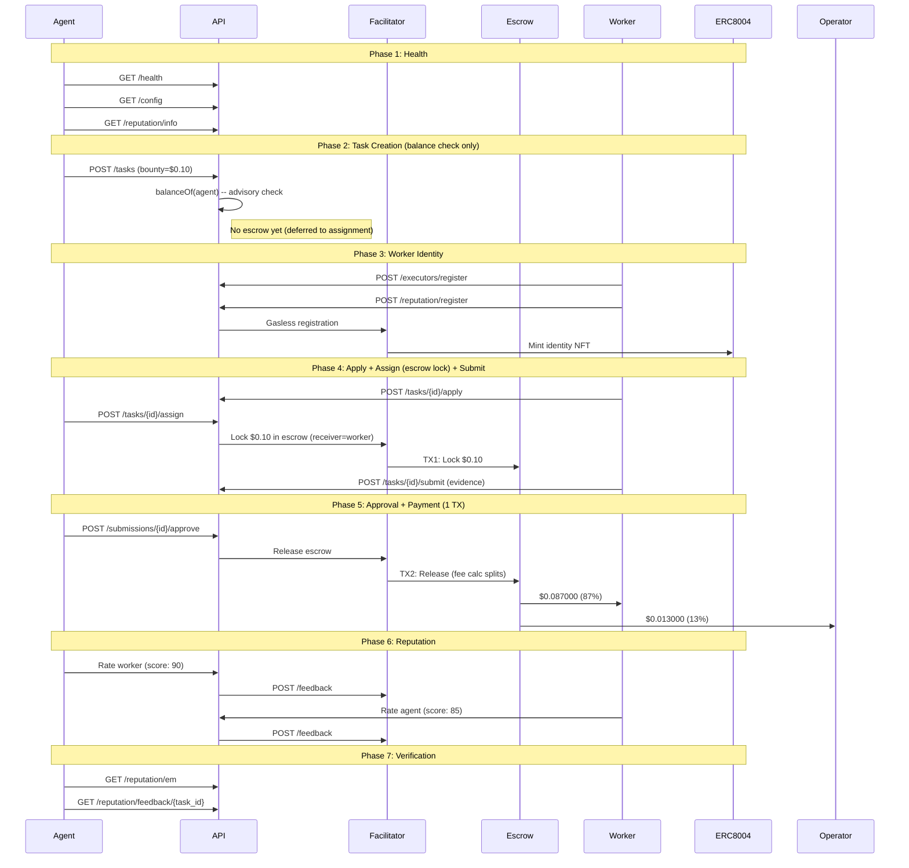

# Golden Flow Report -- Definitive E2E Acceptance Test (Fase 5)

> **Date**: 2026-02-21 09:14 UTC
> **Environment**: Production (Base Mainnet, chain 8453)
> **API**: `https://api.execution.market`
> **Fee Model**: credit_card (fee deducted from bounty on-chain)
> **Escrow Mode**: direct_release (escrow at assignment, 1-TX release)
> **Token**: USDC (`0x833589fCD6eDb6E08f4c7C32D4f71b54bdA02913`)
> **Result**: **PARTIAL**

---

## Executive Summary

The Golden Flow tested the complete Execution Market lifecycle end-to-end 
on production against Base Mainnet using the Fase 5 credit card fee model with **USDC**. 6/7 phases passed.

**Overall Result: PARTIAL**

---

## Test Configuration

| Parameter | Value |
|-----------|-------|
| Payment Token | USDC |
| Token Contract | `0x833589fCD6eDb6E08f4c7C32D4f71b54bdA02913` |
| Bounty (lock amount) | $0.10 USDC |
| Worker Net (87%) | $0.087000 USDC |
| Operator Fee (13%) | $0.013000 USDC |
| Total Cost to Agent | $0.10 USDC |
| Fee Model | credit_card |
| Escrow Mode | direct_release |
| Worker Wallet | `0x52E05C8e45a32eeE169639F6d2cA40f8887b5A15` |
| Treasury | `0xae07ceb6b395bc685a776a0b4c489e8d9ce9a6ad` |
| API Base | `https://api.execution.market` |
| EM Agent ID | 2106 |

---

## Flow Diagram

---

## Phase Results

| # | Phase | Status | Time |
|---|-------|--------|------|
| 1 | Health & Config Verification | **PASS** | 0.5s |
| 2 | Task Creation (Balance Check) | **PASS** | 1.51s |
| 3 | Worker Registration & Identity | **PASS** | 14.01s |
| 4 | Task Lifecycle (Apply -> Assign+Escrow -> Submit) | **PASS** | 13.11s |
| 5 | Approval & Payment Settlement | **PASS** | 26.08s |
| 6 | Bidirectional Reputation | **PARTIAL** | 1.51s |
| 7 | Final Verification | **PASS** | 0.25s |

---

## Health & Config Verification

- **Status**: PASS
- **Time**: 0.5s

## Task Creation (Balance Check)

- **Status**: PASS
- **Time**: 1.51s

- **Task ID**: `2a78dfa3-f190-406c-8376-132b560ab449`
- **Escrow at creation**: False
- **Fee model**: credit_card

## Worker Registration & Identity

- **Status**: PASS
- **Time**: 14.01s

- **Executor ID**: `803dfbf1-7b91-4a41-8d31-518f4fa2fcd4`
- **ERC-8004 Agent ID**: 18644
- **ERC-8004 TX**: [`0xeb86981298d733...`](https://basescan.org/tx/0xeb86981298d733dd40f1f113692f422cb1aa04f3aa8223670804eb4c1d9d71fd)

## Task Lifecycle (Apply -> Assign+Escrow -> Submit)

- **Status**: PASS
- **Time**: 13.11s

- **Submission ID**: `80f66105-3dfa-4d45-9b10-4e0f34c01997`
- **Escrow TX (at assignment)**: [`0xd48cb139bb4328...`](https://basescan.org/tx/0xd48cb139bb43282b00908cac7ca58a43ec6f21ad68877a89aeefd42be5916d0b)
- **Escrow Verified**: True
- **Escrow mode**: direct_release

## Approval & Payment Settlement

- **Status**: PASS
- **Time**: 26.08s

- **Payment Mode**: `unknown`
- **Worker TX**: [`0x1decddb3d26043...`](https://basescan.org/tx/0x1decddb3d2604327290723cf940e8c4447e9510d41a3f69ad9276618da51704d)
- **Fee TX**: [`0xa58c717ab94950...`](https://basescan.org/tx/0xa58c717ab94950786c9c42ce1df6f4e0396130ca8bfa80aa840b3277b214b473)

## Bidirectional Reputation

- **Status**: PARTIAL
- **Time**: 1.51s
- **Error**: Worker->Agent: HTTP 200, success=False, error=EM_WORKER_PRIVATE_KEY not set — worker cannot sign on-chain TX

- **Agent->Worker TX**: [`8e1d50d8d685d503...`](https://basescan.org/tx/8e1d50d8d685d503ce28ec60e4ebc176bd5fce1ab50267a42d48260b25839685)

## Final Verification

- **Status**: PASS
- **Time**: 0.25s

- **EM Reputation Score**: 79.0
- **EM Reputation Count**: 14
- **Feedback Available**: True

---

## ERC-8004 Identity Verification

| Field | Value |
|-------|-------|
| Worker Wallet | `0x52E05C8e45a32eeE169639F6d2cA40f8887b5A15` |
| ERC-8004 Agent ID | 18644 |
| Network | base |
| Identity Registry | `0x8004A169FB4a3325136EB29fA0ceB6D2e539a432` |
| Registration TX | `0xeb86981298d733dd40f1f113692f422cb1aa04f3aa8223670804eb4c1d9d71fd` |

---

## On-Chain Transaction Summary

| # | TX Hash | BaseScan |
|---|---------|----------|
| 1 | `0xeb86981298d733dd40...` | [View](https://basescan.org/tx/0xeb86981298d733dd40f1f113692f422cb1aa04f3aa8223670804eb4c1d9d71fd) |
| 2 | `0xd48cb139bb43282b00...` | [View](https://basescan.org/tx/0xd48cb139bb43282b00908cac7ca58a43ec6f21ad68877a89aeefd42be5916d0b) |
| 3 | `0x1decddb3d260432729...` | [View](https://basescan.org/tx/0x1decddb3d2604327290723cf940e8c4447e9510d41a3f69ad9276618da51704d) |
| 4 | `0xa58c717ab94950786c...` | [View](https://basescan.org/tx/0xa58c717ab94950786c9c42ce1df6f4e0396130ca8bfa80aa840b3277b214b473) |
| 5 | `8e1d50d8d685d503ce28...` | [View](https://basescan.org/tx/8e1d50d8d685d503ce28ec60e4ebc176bd5fce1ab50267a42d48260b25839685) |

---

## Invariants Verified

- [x] API is healthy and returning correct configuration
- [x] Task created successfully with published status (balance check only)
- [x] Escrow locked at assignment (direct_release, worker as receiver)
- [x] Escrow lock TX verified on-chain (status: SUCCESS)
- [x] Worker registered with executor ID
- [x] Operator receives $0.013000 (13% on-chain fee calculator)
- [x] All payment TXs verified on-chain (status: 0x1)
- [x] Single-TX escrow release (fee split by StaticFeeCalculator 1300bps)
