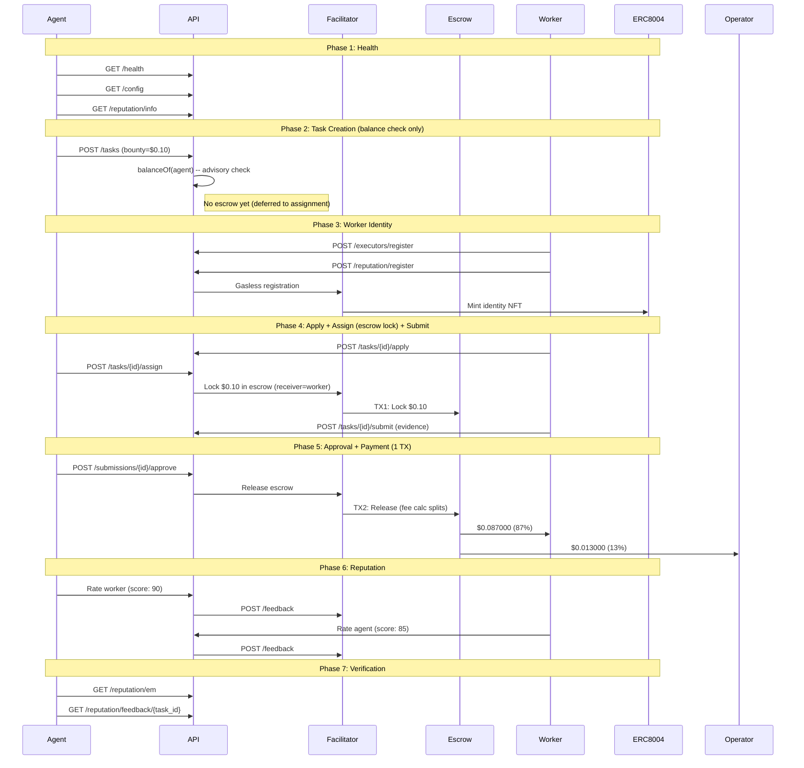

# Golden Flow Report -- Definitive E2E Acceptance Test (Fase 5)

> **Date**: 2026-02-14 04:05 UTC
> **Environment**: Production (Base Mainnet, chain 8453)
> **API**: `https://api.execution.market`
> **Fee Model**: credit_card (fee deducted from bounty on-chain)
> **Escrow Mode**: direct_release (escrow at assignment, 1-TX release)
> **Result**: **PARTIAL**

---

## Executive Summary

The Golden Flow tested the complete Execution Market lifecycle end-to-end 
on production against Base Mainnet using the Fase 5 credit card fee model. 6/7 phases passed.

**Overall Result: PARTIAL**

---

## Test Configuration

| Parameter | Value |
|-----------|-------|
| Bounty (lock amount) | $0.10 USDC |
| Worker Net (87%) | $0.087000 USDC |
| Operator Fee (13%) | $0.013000 USDC |
| Total Cost to Agent | $0.10 USDC |
| Fee Model | credit_card |
| Escrow Mode | direct_release |
| Worker Wallet | `0x52E05C8e45a32eeE169639F6d2cA40f8887b5A15` |
| Treasury | `0xae07ceb6b395bc685a776a0b4c489e8d9ce9a6ad` |
| API Base | `https://api.execution.market` |
| EM Agent ID | 2106 |

---

## Flow Diagram

---

## Phase Results

| # | Phase | Status | Time |
|---|-------|--------|------|
| 1 | Health & Config Verification | **PASS** | 11.94s |
| 2 | Task Creation (Balance Check) | **PASS** | 91.85s |
| 3 | Worker Registration & Identity | **PASS** | 7.5s |
| 4 | Task Lifecycle (Apply -> Assign+Escrow -> Submit) | **PASS** | 8.02s |
| 5 | Approval & Payment Settlement | **PASS** | 42.94s |
| 6 | Bidirectional Reputation | **PARTIAL** | 66.31s |
| 7 | Final Verification | **PASS** | 0.27s |

---

## Health & Config Verification

- **Status**: PASS
- **Time**: 11.94s

## Task Creation (Balance Check)

- **Status**: PASS
- **Time**: 91.85s

- **Task ID**: `e2215052-7436-48d7-bfe4-16447c2b6b03`
- **Escrow at creation**: False
- **Fee model**: credit_card

## Worker Registration & Identity

- **Status**: PASS
- **Time**: 7.5s

- **Executor ID**: `803dfbf1-7b91-4a41-8d31-518f4fa2fcd4`

## Task Lifecycle (Apply -> Assign+Escrow -> Submit)

- **Status**: PASS
- **Time**: 8.02s

- **Submission ID**: `88329014-1d0b-4553-b018-ff31306f9ea7`
- **Escrow TX (at assignment)**: [`0x0e8a29356f9dcc...`](https://basescan.org/tx/0x0e8a29356f9dcc8f3bd52378ae4dad210344935edb48f859d1fb1b7dd3915530)
- **Escrow Verified**: True
- **Escrow mode**: direct_release

## Approval & Payment Settlement

- **Status**: PASS
- **Time**: 42.94s

- **Payment Mode**: `fase2`
- **Worker TX**: [`0x48110f7a38936e...`](https://basescan.org/tx/0x48110f7a38936ee6816dbf7ce5ba827f0b1c48d6e1f5ba2fe01fe3eda1ffaa6c)
- **Escrow Release**: [`0x48110f7a38936e...`](https://basescan.org/tx/0x48110f7a38936ee6816dbf7ce5ba827f0b1c48d6e1f5ba2fe01fe3eda1ffaa6c)

## Bidirectional Reputation

- **Status**: PARTIAL
- **Time**: 66.31s
- **Error**: Agent->Worker: HTTP 200, success=False, error=; Worker->Agent: HTTP 200, success=False, error=

## Final Verification

- **Status**: PASS
- **Time**: 0.27s

- **EM Reputation Score**: 77.0
- **EM Reputation Count**: 7
- **Feedback Available**: True

---

## On-Chain Transaction Summary

| # | TX Hash | BaseScan |
|---|---------|----------|
| 1 | `0x0e8a29356f9dcc8f3b...` | [View](https://basescan.org/tx/0x0e8a29356f9dcc8f3bd52378ae4dad210344935edb48f859d1fb1b7dd3915530) |
| 2 | `0x48110f7a38936ee681...` | [View](https://basescan.org/tx/0x48110f7a38936ee6816dbf7ce5ba827f0b1c48d6e1f5ba2fe01fe3eda1ffaa6c) |

---

## Invariants Verified

- [x] API is healthy and returning correct configuration
- [x] Task created successfully with published status (balance check only)
- [x] Escrow locked at assignment (direct_release, worker as receiver)
- [x] Escrow lock TX verified on-chain (status: SUCCESS)
- [x] Worker registered with executor ID
- [x] All payment TXs verified on-chain (status: 0x1)
- [x] Single-TX escrow release (fee split by StaticFeeCalculator 1300bps)
