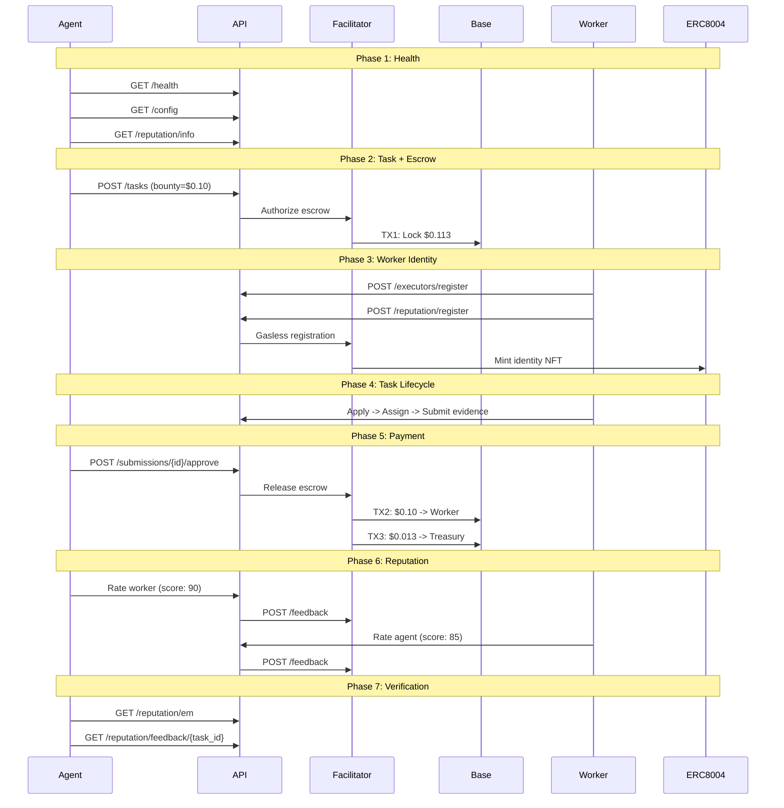

# Golden Flow Report -- Definitive E2E Acceptance Test

> **Date**: 2026-02-13 23:43 UTC
> **Environment**: Production (Base Mainnet, chain 8453)
> **API**: `https://api.execution.market`
> **Result**: **PASS**

---

## Executive Summary

The Golden Flow tested the complete Execution Market lifecycle end-to-end 
on production against Base Mainnet. 7/7 phases passed.

**Overall Result: PASS**

---

## Test Configuration

| Parameter | Value |
|-----------|-------|
| Bounty | $0.10 USDC |
| Platform Fee | 13% ($0.013000) |
| Total Cost | $0.113000 USDC |
| Worker Wallet | `0x52E05C8e45a32eeE169639F6d2cA40f8887b5A15` |
| Treasury | `0xae07ceb6b395bc685a776a0b4c489e8d9ce9a6ad` |
| API Base | `https://api.execution.market` |
| EM Agent ID | 2106 |

---

## Flow Diagram

---

## Phase Results

| # | Phase | Status | Time |
|---|-------|--------|------|
| 1 | Health & Config Verification | **PASS** | 0.47s |
| 2 | Task Creation with Escrow | **PASS** | 20.46s |
| 3 | Worker Registration & Identity | **PASS** | 0.38s |
| 4 | Task Lifecycle (Apply -> Assign -> Submit) | **PASS** | 2.28s |
| 5 | Approval & Payment Settlement | **PASS** | 26.16s |
| 6 | Bidirectional Reputation | **PASS** | 10.31s |
| 7 | Final Verification | **PASS** | 0.27s |

---

## Health & Config Verification

- **Status**: PASS
- **Time**: 0.47s

## Task Creation with Escrow

- **Status**: PASS
- **Time**: 20.46s

- **Task ID**: `ad4d4406-bd43-4734-ac57-5a21732aa1bb`
- **Escrow TX**: [`0xf94925d273f5a0...`](https://basescan.org/tx/0xf94925d273f5a0b1abf83b983becba8f43db9508a982245f57ef7952797c93d6)
- **Escrow Verified**: True
- **Escrow Amount**: $0.113000 USDC

## Worker Registration & Identity

- **Status**: PASS
- **Time**: 0.38s

- **Executor ID**: `803dfbf1-7b91-4a41-8d31-518f4fa2fcd4`

## Task Lifecycle (Apply -> Assign -> Submit)

- **Status**: PASS
- **Time**: 2.28s

- **Submission ID**: `0509169f-75d6-4ab5-8cfb-be070e55f874`

## Approval & Payment Settlement

- **Status**: PASS
- **Time**: 26.16s

- **Payment Mode**: `facilitator`
- **Worker TX**: [`0x750f3843a8fb6e...`](https://basescan.org/tx/0x750f3843a8fb6e94135257c39ee500a914ef745f2d977e73090b818a4d360578)

## Bidirectional Reputation

- **Status**: PASS
- **Time**: 10.31s

- **Agent->Worker TX**: [`0x417e03cb8125f3...`](https://basescan.org/tx/0x417e03cb8125f3c579a90d66eebfe00d5185a199b1b39f0e5641e8df30426113)
- **Worker->Agent TX**: [`0x17cf9ed176fc18...`](https://basescan.org/tx/0x17cf9ed176fc18ffede104f6b9ac6a48c1b8d060c3fb4da765f7e73fdbf1beb2)

## Final Verification

- **Status**: PASS
- **Time**: 0.27s

- **EM Reputation Score**: 82.0
- **EM Reputation Count**: 3
- **Feedback Available**: True

---

## On-Chain Transaction Summary

| # | TX Hash | BaseScan |
|---|---------|----------|
| 1 | `0xf94925d273f5a0b1ab...` | [View](https://basescan.org/tx/0xf94925d273f5a0b1abf83b983becba8f43db9508a982245f57ef7952797c93d6) |
| 2 | `0x750f3843a8fb6e9413...` | [View](https://basescan.org/tx/0x750f3843a8fb6e94135257c39ee500a914ef745f2d977e73090b818a4d360578) |
| 3 | `0x417e03cb8125f3c579...` | [View](https://basescan.org/tx/0x417e03cb8125f3c579a90d66eebfe00d5185a199b1b39f0e5641e8df30426113) |
| 4 | `0x17cf9ed176fc18ffed...` | [View](https://basescan.org/tx/0x17cf9ed176fc18ffede104f6b9ac6a48c1b8d060c3fb4da765f7e73fdbf1beb2) |

---

## Invariants Verified

- [x] API is healthy and returning correct configuration
- [x] Task created successfully with published status
- [x] Escrow TX verified on-chain (status: SUCCESS)
- [x] Worker registered with executor ID
- [x] Treasury receives $0.013000 (13% platform fee)
- [x] All payment TXs verified on-chain (status: 0x1)
- [x] Bidirectional reputation: agent rated worker AND worker rated agent
