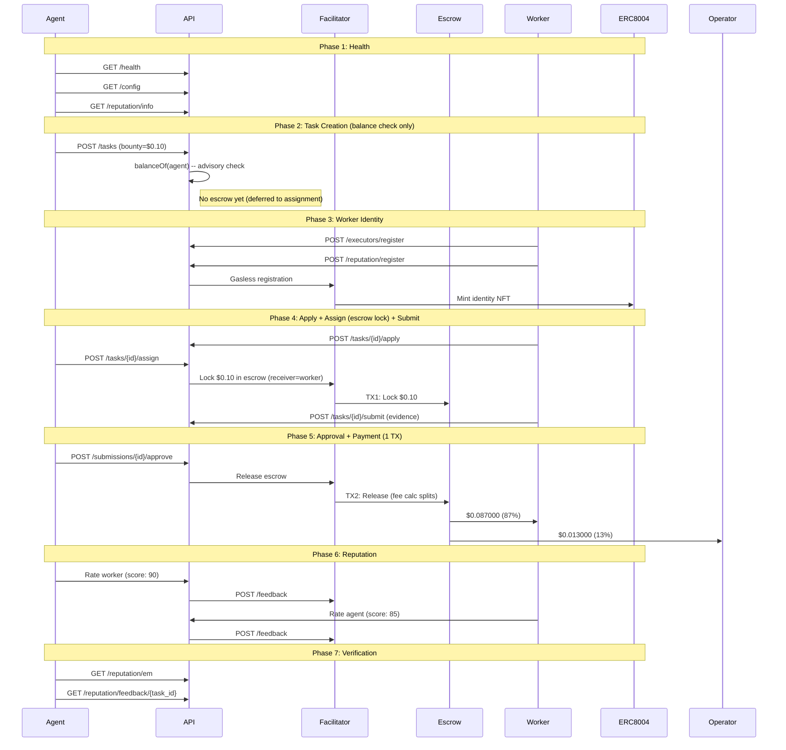

# Golden Flow Report -- Definitive E2E Acceptance Test (Fase 5)

> **Date**: 2026-02-22 02:08 UTC
> **Environment**: Production (Base Mainnet, chain 8453)
> **API**: `https://api.execution.market`
> **Fee Model**: credit_card (fee deducted from bounty on-chain)
> **Escrow Mode**: direct_release (escrow at assignment, 1-TX release)
> **Token**: EURC (`0x60a3E35Cc302bFA44Cb288Bc5a4F316Fdb1adb42`)
> **Result**: **PARTIAL**

---

## Executive Summary

The Golden Flow tested the complete Execution Market lifecycle end-to-end 
on production against Base Mainnet using the Fase 5 credit card fee model with **EURC**. 6/7 phases passed.

**Overall Result: PARTIAL**

---

## Test Configuration

| Parameter | Value |
|-----------|-------|
| Payment Token | EURC |
| Token Contract | `0x60a3E35Cc302bFA44Cb288Bc5a4F316Fdb1adb42` |
| Bounty (lock amount) | $0.10 EURC |
| Worker Net (87%) | $0.087000 EURC |
| Operator Fee (13%) | $0.013000 EURC |
| Total Cost to Agent | $0.10 EURC |
| Fee Model | credit_card |
| Escrow Mode | direct_release |
| Worker Wallet | `0x52E05C8e45a32eeE169639F6d2cA40f8887b5A15` |
| Treasury | `0xae07ceb6b395bc685a776a0b4c489e8d9ce9a6ad` |
| API Base | `https://api.execution.market` |
| EM Agent ID | 2106 |

---

## Flow Diagram

---

## Phase Results

| # | Phase | Status | Time |
|---|-------|--------|------|
| 1 | Health & Config Verification | **PASS** | 1.04s |
| 2 | Task Creation (Balance Check) | **PASS** | 1.73s |
| 3 | Worker Registration & Identity | **PASS** | 14.55s |
| 4 | Task Lifecycle (Apply -> Assign+Escrow -> Submit) | **PASS** | 6.56s |
| 5 | Approval & Payment Settlement | **PASS** | 34.99s |
| 6 | Bidirectional Reputation | **PARTIAL** | 2.39s |
| 7 | Final Verification | **PASS** | 0.26s |

---

## Health & Config Verification

- **Status**: PASS
- **Time**: 1.04s

## Task Creation (Balance Check)

- **Status**: PASS
- **Time**: 1.73s

- **Task ID**: `82f73432-d49b-46f6-9366-aa4c1021f11e`
- **Escrow at creation**: False
- **Fee model**: credit_card

## Worker Registration & Identity

- **Status**: PASS
- **Time**: 14.55s

- **Executor ID**: `803dfbf1-7b91-4a41-8d31-518f4fa2fcd4`
- **ERC-8004 Agent ID**: 18773
- **ERC-8004 TX**: [`0x459afafcb963ae...`](https://basescan.org/tx/0x459afafcb963ae0fdcb795fc6737a00da8b58c9246544a85f1c3707a792d44cc)

## Task Lifecycle (Apply -> Assign+Escrow -> Submit)

- **Status**: PASS
- **Time**: 6.56s

- **Submission ID**: `37dc2267-3d7d-4af8-ac3d-db38ea6e573c`
- **Escrow TX (at assignment)**: [`0xb539db8e953026...`](https://basescan.org/tx/0xb539db8e953026589a91c24423dc932160c72f37063be61d93cb1be617c3dc2e)
- **Escrow Verified**: True
- **Escrow mode**: direct_release

## Approval & Payment Settlement

- **Status**: PASS
- **Time**: 34.99s

- **Payment Mode**: `fase2`
- **Worker TX**: [`0xc4cfe70190194f...`](https://basescan.org/tx/0xc4cfe70190194f62bf0fbd190f39cac607082218b0b17d6ec2b54752b2c66f7c)
- **Escrow Release**: [`0xc4cfe70190194f...`](https://basescan.org/tx/0xc4cfe70190194f62bf0fbd190f39cac607082218b0b17d6ec2b54752b2c66f7c)

### Fee Math Verification (Credit Card Model)

| Metric | Expected | Actual | Match |
|--------|----------|--------|-------|
| Worker net (87%) | $0.087000 | $0.087000 | YES |
| Operator fee (13%) | $0.013000 | $0.013000 | YES |
| Lock amount | $0.100000 | $0.100000 | YES |

## Bidirectional Reputation

- **Status**: PARTIAL
- **Time**: 2.39s
- **Error**: Worker->Agent: HTTP 200, success=False, error=On-chain signing failed: 'SignedTransaction' object has no attribute 'raw_transaction'

- **Agent->Worker TX**: [`0b9284ac6baefe0f...`](https://basescan.org/tx/0b9284ac6baefe0f08163643022201ad690d39b914d0b054b7272a909664bf23)

## Final Verification

- **Status**: PASS
- **Time**: 0.26s

- **EM Reputation Score**: 81.0
- **EM Reputation Count**: 22
- **Feedback Available**: True

---

## ERC-8004 Identity Verification

| Field | Value |
|-------|-------|
| Worker Wallet | `0x52E05C8e45a32eeE169639F6d2cA40f8887b5A15` |
| ERC-8004 Agent ID | 18773 |
| Network | base |
| Identity Registry | `0x8004A169FB4a3325136EB29fA0ceB6D2e539a432` |
| Registration TX | `0x459afafcb963ae0fdcb795fc6737a00da8b58c9246544a85f1c3707a792d44cc` |

---

## On-Chain Transaction Summary

| # | TX Hash | BaseScan |
|---|---------|----------|
| 1 | `0x459afafcb963ae0fdc...` | [View](https://basescan.org/tx/0x459afafcb963ae0fdcb795fc6737a00da8b58c9246544a85f1c3707a792d44cc) |
| 2 | `0xb539db8e953026589a...` | [View](https://basescan.org/tx/0xb539db8e953026589a91c24423dc932160c72f37063be61d93cb1be617c3dc2e) |
| 3 | `0xc4cfe70190194f62bf...` | [View](https://basescan.org/tx/0xc4cfe70190194f62bf0fbd190f39cac607082218b0b17d6ec2b54752b2c66f7c) |
| 4 | `0b9284ac6baefe0f0816...` | [View](https://basescan.org/tx/0b9284ac6baefe0f08163643022201ad690d39b914d0b054b7272a909664bf23) |

---

## Invariants Verified

- [x] API is healthy and returning correct configuration
- [x] Task created successfully with published status (balance check only)
- [x] Escrow locked at assignment (direct_release, worker as receiver)
- [x] Escrow lock TX verified on-chain (status: SUCCESS)
- [x] Worker registered with executor ID
- [x] Worker receives $0.087000 (87% of bounty, credit card model)
- [x] Operator receives $0.013000 (13% on-chain fee calculator)
- [x] All payment TXs verified on-chain (status: 0x1)
- [x] Single-TX escrow release (fee split by StaticFeeCalculator 1300bps)
