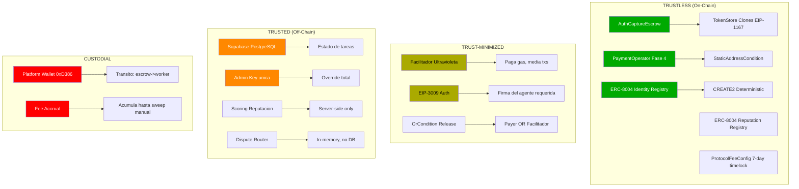
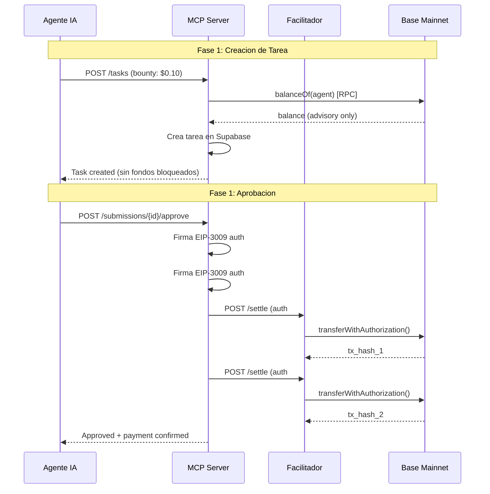
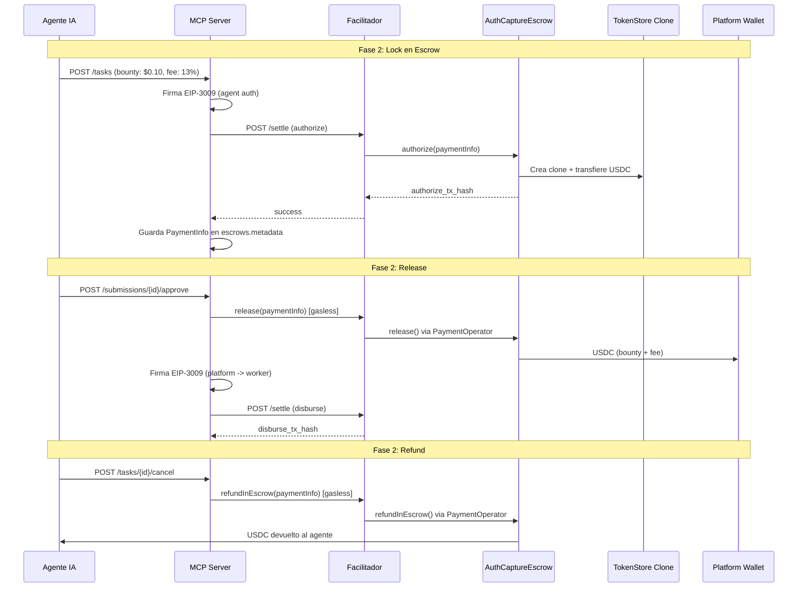
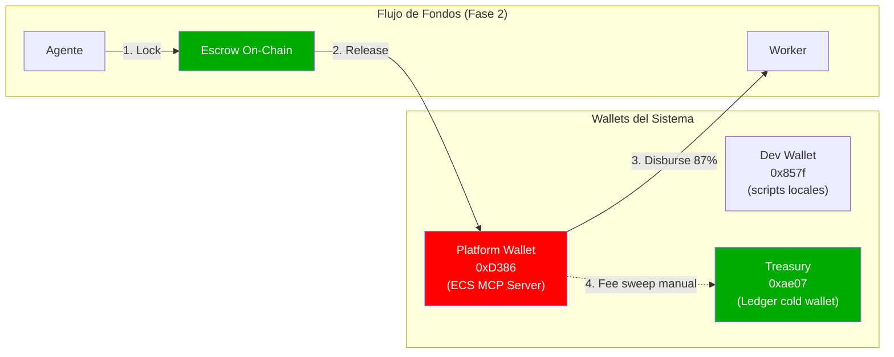
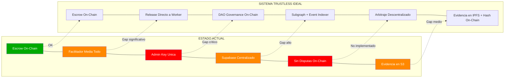

# Auditoria de Trustlessness — Execution Market

**Fecha**: 2026-02-13
**Auditor**: Trustlessness Auditor (Claude Opus 4.6)
**Version del codigo**: commit `3adcc12` (branch `main`)
**Alcance**: Analisis completo de superficies de confianza, vectores de centralizacion y riesgos custodiales

---

## Resumen Ejecutivo

Execution Market es una plataforma donde agentes IA publican bounties para tareas fisicas que humanos ejecutan, con pagos via el protocolo x402. La plataforma opera en **Base Mainnet** con USDC como token de pago.

**Veredicto general: TRUST-MINIMIZED con vectores CUSTODIALES significativos.**

La plataforma implementa escrow on-chain real mediante contratos x402r (AuthCaptureEscrow + PaymentOperator), lo cual proporciona garantias criptograficas sobre la custodia de fondos durante el ciclo de vida de una tarea. Sin embargo, multiples componentes criticos operan de forma centralizada: el Facilitador controla el gas y media todas las operaciones on-chain, un unico admin key gobierna la plataforma sin timelock ni multisig, la autenticacion esta deshabilitada por defecto, y la resolucion de disputas es completamente off-chain y centralizada.

### Hallazgos por Severidad

| Severidad | Cantidad | Descripcion |
|-----------|----------|-------------|
| CRITICO | 3 | Auth deshabilitada por defecto, admin key sin multisig, wallet de plataforma custodial en transito |
| ALTO | 4 | Facilitador como single point of failure, scoring off-chain manipulable, disputas centralizadas, fail-open en balance check |
| MEDIO | 3 | ProtocolFeeConfig externo, evidencia en S3 centralizado, side effects con perdida silenciosa |
| BAJO | 2 | Operador Fase 4 no activado aun, task factory sin limites on-chain |
| INFORMACIONAL | 2 | Migracion de fee 8% a 13%, modulos dormant no conectados |

### Mapa de Confianza



---

## 1. Flujo de Pagos — Fase 1 (Liquidacion Directa)

### Nivel de Confianza: TRUSTED

### Como Funciona

En Fase 1, el modo de pago por defecto en produccion (`EM_PAYMENT_MODE=fase1`):

1. **Creacion de tarea**: Solo se hace un `balanceOf()` RPC al wallet del agente. No se firma nada, no se mueven fondos. La tarea se crea **independientemente del resultado** del balance check.
2. **Aprobacion**: El servidor firma 2 autorizaciones EIP-3009 frescas y las envia al Facilitador para settlement: agente->worker (bounty) + agente->treasury (13% fee).
3. **Cancelacion**: No-op. No se firmo nada, nada que reembolsar.



### Supuestos de Confianza

1. **El servidor firma EIP-3009 con la private key del agente** -- Severidad: CRITICO
   - Que podria salir mal: El servidor tiene acceso a `WALLET_PRIVATE_KEY`, lo que significa que puede firmar transferencias arbitrarias desde el wallet del agente en cualquier momento, sin consentimiento del agente para cada transaccion individual.
   - Mitigacion actual: El agente provee su private key como variable de entorno. En teoria, el agente "confio" al desplegar el servidor.
   - Mitigacion ideal: El agente deberia firmar cada autorizacion EIP-3009 de forma interactiva, o usar un smart contract wallet con reglas de gasto predefinidas.

2. **Balance check es advisory y fail-open** -- Severidad: ALTO
   - Que podria salir mal: En `sdk_client.py`, si el RPC falla, `check_agent_balance()` retorna `sufficient=True`. Esto significa que las tareas se crean aunque el agente no tenga fondos suficientes, causando settlement failures al aprobar.
   - Codigo relevante (`mcp_server/integrations/x402/sdk_client.py`):
     ```python
     # Si el RPC falla, asumimos que hay fondos (optimistic)
     return {"sufficient": True, "balance": "unknown", ...}
     ```
   - Mitigacion: Cambiar a fail-closed o exigir escrow on-chain en creacion (Fase 2).

3. **No hay fondos bloqueados hasta la aprobacion** -- Severidad: ALTO
   - Que podria salir mal: El agente puede gastar sus USDC entre la creacion de la tarea y la aprobacion. El worker completa el trabajo pero el settlement falla por fondos insuficientes. El worker no tiene recurso on-chain.
   - Mitigacion: Migrar a Fase 2 (escrow on-chain en creacion).

### Hallazgos Positivos

- EIP-3009 `transferWithAuthorization()` es un estandar verificable on-chain.
- El Facilitador solo puede ejecutar la autorizacion exacta que fue firmada (monto, receptor, nonce son inmutables en la firma).
- El Facilitador no puede robar fondos mas alla de lo que la autorizacion firmada permite.

### Recomendaciones

- Migrar produccion a Fase 2 como modo por defecto para eliminar el riesgo de fondos insuficientes.
- Implementar firma interactiva de EIP-3009 donde el agente controle su propia clave.
- Cambiar balance check a fail-closed (retornar `sufficient=False` cuando el RPC falla).

---

## 2. Flujo de Pagos — Fase 2 (Escrow On-Chain)

### Nivel de Confianza: TRUST-MINIMIZED

### Como Funciona

En Fase 2 (`EM_PAYMENT_MODE=fase2`):

1. **Creacion de tarea**: Los fondos (bounty + fee) se bloquean on-chain en el contrato AuthCaptureEscrow via el Facilitador. Se crea un TokenStore clone (EIP-1167) para aislar los fondos.
2. **Aprobacion**: 2 transacciones -- (1) release gasless via Facilitador (escrow -> platform wallet), (2) disburse bounty a worker via EIP-3009.
3. **Cancelacion**: Refund gasless via Facilitador -- fondos retornan directamente al wallet del agente.



### Supuestos de Confianza

1. **Fondos pasan por Platform Wallet en transito** -- Severidad: CRITICO
   - Que podria salir mal: Al hacer release, los fondos van del escrow al platform wallet (`0xD386...`), y luego el servidor disbursa al worker en una segunda TX. Si el servidor se cae entre la TX 1 y la TX 2, los fondos quedan atrapados en el platform wallet. La private key del platform wallet es un single point of failure.
   - Evidencia en codigo (`mcp_server/integrations/x402/payment_dispatcher.py`):
     ```python
     # Step 1: Release from escrow to platform wallet
     release_result = await self._release_escrow_via_facilitator(...)
     # Step 2: Disburse to worker (if step 1 succeeded)
     disburse_result = await self._disburse_to_worker(...)
     ```
   - Mitigacion actual: `payment_events` audit trail registra cada paso. Admin puede hacer `POST /payments/retry/{submission_id}` para reintentar.
   - Mitigacion ideal: Release directo del escrow al worker (requiere que el PaymentOperator permita al receiver como beneficiario directo).

2. **Facilitador controla release y refund** -- Severidad: ALTO
   - Que podria salir mal: El Facilitador (servidor de Ultravioleta DAO) es quien ejecuta las operaciones `release()` y `refundInEscrow()` on-chain. Si el Facilitador se cae, no se pueden mover los fondos del escrow.
   - Mitigacion actual (Fase 3/4): `OrCondition` permite que **el payer (agente) O el Facilitador** puedan hacer release. El payer puede interactuar directamente con el contrato sin el Facilitador.
   - Mitigacion actual (escape hatch): El agente puede llamar `PaymentOperator.release()` directamente con su propia wallet, pagando gas.

3. **Fee accrual en platform wallet** -- Severidad: MEDIO
   - Que podria salir mal: Las fees (13%) se acumulan en el platform wallet hasta que un admin ejecuta `POST /admin/fees/sweep`. Mientras tanto, todos los fees acumulados estan bajo una sola private key (AWS Secret `em/x402:PRIVATE_KEY`).
   - Mitigacion actual: Safety buffer de $1.00, minimo sweep de $0.10. Admin endpoints protegidos por `EM_ADMIN_KEY`.
   - Mitigacion ideal: Auto-sweep por smart contract, o transferencia directa del escrow al treasury.

### Hallazgos Positivos

- Fondos genuinamente bloqueados on-chain en TokenStore clones (EIP-1167) -- el escrow es real y verificable.
- PaymentInfo se guarda en la base de datos para reconstruccion de estado tras reinicios del servidor (`_reconstruct_fase2_state()`).
- Expiry automatico del escrow (48 horas por defecto).
- Protocol fee leido dinamicamente de la chain con cache de 5 minutos (`_get_protocol_fee_bps()`).

### Recomendaciones

- Implementar release directo a worker eliminando el paso intermedio por platform wallet.
- Implementar auto-sweep de fees por contrato, no por admin manual.
- Documentar el procedimiento de recuperacion cuando una TX falla entre release y disburse.

---

## 3. Rol del Facilitador

### Nivel de Confianza: TRUSTED (mitigado parcialmente por escape hatches on-chain)

### Como Funciona

El Facilitador (`facilitator.ultravioletadao.xyz`) es un servidor controlado por Ultravioleta DAO que:

- Paga gas por todas las operaciones on-chain (gasless UX).
- Media operaciones de escrow (authorize, release, refund).
- Registra identidades ERC-8004 (gasless registration).
- Registra feedback de reputacion on-chain.
- Ejecuta settlements EIP-3009.

### Supuestos de Confianza

1. **Single point of failure para operaciones on-chain** -- Severidad: ALTO
   - Que podria salir mal: Si el Facilitador se cae, ninguna operacion de pago, identidad o reputacion funciona. Los usuarios no pueden crear tareas con escrow, aprobar submissions, registrar identidades o dar feedback.
   - Mitigacion actual: Para release/refund, el `OrCondition` permite al payer (agente) operar directamente en el contrato, pagando su propio gas.
   - Mitigacion actual para identidad: No hay escape hatch. Sin Facilitador = sin registro ERC-8004.

2. **El Facilitador puede censurar transacciones** -- Severidad: MEDIO
   - Que podria salir mal: El Facilitador puede elegir no procesar ciertas operaciones (ej: no hacer release para un task especifico, no registrar un agente).
   - Mitigacion: El agente siempre puede interactuar directamente con los contratos (pagando gas), excepto para ERC-8004 registration que depende del Facilitador.

3. **El Facilitador conoce todas las operaciones** -- Severidad: BAJO
   - Que podria salir mal: El Facilitador tiene visibilidad completa de todas las transacciones, montos, participantes. Esto es un vector de privacidad, no de seguridad de fondos.
   - Mitigacion: Las operaciones son publicas on-chain de todos modos. El Facilitador no agrega informacion que no sea ya publica.

### Hallazgos Positivos

- El Facilitador NO puede mover fondos fuera de lo que las firmas EIP-3009 autorizan.
- El `OrCondition` en el PaymentOperator proporciona un escape hatch real: el agente puede release/refund sin el Facilitador.
- El Facilitador es software propio de Ultravioleta DAO (repo: `UltravioletaDAO/x402-rs`), no depende de un tercero.

### Recomendaciones

- Implementar un Facilitador de respaldo (redundancia) o documentar el procedimiento de interaccion directa con contratos para cuando el Facilitador no este disponible.
- Evaluar la factibilidad de registro ERC-8004 directo (sin Facilitador) como escape hatch para identidad.

---

## 4. Condiciones del PaymentOperator

### Nivel de Confianza: TRUSTLESS (Fase 4) / TRUST-MINIMIZED (Fase 3)

### Como Funciona

El PaymentOperator es un contrato que define **quien puede autorizar** cada operacion del escrow via "condiciones" -- contratos que verifican la direccion del llamador on-chain.

**Fase 3 Clean** (`0xd514...df95`):
- `RELEASE_CONDITION` = `OrCondition(Payer|Facilitator)` (`0xb365...`)
- `REFUND_IN_ESCROW_CONDITION` = `OrCondition(Payer|Facilitator)` (`0xb365...`)
- `feeCalculator` = `address(0)` (sin fee on-chain del operador)

**Fase 4 Secure** (`0x0303...cBe5`):
- `RELEASE_CONDITION` = `OrCondition(Payer|Facilitator)` (`0xb365...`)
- `REFUND_IN_ESCROW_CONDITION` = `StaticAddressCondition(Facilitator)` (`0x9d03...`)
- `feeCalculator` = `address(0)` (sin fee on-chain del operador)

### Supuestos de Confianza

1. **Fase 3: Payer puede auto-reembolsarse** -- Severidad: CRITICO (para Fase 3)
   - Que podria salir mal: En Fase 3, `REFUND_IN_ESCROW_CONDITION` es `OrCondition(Payer|Facilitator)`. Esto significa que el payer (agente) puede llamar `refundInEscrow()` directamente en el contrato, recuperando sus fondos sin que el Facilitador o el worker puedan impedirlo. Un agente malicioso podria: crear tarea -> worker completa trabajo -> agente se auto-reembolsa.
   - Evidencia en deploy script (`scripts/deploy-payment-operator.ts`):
     ```typescript
     // Fase 3 - KNOWN VULNERABILITY
     refundInEscrowCondition: orCondition, // OR(Payer|Facilitator)

     // Fase 4 - FIXED
     refundInEscrowCondition: facilitatorOnly, // StaticAddressCondition(Facilitator)
     ```
   - Mitigacion: Fase 4 corrige esto. `REFUND_IN_ESCROW_CONDITION` = `StaticAddressCondition(Facilitator)` -- solo el Facilitador puede reembolsar.

2. **Fase 4 aun no esta activo en produccion** -- Severidad: BAJO
   - Que podria salir mal: El operador Fase 4 (`0x0303...cBe5`) esta desplegado y verificado on-chain, pero no esta registrado en el allowlist del Facilitador ni configurado en ECS. Produccion todavia usa Fase 3 Clean.
   - Mitigacion: Activar Fase 4 requiere: (1) agregar al allowlist del Facilitador, (2) actualizar `EM_PAYMENT_OPERATOR` en ECS.

3. **Condiciones son inmutables** -- Severidad: INFORMACIONAL (positivo)
   - Las condiciones del PaymentOperator son set en deploy y no pueden cambiarse despues. No hay funciones de upgrade ni admin keys en el contrato.

### Hallazgos Positivos

- `StaticAddressCondition` y `OrCondition` son contratos simples y auditables que verifican `msg.sender` on-chain.
- El deploy script (`deploy-payment-operator.ts`) incluye verificacion automatica post-deployment que alerta si las condiciones no coinciden.
- Los operadores son inmutables -- una vez desplegados, sus condiciones no pueden modificarse.
- `feeCalculator = address(0)` significa cero fees on-chain adicionales del operador.

### Recomendaciones

- **URGENTE**: Activar Fase 4 en produccion. Cada tarea creada con Fase 3 tiene la vulnerabilidad de auto-reembolso.
- Deprecar formalmente Fase 3 Clean y migrar tareas existentes al nuevo operador.
- Considerar agregar un timelock al release (ej: 1 hora entre submission y release) para dar tiempo al worker de disputar.

---

## 5. Identidad y Reputacion ERC-8004

### Nivel de Confianza: TRUST-MINIMIZED (identidad on-chain) + TRUSTED (scoring off-chain)

### Como Funciona

**Identidad**: Registro on-chain en ERC-8004 Identity Registry (CREATE2 en 15 redes). El Facilitador paga el gas y minta el NFT de identidad. Agent ID #2106 en Base.

**Reputacion On-Chain**: Feedback se registra en ERC-8004 Reputation Registry via Facilitador. Los documentos de feedback se guardan en S3 con hash keccak256 on-chain.

**Scoring Off-Chain**: El sistema de scoring en `mcp_server/reputation/scoring.py` calcula scores multidimensionales (velocidad, evidencia, verificacion AI, forense) que se usan internamente. Estos scores son **completamente off-chain** y manipulables por el servidor.

### Supuestos de Confianza

1. **Scoring es server-side, no verificable on-chain** -- Severidad: ALTO
   - Que podria salir mal: Los scores de reputacion se calculan en el servidor con logica arbitraria. El agente puede dar un `override_score` que toma precedencia sobre los signals objetivos. Un agente malicioso podria dar scores bajos sistematicamente para perjudicar a un worker.
   - Codigo relevante (`mcp_server/reputation/scoring.py`):
     ```python
     if override_score is not None:
         return ReputationScore(
             final_score=max(0.0, min(100.0, override_score)),
             ...
         )
     ```
   - Mitigacion: El feedback on-chain (ERC-8004 Reputation Registry) es persistente e inmutable. Terceros pueden leer el historico on-chain independientemente del scoring del servidor.

2. **Facilitador como gatekeeper de identidad** -- Severidad: MEDIO
   - Que podria salir mal: El Facilitador decide quien se registra on-chain. Si rechaza un registro, el usuario no tiene mecanismo de escape (no puede registrarse directamente sin pagar gas).
   - Mitigacion: Los contratos ERC-8004 son publicos y permiten registro directo pagando gas. Solo la experiencia gasless depende del Facilitador.

3. **Side effects con perdida silenciosa** -- Severidad: MEDIO
   - Que podria salir mal: El outbox pattern en `side_effects.py` reintenta side effects (auto-rating, auto-registration) con backoff exponencial (1m -> 24h, max 6 intentos). Si fallan los 6 intentos, el side effect se pierde silenciosamente. El feedback on-chain nunca se registra.
   - Mitigacion actual: El sistema logea warnings. No hay alerta activa al admin.
   - Mitigacion ideal: Alerta al admin despues de N fallos, cola de dead letters.

### Hallazgos Positivos

- Identidad on-chain es genuinamente verificable -- el NFT de identidad es inmutable y publico.
- Los registros CREATE2 garantizan la misma direccion de contrato en todas las redes.
- El feedback on-chain incluye hash keccak256 del documento completo, permitiendo verificacion de integridad.
- 5 feature flags granulares para controlar side effects (`feature.erc8004_*`).

### Recomendaciones

- Eliminar `override_score` o restringirlo a valores dentro de un rango del score calculado (ej: +/- 10 puntos).
- Implementar alertas para side effects fallidos (dead letter queue + notificacion).
- Considerar publicar los scores calculados on-chain para transparencia (hash del calculo + inputs).

---

## 6. Arquitectura de Wallets

### Nivel de Confianza: CUSTODIAL (en transito)

### Como Funciona



### Supuestos de Confianza

1. **Platform wallet es custodial en transito** -- Severidad: CRITICO
   - Que podria salir mal: El platform wallet (`0xD386`) recibe los fondos del escrow en el paso de release y luego los envia al worker. Durante este periodo (y hasta que se haga fee sweep), los fondos estan bajo una unica private key almacenada en AWS Secrets Manager (`em/x402:PRIVATE_KEY`). Quien tenga acceso a este secret puede mover todos los fondos acumulados.
   - Riesgo cuantificable: En un dia activo, el platform wallet podria acumular multiples bounties + fees sin sweep. Un compromiso de la key = perdida de todos los fondos en transito.
   - Mitigacion actual: La key esta en AWS Secrets Manager con IAM policies. El treasury (`0xae07`) es un Ledger (cold wallet).
   - Mitigacion ideal: Usar un smart contract wallet (Safe) como platform wallet con multisig y reglas automaticas de distribucion.

2. **Dev wallet en .env.local** -- Severidad: MEDIO
   - Que podria salir mal: La dev wallet (`0x857f`) tiene su private key en `.env.local` en texto plano. Si el archivo se filtra, los fondos de testing se pierden.
   - Mitigacion: La dev wallet solo debe tener fondos minimos para testing (< $5 por chain). Produccion usa la platform wallet con AWS Secrets.

3. **Settlement address fallback a treasury** -- Severidad: MEDIO
   - Que podria salir mal: En `sdk_client.py`, si `WALLET_PRIVATE_KEY` no esta configurado, `_resolve_settlement_address()` usa `EM_TREASURY` como fallback. Si los fondos settlea en el treasury (Ledger cold wallet), no se pueden disbursear al worker automaticamente porque la Ledger requiere interaccion manual.
   - Evidencia: Incidente documentado en CLAUDE.md -- "$1.404 settled to treasury instead of platform wallet. Pending Ledger refund."

### Hallazgos Positivos

- Treasury en Ledger cold wallet -- los fees acumulados estan protegidos por hardware.
- Separacion de wallets por entorno (dev vs produccion vs treasury).
- AWS Secrets Manager con IAM para la key de produccion.

### Recomendaciones

- Reemplazar platform wallet EOA por un Gnosis Safe multisig (2-de-3 minimo).
- Implementar auto-sweep por contrato eliminando la acumulacion manual de fees.
- Agregar monitoreo on-chain al platform wallet: alerta si el balance supera un umbral.
- Eliminar el fallback a treasury en `_resolve_settlement_address()` -- si no hay key, debe fallar explicitamente.

---

## 7. Sistema de Evidencia y Disputas

### Nivel de Confianza: TRUSTED (centralizado)

### Como Funciona

**Evidencia**: Los workers suben evidencia (fotos, documentos) via presigned URLs de S3. Los archivos se sirven via CloudFront CDN. Los URLs se almacenan en la tabla `submissions` de Supabase.

**Disputas**: El modulo `disputes/router.py` implementa un sistema de routing de disputas completamente in-memory que NO esta conectado a ningun endpoint de la API (`routes.py`). Es codigo dormant.

### Supuestos de Confianza

1. **Evidencia en S3 es centralizada y mutable** -- Severidad: MEDIO
   - Que podria salir mal: La evidencia se almacena en S3 (AWS). El operador de la plataforma puede eliminar, modificar o reemplazar la evidencia. No hay hash on-chain de la evidencia.
   - Mitigacion parcial: CloudFront CDN proporciona URLs inmutables una vez publicadas, pero el bucket S3 subyacente es mutable.
   - Mitigacion ideal: Hash SHA-256 o IPFS CID de cada pieza de evidencia publicado on-chain (en la tabla `submissions` o en un contrato).

2. **Disputas no implementadas en produccion** -- Severidad: ALTO
   - Que podria salir mal: El modulo `disputes/router.py` es codigo dormant (no conectado a `routes.py` ni `server.py`). En produccion, cuando un agente rechaza una submission, el worker NO tiene mecanismo de disputa. El agente decide unilateralmente.
   - Impacto: Un agente malicioso puede: asignar tarea -> worker completa -> agente rechaza -> worker no cobra -> no hay recurso.
   - El DisputeRouter usa `_pending_arbitrations: Dict` en memoria -- se pierde al reiniciar el servidor.
   - Mitigacion: Ninguna activa. El worker depende enteramente de la honestidad del agente.

3. **Scoring de evidencia es server-side** -- Severidad: MEDIO
   - Que podria salir mal: Las dimensiones de scoring (velocidad, calidad de evidencia, verificacion AI, forense) se calculan en el servidor. No son auditables externamente.
   - El scoring incluye `evidence_quality_score` basado en `evidence_count` y `has_photos/gps/metadata`. Estos datos vienen del servidor, no son verificados on-chain.

### Hallazgos Positivos

- El feedback on-chain (ERC-8004) incluye un hash keccak256 del documento de feedback almacenado en S3, proporcionando una ancla de integridad.
- La forensic metadata (EXIF, GPS) se extrae server-side para validacion de evidencia.
- Presigned URLs de S3 tienen expiracion temporal.

### Recomendaciones

- **URGENTE**: Implementar un mecanismo de disputas funcional. Opciones:
  1. On-chain: Usar escrow con timelock donde el worker puede disputar antes del release.
  2. Off-chain con garantias: Escrow se mantiene bloqueado durante un periodo de disputa (ej: 24 horas post-submission) antes de que el agente pueda hacer release.
  3. Tercero: Integrar MoltCourt o sistema de arbitraje descentralizado.
- Publicar hashes de evidencia on-chain al momento de la submission.
- Migrar evidencia a IPFS para inmutabilidad y verificabilidad.

---

## 8. Base de Datos y Estado Off-Chain

### Nivel de Confianza: TRUSTED (centralizado)

### Como Funciona

Toda la logica de negocio y estado de la plataforma se almacena en **Supabase** (PostgreSQL hosteado):

- `tasks`: Estado de tareas, bounties, deadlines.
- `escrows`: Tracking de escrows on-chain (DB mirror).
- `submissions`: Evidencia de workers.
- `payment_events`: Audit trail de operaciones de pago.
- `executors`: Perfiles de workers, balances, reputacion.
- `erc8004_side_effects`: Outbox de side effects pendientes.

### Supuestos de Confianza

1. **Supabase es la fuente de verdad, no la blockchain** -- Severidad: ALTO
   - Que podria salir mal: El estado del escrow on-chain puede diverger del estado en la DB. Si la DB dice "released" pero el escrow on-chain aun tiene fondos, el sistema no reconcilia automaticamente. Inversamente, si alguien interactua directamente con el contrato, la DB no se entera.
   - Mitigacion actual: `_reconstruct_fase2_state()` en `payment_dispatcher.py` puede releer el estado on-chain al reiniciar. Pero no hay reconciliacion continua.
   - Mitigacion ideal: Event listener on-chain (subgraph o webhook) que sincronice estados automaticamente.

2. **RLS parcialmente implementado** -- Severidad: MEDIO
   - Que podria salir mal: Las politicas RLS en la tabla `escrows` tienen `USING (true)` para SELECT de agentes -- cualquier usuario autenticado puede ver todos los escrows. La tabla `payments` tiene la misma politica abierta.
   - Codigo relevante (`002_escrow_and_payments.sql`):
     ```sql
     -- Agents can view their own escrows
     CREATE POLICY "escrows_select_agent" ON escrows
         FOR SELECT
         USING (true);  -- API validates agent_id
     ```
   - Mitigacion: El comentario dice "API validates agent_id", pero esto depende del backend, no de la DB.

3. **Service role key como god mode** -- Severidad: ALTO
   - Que podria salir mal: El `SUPABASE_SERVICE_KEY` bypasses todas las politicas RLS. Quien tenga este key tiene acceso completo a toda la DB (leer, escribir, borrar). Esta key esta en: ECS secrets, `.env` del MCP server, AWS Secrets Manager.
   - Mitigacion: La key esta en AWS Secrets Manager. Pero es una unica credencial sin rotacion automatica documentada.

### Hallazgos Positivos

- `payment_events` tabla proporciona un audit trail detallado de cada operacion de pago con tx hashes.
- Migrations son versionadas y secuenciales (001 a 030), facilitando auditoria de cambios de esquema.
- Triggers automaticos actualizan balances de executors cuando los pagos se completan.
- `FOR UPDATE` locks en funciones criticas como `release_partial_payment()` previenen race conditions.

### Recomendaciones

- Implementar un reconciliador on-chain<->DB periodico que verifique consistencia de estados de escrow.
- Restringir politicas RLS de escrows y payments a solo registros relacionados con el usuario autenticado.
- Implementar rotacion automatica de la service role key.
- Considerar un event indexer (The Graph subgraph o Ponder) para sincronizar eventos on-chain a la DB.

---

## 9. ProtocolFeeConfig (BackTrack)

### Nivel de Confianza: TRUST-MINIMIZED (timelock + hard cap)

### Como Funciona

BackTrack controla el contrato `ProtocolFeeConfig` (`0x59314674...`) -- un singleton compartido que afecta a TODOS los PaymentOperators en Base. Este contrato puede habilitar una fee del protocolo que se descuenta automaticamente de cada release de escrow.

### Supuestos de Confianza

1. **Parte externa controla parametros de fee** -- Severidad: MEDIO
   - Que podria salir mal: BackTrack puede habilitar una fee de hasta 5% (hard cap on-chain). Esto reduce el monto que llega al treasury de Execution Market en cada tarea.
   - Mitigacion on-chain: Hard cap de 5% inmutable en el contrato. Timelock de 7 dias para cambios.
   - Mitigacion en codigo: `_get_protocol_fee_bps()` lee la fee dinamicamente de la chain y `_compute_treasury_remainder()` ajusta automaticamente:
     ```python
     treasury = total_fee - worker_bounty - protocol_fee
     # Worker SIEMPRE recibe 100% del bounty
     # Treasury absorbe la fee del protocolo
     ```

2. **Confianza en BackTrack como protocolo** -- Severidad: BAJO
   - Que podria salir mal: BackTrack podria subir la fee al maximo (5%), reduciendo significativamente el margen del treasury.
   - Mitigacion: El timelock de 7 dias da tiempo para reaccionar. En el peor caso, se puede desplegar un nuevo PaymentOperator sin feeCalculator del protocolo.

### Hallazgos Positivos

- Hard cap de 5% es una garantia on-chain fuerte.
- Timelock de 7 dias proporciona aviso previo.
- El codigo lee la fee dinamicamente -- no hay valores hardcoded que puedan desincronizarse.
- Worker siempre recibe 100% del bounty -- la fee del protocolo la absorbe el treasury, no el worker.

### Recomendaciones

- Monitorear `ProtocolFeeConfig` on-chain para detectar cambios de fee en el periodo de timelock.
- Documentar el plan de contingencia si BackTrack sube la fee al maximo.

---

## 10. Funciones de Admin

### Nivel de Confianza: TRUSTED (centralizado, sin on-chain constraints)

### Como Funciona

El backend expone endpoints administrativos protegidos por un unico `EM_ADMIN_KEY` (variable de entorno). Las funciones admin incluyen:

- `update_task()`: Cambiar estado, bounty, deadline de cualquier tarea.
- `cancel_task()`: Force-cancel de tareas (incluso non-published).
- `POST /admin/fees/sweep`: Transferir fees acumulados al treasury.
- `POST /admin/payments/retry/{id}`: Reintentar pagos fallidos.
- Platform config: Cambiar fee %, feature flags.

### Supuestos de Confianza

1. **Unica admin key sin multisig ni timelock** -- Severidad: CRITICO
   - Que podria salir mal: Quien tenga `EM_ADMIN_KEY` puede: cambiar bounties de tareas, force-cancel tareas en progreso, ejecutar fee sweeps, cambiar la platform fee, habilitar/deshabilitar features. No hay timelock, no hay multisig, no hay log on-chain de acciones admin.
   - Evidencia (`mcp_server/api/admin.py`):
     ```python
     _ADMIN_KEY = os.environ.get("EM_ADMIN_KEY", "")
     if not secrets.compare_digest(provided_key, _ADMIN_KEY):
         raise HTTPException(status_code=403, detail="Invalid admin key")
     ```
   - Mitigacion actual: `secrets.compare_digest` previene timing attacks. La key esta en env vars (no hardcoded).
   - Mitigacion ideal: Multisig wallet, timelock on-chain, audit log inmutable.

2. **Auth deshabilitada por defecto** -- Severidad: CRITICO
   - Que podria salir mal: `EM_REQUIRE_API_KEY` default es `"false"`. Esto significa que **cualquiera** puede crear tareas, aprobar submissions y mover fondos como el agente de la plataforma (agent_id=2106) sin autenticacion.
   - Codigo relevante (`mcp_server/api/auth.py`):
     ```python
     _REQUIRE_API_KEY = os.environ.get("EM_REQUIRE_API_KEY", "false").lower() == "true"
     ```
   - Si no se setea explicitamente `EM_REQUIRE_API_KEY=true` en produccion, la API esta completamente abierta.
   - Mitigacion: Verificar que ECS tiene `EM_REQUIRE_API_KEY=true` en produccion.

3. **DEV_ALLOW_FAKE_KEYS bypass** -- Severidad: MEDIO (si llega a produccion)
   - Que podria salir mal: Si `DEV_ALLOW_FAKE_KEYS=true` esta seteado en produccion, cualquier key con formato valido (`em_free_xxxx...`) es aceptada sin verificacion en DB.
   - Mitigacion: Solo debe usarse en desarrollo. Verificar que no esta seteado en ECS.

### Hallazgos Positivos

- `secrets.compare_digest` es la funcion correcta para comparacion de keys (previene timing attacks).
- Admin endpoints estan separados en su propio modulo (`admin.py`) con su propia dependencia de autenticacion.
- Fee sweep tiene safety buffer ($1.00) y minimo ($0.10).

### Recomendaciones

- **URGENTE**: Verificar que `EM_REQUIRE_API_KEY=true` esta seteado en ECS produccion.
- **URGENTE**: Verificar que `DEV_ALLOW_FAKE_KEYS` NO esta seteado en ECS produccion.
- Implementar multisig (Gnosis Safe) para operaciones admin criticas (fee sweep, task override).
- Agregar timelock a cambios de platform config (fee %, feature flags).
- Implementar audit log inmutable de acciones admin (on-chain o append-only log).

---

## Analisis Comparativo: Estado Actual vs. Sistema Trustless Ideal



### Espectro de Confianza por Componente

| Componente | Nivel Actual | Nivel Ideal | Gap |
|------------|:---:|:---:|:---:|
| Escrow de fondos | TRUST-MINIMIZED | TRUSTLESS | Bajo |
| Release a worker | CUSTODIAL (transito) | TRUSTLESS | Alto |
| Condiciones on-chain (Fase 4) | TRUSTLESS | TRUSTLESS | Ninguno |
| Facilitador (gas) | TRUSTED | TRUST-MINIMIZED | Medio |
| Identidad ERC-8004 | TRUST-MINIMIZED | TRUSTLESS | Bajo |
| Reputacion scoring | TRUSTED | TRUST-MINIMIZED | Alto |
| Disputas | NO IMPLEMENTADO | TRUSTLESS | Critico |
| Base de datos | TRUSTED | TRUST-MINIMIZED | Alto |
| Admin | TRUSTED | TRUSTLESS (DAO) | Critico |
| Evidencia | TRUSTED | TRUST-MINIMIZED | Medio |
| Auth API | TRUSTED (deshabilitada!) | TRUST-MINIMIZED | Critico |
| ProtocolFeeConfig | TRUST-MINIMIZED | TRUST-MINIMIZED | Ninguno |

---

## Resumen de Recomendaciones Priorizadas

### Prioridad 1 -- INMEDIATO (seguridad de fondos y acceso)

| # | Recomendacion | Componente | Esfuerzo |
|---|---------------|------------|----------|
| 1 | Verificar `EM_REQUIRE_API_KEY=true` en ECS produccion | Auth | 5 min |
| 2 | Verificar `DEV_ALLOW_FAKE_KEYS` NO esta en ECS produccion | Auth | 5 min |
| 3 | Activar Fase 4 Secure Operator en produccion | PaymentOperator | 1 hora |
| 4 | Eliminar fallback a treasury en `_resolve_settlement_address()` | Wallet | 30 min |

### Prioridad 2 -- CORTO PLAZO (reduccion de trust surfaces)

| # | Recomendacion | Componente | Esfuerzo |
|---|---------------|------------|----------|
| 5 | Migrar produccion a Fase 2 (escrow on-chain por defecto) | Pagos | 2-4 horas |
| 6 | Implementar release directo a worker (sin platform wallet intermedio) | Pagos | 1-2 semanas |
| 7 | Cambiar balance check a fail-closed | Pagos | 1 hora |
| 8 | Reemplazar platform wallet EOA por Gnosis Safe | Wallet | 1 dia |
| 9 | Eliminar o restringir `override_score` en scoring | Reputacion | 2 horas |

### Prioridad 3 -- MEDIANO PLAZO (hardening)

| # | Recomendacion | Componente | Esfuerzo |
|---|---------------|------------|----------|
| 10 | Implementar disputas funcionales (on-chain o con timelock) | Disputas | 2-4 semanas |
| 11 | Publicar hashes de evidencia on-chain | Evidencia | 1 semana |
| 12 | Implementar reconciliador on-chain <-> DB | Estado | 1-2 semanas |
| 13 | Implementar multisig para admin operations | Admin | 1 semana |
| 14 | Implementar auto-sweep de fees por contrato | Wallet | 1-2 semanas |
| 15 | Alertas para side effects fallidos (dead letter queue) | ERC-8004 | 2-3 dias |

### Prioridad 4 -- LARGO PLAZO (trustlessness plena)

| # | Recomendacion | Componente | Esfuerzo |
|---|---------------|------------|----------|
| 16 | Migrar evidencia a IPFS | Evidencia | 1-2 semanas |
| 17 | Event indexer on-chain (The Graph / Ponder) | Estado | 2-4 semanas |
| 18 | DAO governance on-chain para parametros de plataforma | Admin | 1-3 meses |
| 19 | Firma interactiva EIP-3009 (agente controla su key) | Pagos | 2-4 semanas |
| 20 | Arbitraje descentralizado (MoltCourt o similar) | Disputas | 1-3 meses |

---

## Apendice A: Contratos Verificados On-Chain

| Contrato | Direccion | Red | Estado |
|----------|-----------|-----|--------|
| ERC-8004 Identity Registry | `0x8004A169FB4a3325136EB29fA0ceB6D2e539a432` | All Mainnets | Activo |
| ERC-8004 Reputation Registry | `0x8004BAa17C55a88189AE136b182e5fdA19dE9b63` | All Mainnets | Activo |
| AuthCaptureEscrow | `0xb9488351E48b23D798f24e8174514F28B741Eb4f` | Base | Activo |
| PaymentOperator Fase 4 | `0x030353642B936c9D4213caD7BcB0fB8a1489cBe5` | Base | Desplegado, no activado |
| PaymentOperator Fase 3 Clean | `0xd5149049e7c212ce5436a9581b4307EB9595df95` | Base | Activo (vulnerable) |
| StaticAddressCondition(Facilitator) | `0x9d03c03c15563E72CF2186E9FDB859A00ea661fc` | Base | Activo |
| OrCondition(Payer\|Facilitator) | `0xb365717C35004089996F72939b0C5b32Fa2ef8aE` | Base | Activo |
| StaticFeeCalculator(100bps) | `0xB422A41aae5aFCb150249228eEfCDcd54f1FD987` | Base | Activo (no usado) |
| ProtocolFeeConfig | `0x59314674...` | Base | Controlado por BackTrack |

## Apendice B: Archivos Auditados

| Archivo | Lineas | Proposito |
|---------|--------|-----------|
| `mcp_server/integrations/x402/sdk_client.py` | 1780 | SDK wrapper, EIP-3009, balance checks |
| `mcp_server/integrations/x402/payment_dispatcher.py` | 2084 | Orquestacion de pagos multi-fase |
| `mcp_server/integrations/x402/advanced_escrow_integration.py` | 733 | Integracion avanzada de escrow |
| `mcp_server/api/routes.py` | ~7000+ | Endpoints REST API |
| `mcp_server/api/admin.py` | 1556 | Endpoints admin |
| `mcp_server/api/auth.py` | 449 | Autenticacion API |
| `mcp_server/integrations/erc8004/facilitator_client.py` | 865 | Operaciones ERC-8004 via Facilitador |
| `mcp_server/reputation/scoring.py` | 240 | Scoring multidimensional |
| `mcp_server/reputation/side_effects.py` | 257 | Outbox de side effects |
| `mcp_server/disputes/router.py` | 392 | Router de disputas (dormant) |
| `scripts/deploy-payment-operator.ts` | 894 | Deploy de PaymentOperator |
| `supabase/migrations/002_escrow_and_payments.sql` | 850 | Schema de escrow y pagos |
| `supabase/migrations/027_payment_events.sql` | 45 | Audit trail de pagos |

## Apendice C: Glosario de Trust Levels

| Nivel | Definicion |
|-------|-----------|
| **TRUSTLESS** | Logica pura de smart contract, sin admin keys, sin upgradability. El usuario siempre puede salir unilateralmente. |
| **TRUST-MINIMIZED** | Escrow on-chain con mediacion off-chain para gas/UX. Existen escape hatches. Timelocks en cambios. |
| **TRUSTED** | Decisiones mediadas por servidor sin enforcement on-chain. El servidor podria comportarse mal, pero el dano es limitado. |
| **CUSTODIAL** | El servidor/wallet controla fondos sin garantias on-chain de retorno. El usuario no puede salir unilateralmente. |

---

*Reporte generado el 2026-02-13 por el Trustlessness Auditor. Basado en lectura directa del codigo fuente y documentacion del proyecto.*
