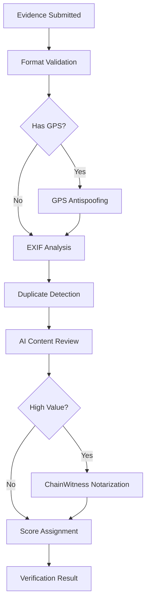

# Evidence Verification

Comprehensive verification pipeline for task submissions. 12 evidence types with multi-layer validation including GPS antispoofing, AI review, forensic checks, and on-chain notarization.

## Evidence Types

| Type | Description | Verification |
|------|-------------|-------------|
| `photo` | Standard photograph | EXIF, AI content check |
| `photo_geo` | Geotagged photograph | GPS validation + EXIF |
| `video` | Video recording | Duration, content check |
| `document` | Scanned document | OCR, format validation |
| `receipt` | Purchase receipt | Amount, vendor, date |
| `signature` | Signed document | Signature presence check |
| `notarized` | Notarized document | Seal + notary verification |
| `timestamp_proof` | Timestamped evidence | Chain timestamp validation |
| `text_response` | Written answer | Completeness, relevance |
| `measurement` | Physical measurement | Value range, units |
| `screenshot` | Screen capture | Metadata, tampering check |
| `audio` | Audio recording | Duration, content check |

## Verification Pipeline

### Layer 1: Format Validation
Basic checks -- file size, MIME type, required metadata present.

### Layer 2: GPS Antispoofing
For `photo_geo` evidence. Validates coordinates against task location. Detects spoofed GPS via consistency checks (altitude, accuracy, speed).

### Layer 3: EXIF Analysis
Extracts camera metadata. Checks for manipulation indicators: software editing tags, inconsistent timestamps, missing expected fields.

### Layer 4: Duplicate Detection
Hash-based comparison against previously submitted evidence. Prevents reuse of old photos/documents across tasks.

### Layer 5: AI Content Review
Detects AI-generated images/text. Validates that evidence matches task requirements (e.g., photo shows the requested location).

### Layer 6: ChainWitness Notarization (Tier 2)
For high-value tasks. On-chain attestation of evidence hash and timestamp. Score bonus: +7 points. See [[chainwitness]].

## Source

Verification modules: `mcp_server/verification/`
Security checks: `mcp_server/security/`

## Related

- [[fraud-detection]] -- Detailed anti-gaming measures
- [[chainwitness]] -- On-chain notarization service
- [[task-lifecycle]] -- VERIFYING state in the state machine
- [[task-categories]] -- Which evidence types each category uses
