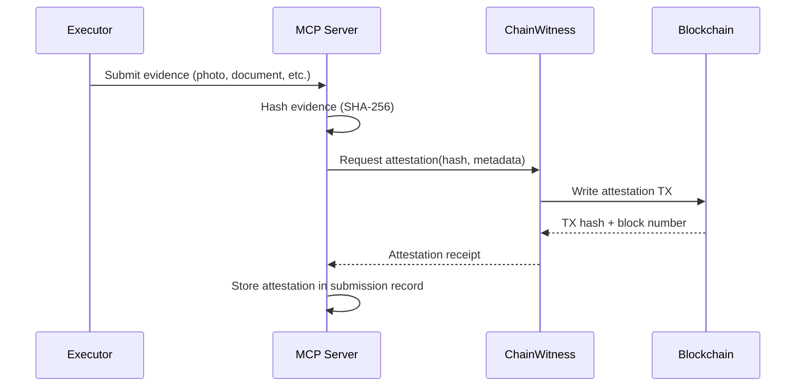

# ChainWitness

On-chain evidence notarization service used for high-value task submissions. Provides immutable, timestamped proof that evidence existed at a specific point in time.

## Overview

| Field | Value |
|-------|-------|
| Tier | 2 (premium verification) |
| Score bonus | +7 points |
| Trigger | High-value tasks (configurable threshold) |
| Module | `mcp_server/verification/attestation.py` |

## How It Works

### Steps

1. **Evidence hashing**: Server computes SHA-256 of the submitted evidence file
2. **Attestation request**: Hash + task metadata sent to ChainWitness service
3. **On-chain write**: ChainWitness writes the hash to the blockchain with a timestamp
4. **Receipt storage**: TX hash and block number stored alongside the submission

## When It Triggers

ChainWitness notarization is used when:
- Task bounty exceeds the high-value threshold
- Task category is `human_authority` (notarized documents, legal tasks)
- Publisher explicitly requests on-chain attestation
- Dispute is raised on a submission (retroactive notarization)

## Verification Score Impact

| Check | Base Score | With ChainWitness |
|-------|-----------|-------------------|
| Photo evidence | 5 | 12 |
| Document evidence | 6 | 13 |
| Notarized document | 8 | 15 |

## Limitations

- Proves evidence EXISTED at time T, not that it is AUTHENTIC
- Cannot verify content of the evidence, only its hash
- On-chain TX cost applies (paid by platform, not executor)
- Latency: depends on block confirmation time of the target chain

## Related

- [[evidence-verification]] -- Full verification pipeline
- [[task-categories]] -- Which categories trigger notarization
- [[fraud-detection]] -- Complementary anti-tampering checks
