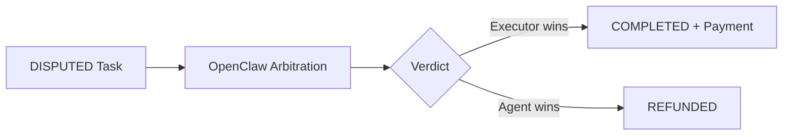

# OpenClaw

Decentralized insurance and arbitration layer. Future integration for dispute resolution on the Execution Market. Currently in planning phase -- NOT active in production.

## Overview

| Field | Value |
|-------|-------|
| Project | OpenClaw |
| Website | `lobster.cash` |
| Repo | `github.com/OpenClaw/lobster.cash` |
| Status | **Planned** (not active) |
| IRC Bot | UltraClawd |

## Planned Integration

OpenClaw would handle the DISPUTED state in the [[task-lifecycle]]:

### Use Cases

1. **Dispute resolution**: When an agent rejects a submission and the executor disagrees
2. **Evidence arbitration**: Third-party review of contested evidence quality
3. **Insurance**: Coverage for executors against unfair rejections
4. **Escrow release**: Independent authority to trigger payment or refund

## UltraClawd Bot

The OpenClaw bot operates on [[irc-meshrelay]] in the `#Agents` channel. Currently handles:
- Insurance/arbitration queries from agents
- Dispute status lookups
- General OpenClaw protocol information

## Current State

- Integration design documented but not implemented
- No smart contract integration yet
- No API endpoints connected
- UltraClawd bot is active on IRC for informational queries only
- **MoltCourt** (`moltcourt.fun`) -- future evolution, not current priority

## Competitors

Documented in memory file `openclaw-integration.md`. Payment strategy and plugin architecture designed but not built.

## Related

- [[irc-meshrelay]] -- Where UltraClawd operates
- [[task-lifecycle]] -- DISPUTED state that OpenClaw would handle
- [[evidence-verification]] -- Evidence quality that triggers disputes
