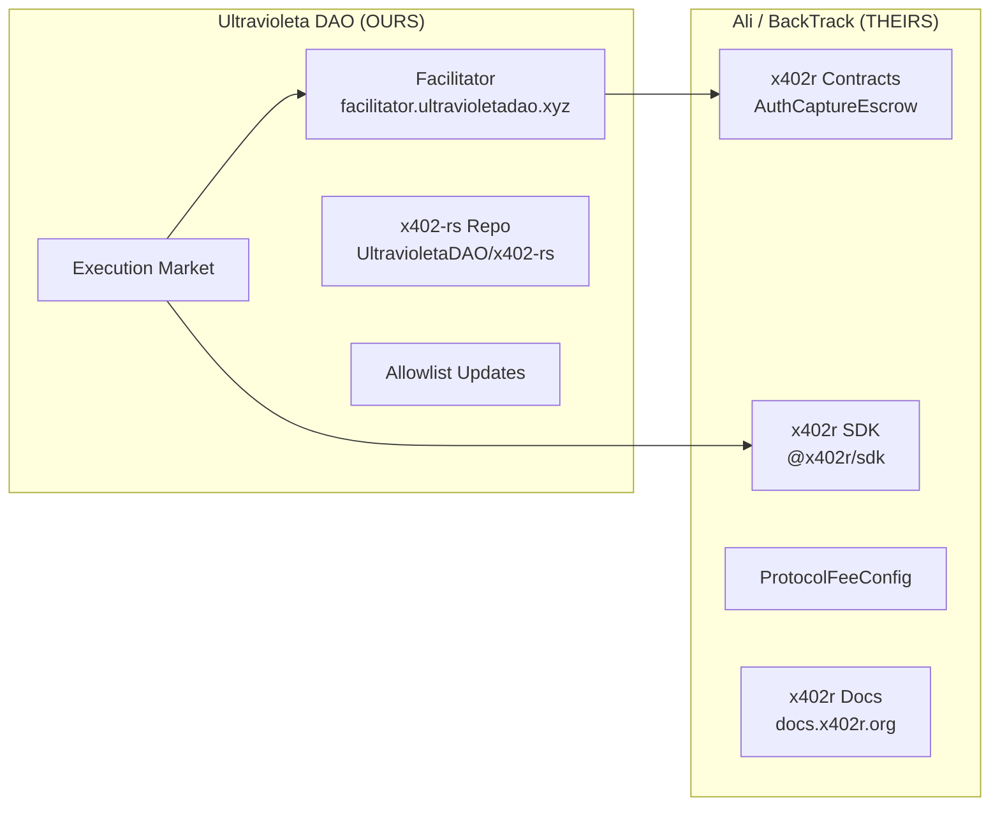

# x402r Team Relationship

**CRITICAL OWNERSHIP BOUNDARY** -- misunderstanding this causes incorrect decisions about who fixes what and who controls what.

## Ownership Map

## Rules

1. **Facilitator = OURS.** We deploy, control, maintain, update. Repo: `UltravioletaDAO/x402-rs`. NEVER say Ali owns or controls the Facilitator.

2. **Allowlist updates = OUR job.** When a new PaymentOperator is deployed, WE update `addresses.rs` in our x402-rs repo. Not Ali.

3. **x402r SDK bugs = THEIR responsibility.** Report to BackTrack via GitHub issues or IRC. Examples: wrong factory addresses, incorrect domain names, missing ESCROW_CONTRACTS entries.

4. **ProtocolFeeConfig = THEIR control.** Up to 5% hard cap, 7-day timelock. Our code reads it from chain dynamically. We adapt, we do not control it.

5. **Contract deployments = SHARED.** We deploy PaymentOperators using their SDK/contracts. They maintain the underlying AuthCaptureEscrow singletons.

## Contact

- **Ali**: x402r protocol lead at BackTrack
- **Communication**: GitHub issues, IRC `#Agents`
- **Repos**: `github.com/BackTrackCo/x402r-contracts`, `github.com/BackTrackCo/x402r-sdk`

## Common Mistakes to Avoid

- Asking Ali to update our Facilitator allowlist
- Blaming our Facilitator for SDK-level bugs (wrong factory addresses)
- Assuming Ali controls payment flow through our platform
- Waiting for Ali to deploy Facilitator changes

## Related

- [[facilitator]] -- Our Facilitator details
- [[protocol-fee-config]] -- BackTrack's fee configuration
- [[x402r-escrow]] -- Contract architecture
- [[fase-5-operators]] -- Our PaymentOperator deployments
