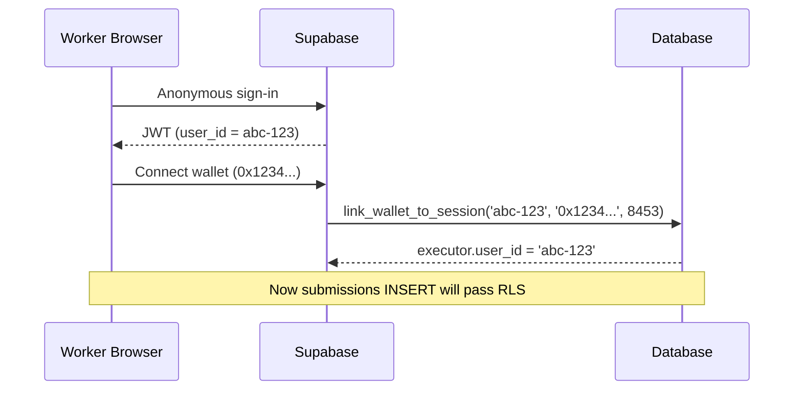

# RLS Policies

Supabase Row-Level Security (RLS) policies control what each authenticated user can read and write in the database. These are the last line of defense -- even if application code has bugs, RLS prevents unauthorized data access.

## Policy Matrix

| Table | SELECT | INSERT | UPDATE | DELETE |
|-------|--------|--------|--------|--------|
| `tasks` | All published | Agent (own) | Agent (own) | None |
| `executors` | Own profile | Own | Own | None |
| `submissions` | Task owner + executor | Executor (linked) | None | None |
| `disputes` | Participants | System | System | None |
| `reputation_log` | Public | System | None | None |
| `platform_config` | All | Admin | Admin | None |
| `payment_events` | Task owner | System | None | None |

## Critical: Submissions INSERT Policy

```sql
-- Executor must be linked to the current auth session
CREATE POLICY "Executors can insert submissions"
ON submissions FOR INSERT
WITH CHECK (
    EXISTS (
        SELECT 1 FROM executors
        WHERE executors.id = submissions.executor_id
        AND executors.user_id = auth.uid()
    )
);
```

**SILENT FAILURE**: If `executors.user_id` does not match `auth.uid()`, the INSERT returns 0 rows with NO error. This is by Supabase design -- RLS violations on INSERT do not throw.

**Mitigation**: `submitWork()` in the dashboard detects 0-row inserts and shows a user-facing error message explaining the wallet linkage issue.

## Wallet Linkage Flow



## Admin Access

Admin endpoints bypass RLS using the Supabase service key (`SUPABASE_SERVICE_KEY` in `mcp_server/.env`). The service key has full database access -- it is never exposed to the frontend.

Admin dashboard uses `X-Admin-Key` header for API auth, but the backend uses the service key for DB queries.

## Known PII Exposure

The `human_wallet` column in `tasks` contains executor wallet addresses. Current RLS allows all authenticated users to SELECT published tasks, which exposes this PII. Tracked as a P1 issue in the H2A audit.

## Related

- [[supabase-database]] -- Database schema and tables
- [[authentication]] -- How users get authenticated
- [[fraud-detection]] -- Additional security layers beyond RLS
